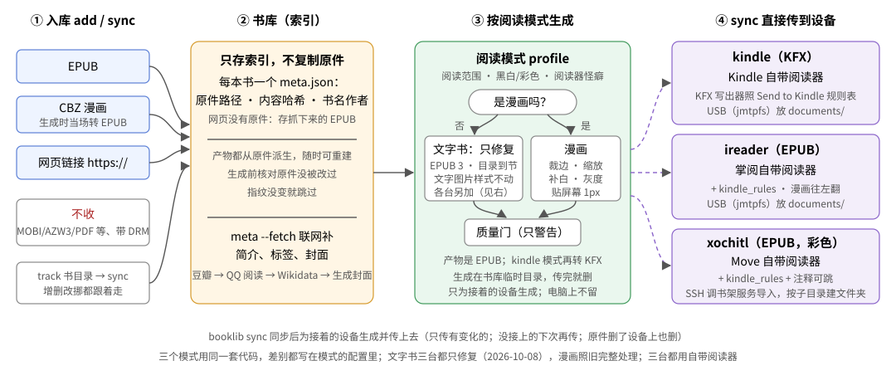

# 电子书入库与按阅读模式优化工具

在电脑上把 EPUB 和 CBZ 漫画收进一个**书库**，再按阅读器的屏幕特点**生成优化过的书**（Kindle 出 KFX，其余出 EPUB），自己拷到设备上读。



- **收书**：EPUB、CBZ 漫画、网页链接。书库**只存索引**（原件在哪、内容哈希、书名作者），不复制原件。同一本书重复入库、改名、挪位置都认得出。
- **文字书**：解开书里写死的字体、字号、行高，阅读器里调字号字体才生效；按中文或英文的习惯排版；注释搬到章末、比正文小一号；章标题独立一页，节与节之间分页，目录里节挂在章下面。
- **漫画**：保留原画质，按阅读器真正能显示的范围缩放、补白，图离屏幕边缘 1px；黑白屏转 256 级灰度（不抖动）。
- **补封面和简介**：没封面的书联网找（豆瓣 → 原作封面 → 都没有就生成一张），原件不动。
- **跟着书目录走**：登记一次书目录，之后新增、改过、挪过的书自动同步，只重建有变化的。

> 底线：书里的文字一个不多、一个不少；图片还是原来那张，只为适配屏幕缩放；拿不准的就不处理。

## 快速开始

需要 Rust 工具链（`cargo`）。

```sh
./install.sh                                  # 安装 booklib（详见使用指南 · 安装）
booklib track ~/Documents/ereader/books       # 登记书目录（只需一次）
booklib sync                                  # 同步进书库，按全部阅读模式生成
booklib list                                  # 看每本书的产物在哪、是不是最新
```

产物在书目录旁边：`~/Documents/ereader/kindle/`、`ireader/`、`xochitl/`，子目录和 `books/` 里一样。怎么拷到设备上见[使用指南 · 传书到设备](docs/usage.md#传书到设备)。

## 三个阅读模式

| 模式 | 给谁读 | 产物 |
|---|---|---|
| `kindle` | Kindle Paperwhite 12 代签名版自带阅读器 | KFX |
| `ireader` | 掌阅 Ocean 5 Pro 自带阅读器；Kindle、掌阅上的 KOReader 也读它 | EPUB |
| `xochitl` | reMarkable Paper Pro Move 自带阅读器 | EPUB（彩色） |

三个模式用同一套规则，区别（屏幕、阅读范围、阅读器的怪癖）都写在模式的配置里，见[设备与阅读模式](docs/devices.md)。

## 文档

| 文档 | 讲什么 |
|---|---|
| [使用指南](docs/usage.md) | 安装、各命令、产物在哪、传书到设备、常见问题 |
| [排版与优化规则](docs/typesetting.md) | 文字书、漫画各做了什么、为什么；真机验证情况 |
| [设备与阅读模式](docs/devices.md) | 模式的字段、各阅读器的怪癖、可阅读范围怎么量、KOReader |
| [AZW3 写出器](docs/azw3.md) | Kindle 产物怎么从 EPUB 转成 AZW3 |
| [架构](docs/architecture.md) | 代码怎么分、书库怎么存、生成流程 |
| [开发](docs/development.md) | 测试、真书回归、版本号、工程约束、DRM |
| [决定记录](docs/decisions.md) | 用户定过的事（按日期）和待定的事 |

## 几个词

| 词 | 意思 |
|---|---|
| 书库 | 电脑上的一个目录（缺省 `~/.local/share/booklib`），只记原件在哪、内容哈希、书名作者、找来的封面 |
| 阅读模式（profile） | 一种阅读器的参数：屏幕、可阅读范围、黑白还是彩色、产物格式、注释怎么处理。一个模式出一份产物 |
| 可阅读范围 | 阅读器除去页边距、页眉页脚后真正显示内容的区域 |
| 产物 | 按某个模式优化出来的书，拷到设备上读 |
| 指纹 | 决定产物要不要重建的一串值，其中任何一项变了才重建 |
| 质量门 | 产物生成后的自检（XHTML 合法、引用都找得到、没有 DRM）；不过只警告 |

## 现状

- 三台设备的自带阅读器上，文字书和漫画都在真机上看过，逐条见[验证情况](docs/typesetting.md#验证情况)。
- 自带阅读器之间不能同步阅读进度；Kindle、掌阅上的 KOReader 之间可以（见[设备 · KOReader](docs/devices.md#koreader)）。
- 带 DRM 的书拒收（解 DRM 暂停，见[开发 · DRM](docs/development.md#drm)）。

## 许可证

[MIT](LICENSE)。
