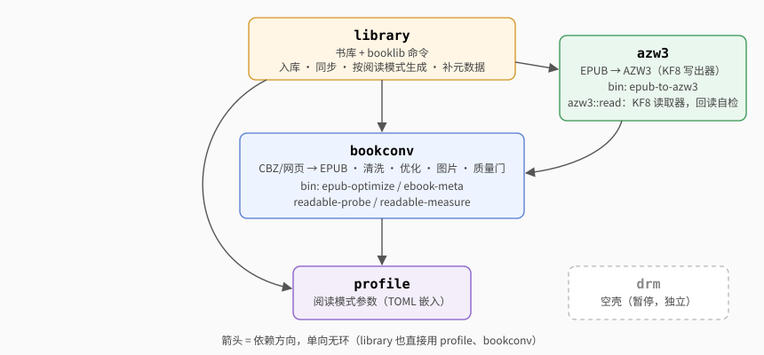

# 架构

## 三条原则

- **阅读模式（profile）是核心抽象**：屏幕、阅读范围、黑白彩色、阅读器的怪癖都从模式读，不在算法里按设备名写分支（见[设备 · 怪癖 → 字段](devices.md#怪癖--字段)）。三个模式用同一套优化规则。
- **书库只存索引，原件是唯一内容**：产物都从原件派生，随时能重建；生成前核对原件还是入库时那本书。
- **质量门**：产物生成后检查 XHTML 合法、引用完整、没有 DRM；没过只警告。

## Crate 与依赖

| crate | 职责 | 命令 |
|---|---|---|
| `library` | 书库：入库、跟踪同步、按模式生成、产物放哪、指纹、联网补元数据 | `booklib` |
| `bookconv` | 内容层：CBZ/网页 → EPUB、清洗、优化、图片、质量门。**不管书库**，只按调用方给的阅读范围和选项处理 | `epub-optimize`、`readable-probe`、`readable-measure` |
| `azw3` | EPUB → AZW3 写出器（clean-room，见 [AZW3 写出器](azw3.md)）；书库 2026-10-05 起不用，命令还在；`azw3::read` 只给回读自检、测试和 `mobidict` 读 MOBI 容器用 | `epub-to-azw3` |
| `mobidict` | MOBI 词典 → StarDict，当初给 KOReader 查词（clean-room，读 MOBI 容器借 `azw3::read::palm`）。2026-10-06 起两台都不装 KOReader、掌阅自带阅读器直接用 MOBI 词典，这个包暂时保留（用户定：别删） | `mobi-dict-to-stardict` |
| `kfx` | KFX：Ion 编解码、容器读写、EPUB → KFX 写出器（clean-room，见 [KFX](kfx.md)）；书库 `kindle` 模式的文字书和漫画都用它 | `epub-to-kfx`、`kfx-dump`、`kfx-repack`（三个都不随 `--tools` 装，用 `cargo run -p kfx --bin …`） |
| `profile` | 阅读模式的参数，TOML 编译时嵌入；`--device=` 的解析 | |
| `drm` | 空壳，解 DRM 暂停 | |

依赖单向无环：`library` → `azw3`、`kfx` → `bookconv` → `profile`（`library` 也直接用 `bookconv`、`profile`）；`mobidict` → `azw3`、`bookconv`；`drm` 独立。

### bookconv 模块

| 模块 | 职责 |
|---|---|
| `convert/` | CBZ → 每页一张原图的 EPUB（第一页就是封面，OPF 标"漫画"）；入库时的轻量检查。有打不开的页（不支持的压缩方式等）时生成报错，不出缺页的书 |
| `article` | 网页 → EPUB（正文抽取，图片保留原图，按 HTTP 头 / `<meta charset>` 认编码） |
| `optimize/` | 优化主流程：流式读写、逐文件变换、图片并行处理 |
| `wash/` | 清洗层：解锁字体字号、按语言排版、定章节（`chapters`：按目录层级定书/卷、章、节，漏掉的节补进目录、目录改指到文件中间的标题；不拆文件）、目录修复与生成（`toc`）、全书 id 去重、章尾空白；`fonts` 定哪些嵌入字体保留、哪些是批注；`safe_names` 给文件名里有安卓存储不能用的字符的条目改名；`normalize` 是最后一步的 EPUB 3 规范整理；`opf` 是 OPF 的读改（清洗、优化、`meta --edit` 共用）；读唯一标识符全书只用 `opf::unique_identifier`：`<package unique-identifier>` 指向的任意前缀 identifier，值去空白、空值算没有，NCX 的 `dtb:uid`、规范整理、`epubbook` 的稳定 ID 都按它） |
| `html` | 容错的 XHTML 工具：标签扫描、属性读写（单双引号、无引号）、加类、纯文本。全仓库的 HTML 操作都用它 |
| `htmlproc/` | 注释搬移与编号、字体锁、重复 id |
| `cssunlock` | 解开字体、字号、行高的锁 |
| `bgfit` | 整页背景图的尺寸意图（`cover`、`contain`、宽 100%、没写尺寸），去掉 `background-size` 的模式按它预先缩图 |
| `capfit` | 带图注、会超页的竖长图给 `` 写宽度百分比，图和图注同页（profile `caption_fit`） |
| `imgalpha` | 正文 ``/SVG `<image>` 用到、CSS 没用到的图：不认透明的阅读器（profile `image_alpha = false`）把它们合成白底 |
| `imgopt` / `imgpool` / `jpegopt` | 图片处理（摆正、裁边、缩放、灰度；`guard` 把解码器的 panic 变成"这张不处理"）；按像素额度限内存的并发池；JPEG 哈夫曼表无损重做 |
| `opfmeta` | EPUB 元数据与封面的读改：只重写文字条目，图片原样拷；`meta --edit` 和生成时补元数据共用 |
| `comic_detect` / `comicfxl` / `comicpad` | 判断是不是漫画；漫画固定版式（kindle）；页边距 1 时各页的补救（xochitl） |
| `check` | 质量门 |
| `epub` / `epubzip` | EPUB 组装与读写（每个 zip 条目解压上限 `MAX_ENTRY_BYTES` 256MB，EPUB、CBZ 共用，超过报错）：`EpubWriter`（全仓库写 EPUB 都用它）、`read_entries_from`、zip 内路径工具、书里链接解析 `resolve_link` |
| `epubbook` | 读整本 EPUB（元数据、spine 里的 XHTML、CSS、图片、封面、目录），AZW3 和 KFX 写出器共用 |
| `ncx` | NCX 目录解析与改写 |
| `netimg` / `direction` / `probe` | 远程图抓取（单张上限 `MAX_IMAGE_BYTES` 20MB；`origin_of` 取网址的站点）；翻页方向（读写 spine `page-progression-direction` 全书只用 `direction::spine_direction`/`set_spine_direction`）；测量书 |
| `util` / `naming` | 转义、全角转半角、文件名、书名规整；原子写（`produce_then_replace`、`commit`，书库也用；产出途中 panic 也删临时文件）；带上限的读取 `read_capped`（超过报错、不截断）；命令行公共函数 |

### kfx 模块

| 模块 | 职责 |
|---|---|
| `ion` | Amazon Ion 1.0 二进制编解码（只照公开规范），符号按编号存；编码取最短表示，解开再编回逐字节相同 |
| `container` | KFX 容器（`CONT`）读写：索引表、符号表、实体；没改动的容器写出来和原文件逐字节相同；`set_container_id` 一次换掉容器 id 的 4 处 |
| `yj` | 用到的 `YJ_symbols` 编号和我们起的名字（含义是对照样本推的） |
| `css` | 够写 KFX 用的 CSS：解析、按选择器优先级层叠、算出每个元素的计算值 |
| `write` | EPUB → KFX 写出器：版面、排版流、样式、位置映射、锚点、目录、注释弹窗、图片字体资源、固定版式 |

结构见 [KFX · 容器与符号](kfx.md#容器样本-2026-10-05-读出)。

### library 模块

| 模块 | 职责 |
|---|---|
| `bin/booklib/` | 命令行：`main.rs` 解析参数、打印结果；`meta_edit.rs` 是 `meta --edit`（不打开书库） |
| `lib.rs` | 条目（`Meta`）、入库、原件核对、`dedupe`、删除 |
| `sources.rs` | 跟踪目录与同步 |
| `generate.rs` | 生成计划与指纹、产物放哪、一本书几个模式共用的中间文件、按模式生成、生成记录 |
| `metadata.rs` | `meta --fetch` 的调度；生成时往书里补缺的封面、简介、标签 |
| `douban.rs` / `wikidata.rs` / `cover.rs` / `covergen.rs` | 书目源：豆瓣、Wikidata；原作封面（Open Library / Commons）；生成封面 |
| `net.rs` / `matching.rs` | 节流重试的 HTTP；书名人名比对（全半角、繁简、译名用字） |
| `fsutil.rs` | 临时文件命名、JSON 读写与缓存、记录文件核对、流式哈希、进程锁、残留临时文件清理 |

**联网策略**（`net.rs`，一次运行里各本书共用）：请求间隔 1.2 秒；429 按 `Retry-After` 等，5xx、超时重试几次；其它 4xx 当"没有"、不重试；**403 和"豆瓣搜索回 200 但不是 JSON"算临时出错**（多半是被反爬拦了），不当"没有"。连不上的网站记下来，之后发给它的请求立即失败；接连两个网站连不上、其间没有请求成功，算断网，整轮中止——网站回了任何 HTTP 状态（含 404、403、5xx）都说明网是通的，断网的判定从头算。Wikidata 的 id 只收 `Q<数字>`（要拼进 SPARQL 查询）。临时出错的书不存不完整的结果、不生成封面，下次再查。用户看到的流程见[使用指南 · meta --fetch](usage.md#meta---fetch联网补简介标签封面)。

## 书库

### 入库（`add_file` / `add_url`）

1. 边读原件边算 SHA-256（不整本进内存），前 12 位作 id；读前读后各看一次大小和修改时间，变了就报"文件正在写入"。文件名不是 UTF-8 的拒收。
2. 已有这个 id：记着的位置已不在时改记成新位置，否则刷新大小和修改时间，返回"已在库里"。同一路径上原来是另一个 id（内容变了）：当新版本入库，旧条目连同产物删掉。
3. 检查能不能用：EPUB 只读非图片条目，取书名作者、查 DRM；CBZ 只读 zip 目录看有没有页面图片。
4. 在 `masters/.tmp-<id>/` 写好 `meta.json`，最后改名成 `masters/<id>/`。

网址没有原件，抓下来的 EPUB 存成 `masters/<id>/master.epub`。

### 跟踪与同步（`track` / `sync`）

`sources.json` 记着跟踪的目录，和其中每个文件上次看到时的大小、修改时间、书 id。

- `track` 时就拒绝和已跟踪目录互相包含的、和任何跟踪目录的产物目录（`<父目录>/<模式 id>/`）互相包含的。
- `sync` 先同步、再生成（2026-10-06 起 `build` 并入 `sync`，生成那一步见下一节；写了书名只生成选中的书）。
- 同步时遍历，大小和修改时间都没变的跳过；变了或新出现的走一遍入库；上次有、这次没有的按 id 判断是挪了还是删了。入库失败的也记下来，文件没变就不再重试。
- **删了的连同产物从书库删掉**（`Prune::Auto`，书库严格镜像跟踪目录；`--keep` 时是 `Prune::Keep`，只报告、继续记着）。只删 `sources.json` 里在跟踪目录下登记过的；挪动、另有一份的，和 `add` 进来、条目记着的原件在跟踪目录以外还在的不算删。删走 `remove` 同一条路：先删产物（只删生成记录里记在这本名下、而且没被别的书记着的文件），再删条目；删不掉的报失败、继续记着，下次再删。
- 清理在生成之前：同一次 `sync` 里旧书走、同名的新书来，新书生成时旧产物已腾出文件名，新书照样叫 `书名.epub`，也不会被旧书的清理删掉。
- 整个跟踪目录不在：里面的记录原样保留。读不了的目录记成"状态未知"：里面已登记的书原样保留，不报原件不在、也不删。
- 新版本入库失败时旧版本继续跟踪；旧版本删不掉的记在 `stale` 里下次再删。没有任何变化时不写 `sources.json`。
- `--watch` 每轮照常清理；跨轮记住报过的问题和失败的生成：只在本轮有增删改，或书库、生成记录、`sources.json` 的修改时间变了时才去生成；失败的书按（书、模式、指纹、原件状态）记住，都没变就不重试。

各种文件变化的处理见[使用指南 · track / sync](usage.md#track--sync跟踪书目录生成)。

### 生成（`sync` 的第二步，`generate.rs`）

1. **核对原件**：大小或修改时间变了先核对内容，改过了就报错停下（不能因为指纹没变就说"已是最新"）；原件不在的这一步不报。
2. **算指纹**，定产物位置：原件在跟踪目录 `D` 里的放 `D/../<模式 id>/<子目录>/`，其余放 `<书库>/output/<模式 id>/`。撞名加 `[id 前 6 位]`。
3. 指纹没变、产物在原位 → 跳过；只是位置变了 → 挪过去，不重新生成。
4. 位置变了先登记再生成：记录先改成新位置（指纹留空 = 没完成）、旧位置记进待删，中途打断下次也认得出。
5. 与模式无关的中间文件（CBZ 转出的 EPUB、补了元数据的 EPUB）放在 `.tmp-<id>-src/`，同一本书的几个模式共用。
6. 流式优化，直接写成目标旁的临时文件 → 质量门 → 落盘、改名到位。`kindle` 模式先把优化结果写进临时目录、过质量门，再转 KFX（profile 可以用 `comic_format` 给漫画另配格式，内置模式不用；配了时是不是漫画按优化器的判定、按内容哈希缓存）。KFX 的唯一 ID 取自书 id（`kfx_id`，见 [KFX · 阅读进度](kfx.md#阅读进度2026-10-06-真机)），`@media` 按这个模式的阅读范围、屏幕求值（`kfx::css::MediaEnv::for_profile`）。
7. 补上指纹，删掉待删的旧位置和变空的目录（只在产物根目录以内）。

生成记录是 `<书库>/output-state/<模式 id>.json`：书 id → 产物路径、指纹、待删的旧位置。**只删这里记着的文件**。

### 指纹

指纹是一串用 `|` 连起来的值，任何一段变了产物就算过期。每段变了影响哪些书：

| 段 | 内容 | 变了以后过期的书 |
|---|---|---|
| 原件 | SHA-256 | 这一本 |
| 封面 | 找来的封面图哈希（没有就 `-`） | 这一本 |
| 简介标签 | **真正补进书的**简介、标签的哈希；补过东西的再带 `i` + `opfmeta::VERSION`。书里本来就有的那项不算 | 这一本；版本号变了是所有补过东西的书 |
| 流程版本 | `PIPELINE_VERSION`；CBZ 来源再带 `c` + `CONVERT_VERSION` | 全部；转换版本变了只有 CBZ 来源的 |
| 优化器版本 | `OPTIMIZE_VERSION` | 全部 |
| 注释方式 | `jump`/`popup`，图标换数字带 `#`，保留回链带 `<` | 这个模式的全部 |
| 模式 id | `kindle` 等 | — |
| 阅读范围与漫画 | 优化器实际用的阅读范围（`output_readable`）+ 漫画白边，如 `1104x1546+1`；漫画画布和阅读器页边距（`c952x1457m1`）、翻页方向（`dltr`）、固定版式（`f`）、保留背景图（`b`，去掉尺寸时 `bn`）、不认 `rgba()`（`r`）、带图注的竖长图写宽度（`k`）、正文图片透明处合成白底（`a`）有的时候再带上 | 这个模式的全部 |
| 黑白彩色 | `gray`/`color` | 这个模式的全部 |
| 格式 | `epub`；KFX 带写出器版本（`kfx7`），AZW3 同理（`azw34`，书库已不出） | 写出器版本变了只有 `kindle` 的 |

版本号什么时候加一、现在是多少，见[开发 · 版本号](development.md#版本号)。

### 可靠性

| 风险 | 做法 |
|---|---|
| 写到一半断电 | `meta.json`、`sources.json`、生成记录和产物都先写临时文件（`.tmp-<进程号>-<计数>-<名>`）、落盘，再改名、落盘目录；进程被杀留下的临时文件下次拿到锁时清掉（书库外只删 `.tmp-` 开头的） |
| `meta.json` 坏了 | `list` 报出来；`remove` 能删；重新 `add` 同一原件会替换 |
| 删书删到一半断电 | `remove` 先把条目目录原子改名成临时目录再删，残留的下次拿到锁时清掉 |
| `dedupe` 把副本当原件 | 书库里的文件（各条目存的副本）不算原件，给了书库所在的目录也不会配成自己 |
| `sources.json`、生成记录坏了 | 加锁时核对，读不出来就拒绝运行（当成空的写回去会丢掉全部记录） |
| 两个 booklib 同时运行 | `.lock` 文件锁；`list` 不持锁、不写书库（核对原件时也不写 `meta.json`） |
| 原件被改、挪、删 | 生成前核对内容；按内容 id 认出挪动；跟踪目录里删了的 `sync` 连同产物从书库删掉（目录整个不在、读不了的不删），`add` 进来的 `list` 报出来 |
| 删错用户的文件 | 只删生成记录里记着的文件，删空目录只在产物根目录以内 |
| 产物重名、文件名过长 | 不分大小写判断撞名，撞了加 id 后缀；书名按字节截断到 200 字节 |

## 优化流程与内存

`optimize::optimize_epub_file_streaming` 分两个阶段：

1. **阶段一**：非图片条目整份读进来，图片只记名字和大小。清洗、HTML 变换、注释搬移都在这里完成。
2. **阶段二**：按条目顺序写出。图片这时才逐张读回，交给 `imgpool` 并行处理，按原顺序写进 zip，处理完立刻丢掉。同时处理的图总像素有上限（3600 万），超过上限的大页独占额度、一张一张来。有远程图、或漫画里有 GIF/WebP 页时，OPF 推迟到最后写。

峰值内存约为"全书文字 + 同时在处理的几张图"，不随漫画页数增长。并行处理的结果和逐张处理逐字节相同。

各步骤做了什么，见[排版与优化规则](typesetting.md)。
