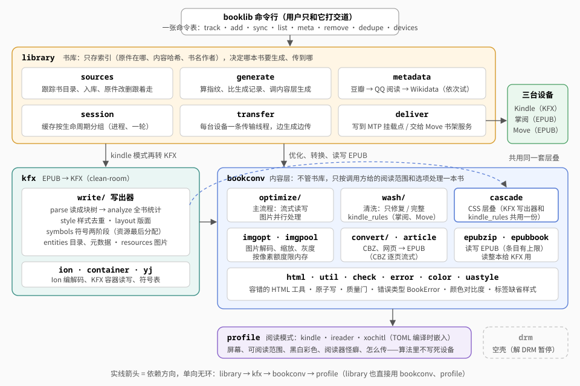
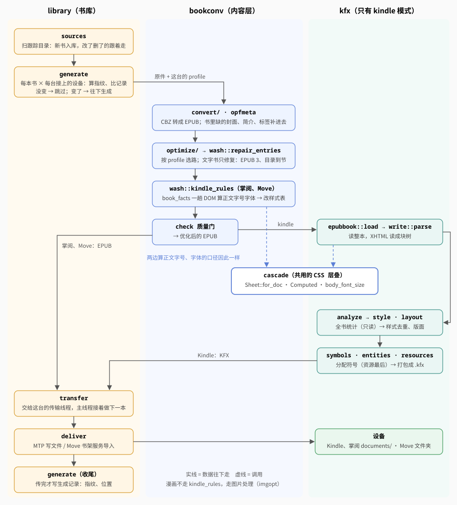
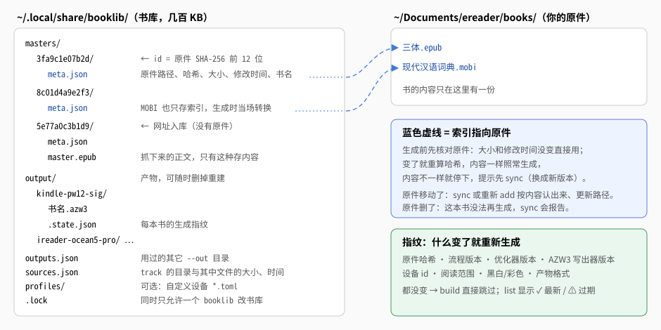
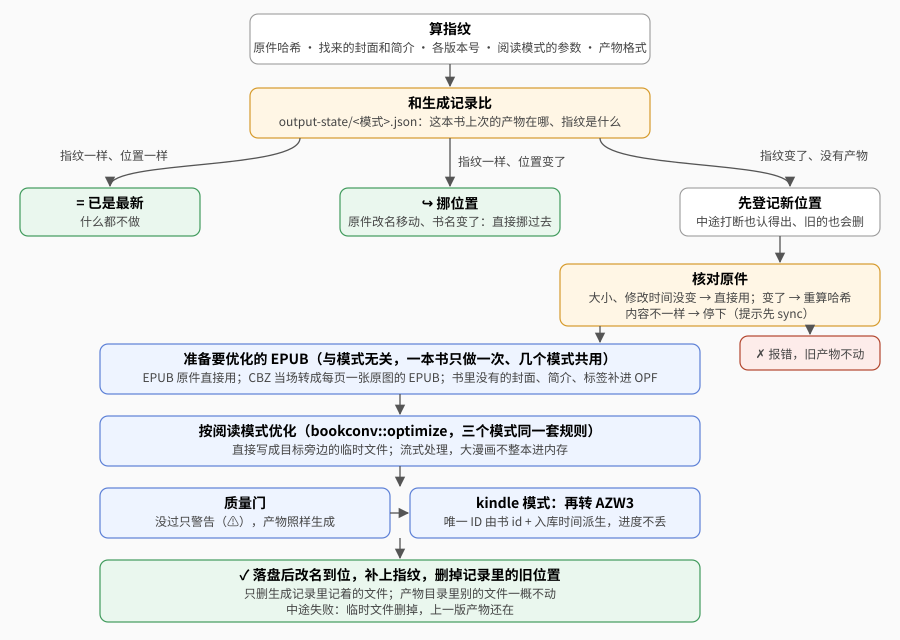
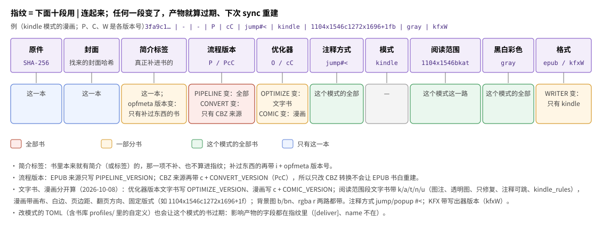

# 架构

这篇讲代码怎么分、一本书怎么流过各个模块、书库怎么存。第一次读：先看下面的三条原则和两张图（[核心架构](#核心架构)、[一本书怎么流过各模块](#一本书怎么流过各模块)），后面的模块表、书库、指纹按需查。用户看到的总体流程见 [README](../README.md) 开头的图。

## 三条原则

- **阅读模式（profile）是核心抽象**：屏幕、阅读范围、黑白彩色、阅读器的怪癖、文字书做到哪一步（`text_repair_only`、`kindle_rules`、`repair_note_links`）、怎么传到设备（`[deliver]`）都从模式读，不在算法里按设备名写分支（见[设备 · 怪癖 → 字段](devices.md#怪癖--字段)）。三个模式用同一套代码。
- **书库只存索引，原件是唯一内容**：产物都从原件派生，随时能重建；生成前核对原件还是入库时那本书。产物直接传到设备，电脑上不留（2026-10-07）。
- **质量门**：产物生成后检查 XHTML 合法、引用完整、没有 DRM；没过只警告。

## 核心架构

四个 crate 分层，上层用下层，下层不知道上层：

| crate | 职责 | 命令 |
|---|---|---|
| `library` | 书库：入库、跟踪同步、按模式生成、产物放哪、指纹、联网补元数据 | `booklib` |
| `bookconv` | 内容层：CBZ/网页 → EPUB、清洗、优化、图片、质量门。**不管书库**，只按调用方给的阅读范围和选项处理 | `epub-optimize`、`readable-probe`、`readable-measure` |
| `kfx` | KFX：Ion 编解码、容器读写、EPUB → KFX 写出器（clean-room，见 [KFX](kfx.md)）；书库 `kindle` 模式的文字书和漫画都用它 | `epub-to-kfx`、`kfx-dump`、`kfx-repack` |
| `profile` | 阅读模式的参数，TOML 编译时嵌入；`--device=` 的解析 | |
| `drm` | 空壳，解 DRM 暂停 | |

依赖单向无环：`library` → `kfx` → `bookconv` → `profile`（`library` 也直接用 `bookconv`、`profile`）；`drm` 独立。

## 一本书怎么流过各模块

以 `booklib sync` 里的一本书、一台设备为例：

1. **`library::sources`** 扫跟踪目录，把新书登记进书库、原件改了删了的跟着更新。
2. **`library::generate`** 对每本书、每台接上的设备算指纹，和生成记录比；没变就跳过（细节见[生成](#生成sync-的第二步generaters)、[指纹](#指纹)）。
3. 要生成的交给 **bookconv**：`convert` 把 CBZ 转成 EPUB、`opfmeta` 补书里缺的封面简介；`optimize` 按阅读模式选路，文字书走 `wash::repair_entries` 只修复，掌阅、Move 再过 `wash::kindle_rules`；`check` 质量门把关，得到优化后的 EPUB。
4. Kindle 再交给 **kfx 写出器**：`epubbook::load` 读整本 → `parse` 读成块树 → `analyze` 算全书统计 → `style`、`layout` → `symbols`、`entities` 打包成 KFX。
5. **`cascade`（CSS 层叠）是两边共用的**：`kindle_rules` 用它算掌阅、Move 的正文字号字体，KFX 写出器用它算每个元素的样式，所以三台认出的"正文"是同一个。
6. 产物交给 **`library::transfer`** 这台设备的传输线程（主线程不等，接着做下一本），由 **`deliver`** 写到 MTP 挂载点或交给 Move 的书架服务；传完 `generate` 才写生成记录。线程怎么配合见[使用指南 · 产物放在哪](usage.md#产物放在哪)里的"边生成边传"图。

## 模块一览

### bookconv 模块

| 模块 | 职责 |
|---|---|
| `convert/` | CBZ → 每页一张原图的 EPUB（第一页就是封面，OPF 标"漫画"）；入库时的轻量检查。有打不开的页（不支持的压缩方式等）时生成报错，不出缺页的书。书库生成时逐页流式写进文件（`cbz_to_epub_file`：先只读每页开头认格式，写到资源时一页一页解压，峰值内存一页） |
| `article` | 网页 → EPUB（正文抽取，图片保留原图；编码按 BOM → HTTP 头 → `<meta charset>` 认，没声明又不是合法 UTF-8、或声明 UTF-8 而字节不合法的按 GB18030，解码后去掉 U+FFFD） |
| `optimize/` | 优化主流程：流式读写、逐文件变换、图片并行处理。文字书走完整处理还是只修复由 `OptimizeOpts::text_mode`（`TextMode::Full` / `Repair { kindle_rules, note_links }`）定，清洗层对应 `WashOpts::mode`（`WashMode::Full` / `Repair { kindle_rules }`） |
| `wash/` | 清洗层：只修复（内置模式的文字书）和完整清洗（漫画、没开只修复的自定义模式）两条路，各文件见下表 |
| `html` | 容错的 XHTML 工具：标签扫描、属性读写（单双引号、无引号）、加类、纯文本。全仓库的 HTML 操作都用它 |
| `htmlproc/` | 注释搬移与编号（只修复时 Move 的 `repair_note_links` 也用它）、字体锁、重复 id |
| `uastyle` | 标签的缺省样式表（`
` 上下 1em、标题字号……）：KFX 写出器按它给缺省值，`kindle_rules` 按它写 `eink-ua.css` |
| `cascade` | CSS 层叠：解析样式表、按选择器优先级层叠、算出每个元素的计算值（2026-10-10 从 `kfx` 挪来）：KFX 写出器（`kfx::css` 就是它）和 `kindle_rules` 算全书正文字号共用，口径一样：每篇文档的样式表 `Sheet::for_doc`（`<link>`/`<style>` 的 `media` 和 `@media` 都按阅读模式的 `MediaEnv` 求）、正文字号 `body_font_size`（按字数加权的众数）、`font` 简写展开成分项。另有全仓库共用的 CSS 文本小工具：规则位置 `rule_spans`（层叠、清洗层、优化器同一套解析）、`rule_selector`、去注释、拆分切词、四值简写 `box_sides`、`@font-face` 规则、选择器最后一段 |
| `color` | CSS 颜色解析、WCAG 对比度、Send to Kindle 的对比度规则（KFX 写出器和 `kindle_rules` 共用） |
| `cssunlock` | 解开字体、字号、行高的锁（内置模式的文字书不用，只有漫画和没开只修复的模式走） |
| `bgfit` | 整页背景图的尺寸意图（`cover`、`contain`、宽 100%、没写尺寸），去掉 `background-size` 的模式按它预先缩图（只修复时不做；漫画不处理，所以内置模式现在都用不到） |
| `capfit` | 带图注、会超页的竖长图给 `` 写宽度百分比，图和图注同页（profile `caption_fit`；只修复时不做，内置模式现在用不到） |
| `imgalpha` | 正文 ``/SVG `<image>` 用到、CSS 没用到的图：不认透明的阅读器（profile `image_alpha = false`）把它们合成白底（只修复时不做，内置模式现在用不到；漫画另有自己的铺白底） |
| `imgopt` / `imgpool` / `jpegopt` | 图片处理（摆正、裁边、缩放、灰度；`guard` 把解码器的 panic 变成"这张不处理"；"读头 → EXIF 方向 → 解码上限 → 解码 → 摆正"统一走 `ImgHead`，对外是 `decode_capped`/`decode_oriented`；带透明的 PNG 插图、背景图缩放都按预乘 alpha，不出黑边）；按像素额度限内存的并发池；JPEG 哈夫曼表无损重做 |
| `opfmeta` | EPUB 元数据与封面的读改：只重写文字条目，图片原样拷；`meta --edit` 和生成时补元数据共用 |
| `comic_detect` / `comicfxl` / `comicpad` | 判断是不是漫画；漫画固定版式（kindle）；页边距 1 时各页的补救（xochitl） |
| `check` | 质量门 |
| `epub` / `epubzip` | EPUB 组装与读写（每个 zip 条目解压上限 `MAX_ENTRY_BYTES` 256MB，EPUB、CBZ 共用，超过报错）：`EpubWriter`（全仓库写 EPUB 都用它）、`read_entries_from`、zip 内路径工具、书里链接解析 `resolve_link` |
| `error` | 错误类型 `BookError`（取消、IO、zip、文件损坏、单条目超上限、不支持、DRM、其它）：`epubzip`、`epubbook`、`optimize` 的公开入口和清洗层返回它，调用方按变体判断（取消看 `is_cancelled()`，不看错误串开头）；`Display` 就是给用户看的中文文字（和以前的错误串逐字相同），还用 `String` 往上传的代码照旧 `?` |
| `epubbook` | 读整本 EPUB（元数据、spine 里的 XHTML、CSS、图片、封面、目录），KFX 写出器用 |
| `ncx` | NCX 目录解析与改写 |
| `netimg` / `direction` / `probe` | 远程图抓取（单张上限 `MAX_IMAGE_BYTES` 20MB；一章里的远程图去重后 4 路同时抓，起名照出现顺序；`origin_of` 取网址的站点）；翻页方向（读写 spine `page-progression-direction` 全书只用 `direction::spine_direction`/`set_spine_direction`）；测量书 |
| `util` / `naming` | 转义、全角转半角、文件名、书名规整；原子写（`produce_then_replace`、`commit`，书库也用；产出途中 panic 也删临时文件）；带上限的读取 `read_capped`（超过报错、不截断）；命令行公共函数 |

### wash 子模块

| 文件 | 职责 |
|---|---|
| `mod.rs` | 入口。两条路都先做 `encoding`。**只修复**（`repair_entries`）：坏引用、重复 id、目录、EPUB 3 规范整理；开了 `kindle_rules` 时再挂 `eink-ua.css`、把 spine 里标了 `linear="no"` 的目录页拿出阅读顺序（`drop_nonlinear_nav`，manifest 里留着，仍是导航文档）。**完整清洗**：另加解锁字体字号、按语言排版、定章节、章尾空白等。`KINDLE_RULES_VERSION` 定义在这里 |
| `encoding` | 不是 UTF-8 的 XHTML、OPF、NCX 转成 UTF-8（后面各步按 UTF-8 读写）；认不出编码的不动 |
| `drm` | 伪 DRM：`encryption.xml` 只加密了字体、样式、脚本的剥掉；真加密报错 |
| `safe_names` | 文件名里有安卓存储不能用的字符（`*`、`:`、`?` 等）的条目改名，引用跟着改 |
| `dead_refs` | 去掉指向不存在文件的 ``、字体文件全缺的 `@font-face` |
| `ids` | 全书 id 去重（xochitl 的锚点是全书一个命名空间），指向它的链接跟着改 |
| `ncx_fix` | NCX：`dtb:uid` 对齐 OPF、manifest 里的 id 规整成 `ncx`、去掉外部 DTD |
| `toc` | 目录：判定目录文件、没有目录时生成（NCX + nav）、扁平目录按"第X部"重建成两级、定章节后补节 |
| `chapters` | 定章节：按目录层级定书/卷、章、节，漏掉的节补进目录、目录改指到文件中间的标题；不拆文件 |
| `kindle_rules` | 照 Send to Kindle 的规则改书自己的样式表（正文字体、字号按正文归一、body 左右边距、文字对比度；只改值、删声明）：掌阅、Move 的文字书用。要改什么由 `book_facts` 全书走一趟 DOM、按 `cascade` 层叠算出（正文字号、正文字体、body 上的类、各文件有没有负外边距），口径同 KFX 写出器 |
| `cover` | `ensure_cover_declared` 保证 OPF 声明了有效的封面图；`prepend_cover_page` 给 spine 里没有封面页、正文也没用到封面图的书在最前面补一页 `eink-cover.xhtml`（掌阅、Move 的文字书，优化器在清洗前调） |
| `normalize` | 最后一步的 EPUB 3 规范整理：XHTML 修成合法 XML、OPF 升到 3.0、nav 与 NCX 互补 |
| `html5fix` | 规范整理配不平的 XHTML（交叉嵌套、没关的 `
`/`<li>`、认不出的实体）按 HTML5 解析算法重新解析、写回 XHTML（2026-10-09） |
| `opf` | OPF 的读改（清洗、优化、`meta --edit` 共用）；读唯一标识符全书只用 `opf::unique_identifier`：`<package unique-identifier>` 指向的 identifier（任意前缀），值去空白、空值算没有，NCX 的 `dtb:uid`、规范整理、`epubbook` 的稳定 ID 都按它 |
| `fonts` | 完整清洗：嵌入字体哪些保留、哪些是批注 |
| `empty_pages` | 完整清洗：删没有可见内容的空白页，指向它的目录、链接、`<guide>` 改指邻页；找不到完整 `<body>` 的页不当空页 |
| `css` / `typeset` / `layout` | 完整清洗：CSS 声明按黑名单剥、`text-indent` 归一；CJK 假段落、标题后首段顶格、外链 `eink-wash.css`；补 `lang`、居中居右换成类、章尾空白页 |
| `tests.rs` | 清洗层的单测（跨子模块，集中放） |

### kfx 模块

| 模块 | 职责 |
|---|---|
| `ion` | Amazon Ion 1.0 二进制编解码（只照公开规范），符号按编号存；编码取最短表示，解开再编回逐字节相同 |
| `container` | KFX 容器（`CONT`）读写：索引表、符号表、实体；没改动的容器写出来和原文件逐字节相同；`set_container_id` 一次换掉容器 id 的 4 处 |
| `yj` | 用到的 `YJ_symbols` 编号和我们起的名字（含义是对照样本推的） |
| `css` | 就是 `bookconv::cascade`（再导出）：解析、按选择器优先级层叠、算出每个元素的计算值 |
| `write` | EPUB → KFX 写出器（2026-10-09 拆成子模块）：`parse`（读 XHTML 成块树、空段折叠、补封面页）、`analyze`（正文字号行高、注释配对）、`style`（块和文字的样式、颜色对比度）、`layout`（版面、排版流、固定版式）、`entities`（位置映射、目录、元数据、资源实体）、`symbols`（本地符号分两阶段：正文阶段 `SymbolAlloc`、换成资源阶段 `ResourceSymbols` 以后只能成组分配资源符号——「资源符号最后分配、资源路径＝字节实体 + 9」由类型保证，不靠调用顺序）、`props`（一个样式的属性集合 `StyleProps`：同一属性后设覆盖先设，按编号升序写出）、`resources`（图片资源 `ResourceStore`）、`mod`（版本号、入口、各阶段共用的 `Builder`、单位常量）；`analyze` 算出只读的全书统计 `BookStats`，`style` 里是样式去重表 `StyleTable`，整棵块树的遍历统一走 `parse::walk_blocks`（2026-10-10 重构，KFX 逐字节不变）。元素套超过 1000 层的书报错不转（不让栈溢出摔掉进程），较深的放到大栈线程里解析 |

结构见 [KFX · 容器与符号](kfx.md#容器样本-2026-10-05-读出)。

### library 模块

| 模块 | 职责 |
|---|---|
| `bin/booklib/` | 命令行：`main.rs` 解析参数、打印结果，命令是一张表 `COMMANDS`（帮助、认的选项、要不要持锁、处理函数；新增命令只加一项），`sync` 的跨轮状态（`--watch`）在 `SyncState`；`meta_edit.rs` 是 `meta --edit`（不打开书库） |
| `lib.rs` | 条目（`Meta`）、入库、原件核对、`dedupe`、删除 |
| `session.rs` | `Library` 的缓存和运行状态按活多久分四组：记录文件与锁（`Records`）、按内容记住的事实（`ContentFacts`）整个进程有效；设备连接（`Devices`）跨轮保留、每轮核一次；生成过程中的临时状态（`BuildCtx`：中间文件、传输中占着的文件名）一轮生成 / 一件传输就清 |
| `sources.rs` | 跟踪目录与同步（`sync_with` 分三步：遍历入库、删旧版本、处理不在了的） |
| `generate.rs` | 生成计划与指纹、产物放哪、一本书几个模式共用的中间文件、按模式生成（`prepare`）、传完记下来（`complete`）、生成记录 |
| `transfer.rs` | 要传的一件（`Transfer`）、它要做的（`Work`：写文件，或交给 Move，Move 专属的数据在 `MoveWork`）、结果（`Done`）；`sync` 的传输线程（`Pipeline`）。依赖方向 `generate` → `transfer` → `deliver`，不成环 |
| `deliver.rs` | 产物送到设备（2026-10-07）：设备接没接上（MTP 挂载点、SSH 到 Move；地址是 IP 的先探 22 端口，0.8 秒不通就跳过，不等 ssh 超时）、往 MTP 设备上放文件（相同字节不拷）、调 Move 上书架服务的导入接口（新加、原地替换、查、进回收站）；不认识生成记录和传输线程 |
| `metadata.rs` | `meta --fetch` 的调度：责任链 `CHAIN`（豆瓣 → QQ 阅读 → Wikidata），书目网站实现 `BookSource`（搜索骨架是它的缺省方法，各网站只给搜索词、网址、怎么认条目、挑封面、取元数据），Wikidata 是链尾单独的一环（原作留给找封面的后备）；生成时往书里补缺的封面、简介、标签 |
| `douban.rs` / `qqread.rs` / `wikidata.rs` / `cover.rs` / `covergen.rs` | 书目源：豆瓣、QQ 阅读、Wikidata；原作封面（Open Library / Commons）；生成封面 |
| `net.rs` / `matching.rs` | 节流重试的 HTTP；书名人名比对（全半角、繁简、译名用字） |
| `fsutil.rs` | 临时文件命名、书库里的原子写（`write_atomic_cleanable`：临时名带 `.tmp-` 前缀，持锁时清残留；和 `bookconv::util::write_atomic` 只差临时名）、JSON 读写与缓存、记录文件核对、流式哈希、进程锁、残留临时文件清理 |

**联网策略**（`net.rs`，一次运行里各本书共用）：请求间隔 1.2 秒；429 按 `Retry-After` 等，5xx、超时重试几次；其它 4xx 当"没有"、不重试；**403 和"豆瓣搜索回 200 但不是 JSON"算临时出错**（多半是被反爬拦了），不当"没有"。连不上的网站记下来，之后发给它的请求立即失败；接连两个网站连不上、其间没有请求成功，算断网，整轮中止——网站回了任何 HTTP 状态（含 404、403、5xx）都说明网是通的，断网的判定从头算。Wikidata 的 id 只收 `Q<数字>`（要拼进 SPARQL 查询）。临时出错的书不存不完整的结果、不生成封面，下次再查。用户看到的流程见[使用指南 · meta --fetch](usage.md#meta---fetch联网补简介标签封面)。

**找书只用书里元数据的书名、作者**（2026-10-08 用户定，不看文件名）。**豆瓣找条目**用搜索建议接口：先搜「书名 作者」，搜不到再只搜书名（书名同时是人名的《张居正》光搜书名回空列表，带上作者才有书）；书名（简体化后）相同或只差 ≤2 字的卷次后缀、作者字重合度 ≥0.6 才算对上。用户看到的顺序和输出见[使用指南 · meta --fetch](usage.md#meta---fetch联网补简介标签封面)。豆瓣没有时找 **QQ 阅读**（`qqread.rs`，2026-10-08）：网页自己的搜索接口 `novel.qq.com/api/search?keywords=…&pageIndex=1&pageSize=10` 回 JSON（`code` 为 0 才算；书名、作者、简介、分类、封面都在搜索结果里，不用再取详情页），不要登录和来源页；关键词模糊搜索，先搜书名、再搜「书名 作者」，对上的规则同豆瓣。豆瓣出过临时错误时不查 QQ 阅读。

## 书库

### 入库（`add_file` / `add_url`）

1. 边读原件边算 SHA-256（不整本进内存），前 12 位作 id；读前读后各看一次大小和修改时间，变了就报"文件正在写入"。文件名不是 UTF-8 的拒收。
2. 已有这个 id：记着的位置已不在时改记成新位置，否则刷新大小和修改时间，返回"已在库里"。同一路径上原来是另一个 id（内容变了）：当新版本入库，旧条目删掉，设备上的产物交给新条目（`hand_over_outputs`：记录挪过去、指纹留空，生成时原地覆盖或原地替换，2026-10-09）。
3. 检查能不能用：EPUB 只读非图片条目，取书名作者、查 DRM；CBZ 只读 zip 目录看有没有页面图片。
4. 在 `masters/.tmp-<id>/` 写好 `meta.json`，最后改名成 `masters/<id>/`。

网址没有原件，抓下来的 EPUB 存成 `masters/<id>/master.epub`。

### 跟踪与同步（`track` / `sync`）

`sources.json` 记着跟踪的目录，和其中每个文件上次看到时的大小、修改时间、书 id。

- `track` 时就拒绝和已跟踪目录互相包含的、和书库所在目录互相包含的、和产物放电脑上的模式（没写 `[deliver]` 的自定义模式）的产物目录（`<父目录>/<模式 id>/`）互相包含的（`sources.rs`）；内置模式都直接传设备，不查这一条。
- `sync` 先同步、再生成（2026-10-06 起 `build` 并入 `sync`，生成那一步见下一节；写了书名只生成选中的书）。
- 同步时遍历，大小和修改时间都没变的跳过；变了或新出现的走一遍入库；上次有、这次没有的按 id 判断是挪了还是删了。入库失败的也记下来（`failed`：哪一版 booklib、什么时候失败的），文件没变就先不重试、不重复报错；升级了 booklib（可能修好了）或过了一小时（偶发的读错误）再试一次（2026-10-09 审计：以前记下就永远不再试）。
- **删了的连同产物从书库删掉**（`Prune::Auto`，书库严格镜像跟踪目录；`--keep` 时是 `Prune::Keep`，只报告、继续记着）。只删 `sources.json` 里在跟踪目录下登记过的；挪动、另有一份的，和 `add` 进来、条目记着的原件在跟踪目录以外还在的不算删。删走 `remove` 同一条路：先删产物（只删生成记录里记在这本名下、而且没被别的书记着的文件），再删条目；删不掉的报失败、继续记着，下次再删。
- 清理在生成之前：同一次 `sync` 里旧书走、同名的新书来，新书生成时旧产物已腾出文件名，新书照样叫 `书名.epub`，也不会被旧书的清理删掉。
- 整个跟踪目录不在：里面的记录原样保留。读不了的目录记成"状态未知"：里面已登记的书原样保留，不报原件不在、也不删。
- 新版本入库失败时旧版本继续跟踪；旧版本删不掉的记在 `stale` 里下次再删。没有任何变化时不写 `sources.json`。
- `--watch` 每轮照常清理；跨轮记住报过的问题和失败的生成：只在本轮有增删改，或书库、生成记录、`sources.json` 的修改时间变了时才去生成；失败的书按（书、模式、指纹、原件状态）记住，都没变就不重试；某台设备重新接上（上一轮没接上这轮接上了，或 Move 的连接断过、重连了）时忘掉这台记着的失败，下一轮重试（传失败多半是连接的事）。

各种文件变化的处理见[使用指南 · track / sync](usage.md#track--sync跟踪书目录生成)。

### 生成（`sync` 的第二步，`generate.rs`）

1. **核对原件**：大小或修改时间变了先核对内容，改过了就报错停下（不能因为指纹没变就说"已是最新"）；原件不在的这一步不报。
2. **算指纹**，定产物位置（设备没接上的模式整个跳过）：Kindle、掌阅是设备存储根目录的 `documents/<子目录>/`，Move 是 xochitl 文件夹 `<子目录>`（`<子目录>` 是原件所在目录相对跟踪目录的路径；不在跟踪目录里的放顶层）；没写 `[deliver]` 的自定义模式放电脑上（`D/../<模式 id>/<子目录>/` 或 `<书库>/output/<模式 id>/`）。撞名加 `[id 前 6 位]`，目录里逐字节相同的同名文件认领。
3. **比较**，按下面几种情况分：
   - 指纹没变、产物在原位 → 跳过。"在原位"对 MTP 是看文件在不在；Move 上的一轮只问一次：第一次要用时 `POST /import/states` 把生成记录里全部 uuid 一批查回来，书架服务太旧没有这个接口时一本一本 `GET /import/<uuid>`（`--watch` 每轮重查）。
   - 指纹没变、记录里的位置空了，而设备上对应位置有文件（以前放电脑上、用户自己挪上设备的）→ 认领（`Built::Adopted`），不生成。
   - 指纹没变、只是位置变了 → 挪过去，不重新生成（以前留在电脑上的产物也这样挪上设备）。Move 上文件夹或书名变了：加入新的、旧的进回收站。
   - 原件换了内容：入库时旧条目的记录已经交给新条目、指纹留空（`hand_over_outputs`，见[入库](#入库add_file--add_url)第 2 步），所以照常重新生成，放到同一个位置：MTP 覆盖同一个文件，Move 按记录里的 uuid 原地替换（图见[使用指南 · 产物放在哪](usage.md#产物放在哪)）。
   - 其余（指纹变了、新书）→ 生成。
4. 位置变了先登记再生成：记录先改成新位置（指纹留空 = 没完成）、旧位置记进待删，中途打断下次也认得出。新书：同一轮里这个文件名先在内存里占住，别的同名书不会选它；放电脑上的不预登记（省一次整份记录的写），中途打断的话下次重新生成出逐字节相同的产物时认领它；MTP 设备上直接写正式文件名，要预登记（见第 6 步）。
5. 与模式无关的中间文件（CBZ 转出的 EPUB、补了元数据的 EPUB）放在 `.tmp-<id>-src/`，同一本书的几个模式共用：按书 id 留到这本书所有模式都做完（某台设备排满、这本留到最后补的，不用再转一遍），留着的总量超过 1GB（`PREPARED_BUDGET`）时丢掉最早的，之后用到再做。
6. **生成和传分开**：上面这些（比较、生成）是 `prepare`，在主线程做；放上设备是 `Transfer`，交给 `transfer::Pipeline` 的传输线程；传完由主线程 `complete` 写记录、删旧位置——**记录只在主线程改**（流程图见[使用指南 · 产物放在哪](usage.md#产物放在哪)）。库函数 `build`（单本、不走传输线程；命令行已经没有 `build`）是 prepare + run + complete。
   - **生成**：流式优化，写进书库的临时目录 `.tmp-<id>-<模式>/`（`product`）→ 质量门 → 算 SHA-256，和记录里上次传的一样就不再传（`Built::Same`）。`kindle` 模式先把优化结果写进临时目录、过质量门，再转 KFX：唯一 ID 取自书 id（`kfx_id`，见 [KFX · 阅读进度](kfx.md#阅读进度2026-10-06-真机)），`@media` 按这个模式的阅读范围、屏幕求值（`kfx::css::MediaEnv::for_profile`）。profile 可以用 `comic_format` 给漫画另配格式（内置模式不用；配了时是不是漫画按优化器的判定、按内容哈希缓存）。
   - **传输线程**：每台设备一条，在传加排队最多 2 件，满了主线程先做别的设备。
   - **MTP（Kindle、掌阅）**：拷贝用 1MB 块；目标已是逐字节相同的就不拷（Kindle 进度不丢）。不同的先删旧的、**直接写正式文件名**（`put_file` 的 `direct`）：原版 jmtpfs 的改名是整份下载再上传，经临时文件等于传三遍。所以写之前先在生成记录里登记一条指纹留空的（第 4 步），写到一半被打断时下次认得出、重传。本机打过补丁的 jmtpfs 2026-10-09 起改成真改名、换目录用 MTP MoveObject，挪位置也不再重传（Kindle、掌阅真机 ✓）。
   - **Move**：经书架服务的导入接口新加，或按 uuid 原地替换；交一件、`GET /import/jobs/<号>` 查到做完再交下一件。原地替换碰到书架服务那边这本还在替换（上一次 `sync` 交的没做完，回 409；旧版回 400），轮询 `GET /import/<uuid>` 的 `replacing` 等它做完再交，最多 30 分钟。
7. 补上指纹，删掉待删的旧位置和变空的目录（只在产物根目录以内；Move 上的进回收站）。MTP 设备没挂上时删不了的留着下次删，不当成已删。

生成记录是 `<书库>/output-state/<模式 id>.json`：书 id → 产物路径（Move 上的是 `uuid`、显示名 `name` 和相对的 `文件夹/文件名`）、指纹、传上去的那份的哈希 `sha`、待删的旧位置；`orphans` 是从书库删了、当时设备没接上没删成的，接上后删（`flush_removed`）。**只删这里记着的**。

### 指纹

指纹是一串用 `|` 连起来的值，任何一段变了产物就算过期。**文字书和漫画分开算**（2026-10-08）：只管一路的版本号、profile 字段只进那一路的指纹，只改了文字书的规则时漫画不过期（以前一个版本号、字段全带，v52 改文字书时漫画全部白白重建，掌阅上的还因为产物里的版本标记变了全部重传）。是不是漫画入库时判一次存进 `meta.json`（`comic`，早期条目第一次用到时判）。每段变了影响哪些书：

| 段 | 内容 | 变了以后过期的书 |
|---|---|---|
| 原件 | SHA-256 | 这一本 |
| 封面 | 找来的封面图哈希（没有就 `-`） | 这一本 |
| 简介标签 | **真正补进书的**简介、标签的哈希；补过东西的再带 `i` + `opfmeta::VERSION`。书里本来就有的那项不算（书里有没有入库时存进 `meta.json` 的 `own_dc`，原件暂时不在也算得对；早期条目当场读 OPF、持锁时补存） | 这一本；版本号变了是所有补过东西的书 |
| 流程版本 | `PIPELINE_VERSION`；CBZ 来源再带 `c` + `CONVERT_VERSION` | 全部；转换版本变了只有 CBZ 来源的 |
| 优化器版本 | 文字书 `OPTIMIZE_VERSION`，漫画 `c` + `COMIC_VERSION` | 这一路的全部 |
| 注释方式 | `jump`/`popup`，图标换数字带 `#`，保留回链带 `<` | 这个模式的全部 |
| 模式 id | `kindle` 等 | — |
| 阅读范围 | 文字书：优化器用的阅读范围（`output_readable`，如 `1104x1546`），带图注的竖长图写宽度（`k`）、正文图片透明处合成白底（`a`）、只修复（`t`，另保证注释能点再带 `n`、照 Send to Kindle 的规则统一再带 `u`，后面跟 `KINDLE_RULES_VERSION`（为 1 时不写）和屏幕 `@宽x高`（统计正文字号时 `@media` 按它求））有的时候再带上（现在三台：kindle `1104x1546bkat`、ireader `1264x1680bnrktu<N>@1264x1680`、xochitl `842x1455tnu<N>@954x1696`，`<N>` 是 `KINDLE_RULES_VERSION`）；漫画：阅读范围 + 漫画画布 + 白边（`1104x1546c1272x1696+1`），阅读器页边距（`m1`）、翻页方向（`dltr`）、固定版式（`f`）有的时候带上；两路都带保留背景图（`b`，去掉尺寸时 `bn`）、不认 `rgba()`（`r`）（清洗层两路都过） | 这个模式这一路的全部 |
| 黑白彩色 | `gray`/`color` | 这个模式的全部 |
| 格式 | `epub`；KFX 带写出器版本和写出器求 `@media` 用的屏幕、KFX 阅读范围（写成 `kfx<版本号>@<屏宽>x<屏高>r<宽>x<高>`，如 `kfx<N>@1272x1696r1104x1546`，`<N>` 是 `WRITER_VERSION`；2026-10-09 补上屏幕） | 写出器版本、屏幕变了只有 `kindle` 的 |

版本号什么时候加一、现在是多少，见[开发 · 版本号](development.md#版本号)。

指纹写法改了、规则没变时不白重建：生成计划另算一份旧写法的指纹（`Plan::legacy`，版本号用这一路现在的），记录里存的正好是它，就把记录改成新写法，当作最新（2026-10-08 换写法时，Kindle、掌阅 78 份记录全部这样认回，没有重新生成）。

### 可靠性

| 风险 | 做法 |
|---|---|
| 写到一半断电 | `meta.json`、`sources.json`、生成记录和产物都先写临时文件（`.tmp-<进程号>-<计数>-<名>`）、落盘，再改名、落盘目录；进程被杀留下的临时文件下次拿到锁时清掉（书库外只删 `.tmp-` 开头的） |
| `meta.json` 坏了 | `list` 报出来；`remove` 能删；重新 `add` 同一原件会替换 |
| 删书删到一半断电 | `remove` 先把条目目录原子改名成临时目录再删，残留的下次拿到锁时清掉 |
| `dedupe` 把副本当原件 | 书库里的文件（各条目存的副本）不算原件，给了书库所在的目录也不会配成自己 |
| `sources.json`、生成记录坏了 | 加锁时核对，读不出来就拒绝运行（当成空的写回去会丢掉全部记录） |
| 传输线程出 panic | 那一件算传失败，线程接着做下一件；线程真的死了，主线程等结果时发现（不一直等），手上没交回的几件记录不改、下次再传 |
| 两个 booklib 同时运行 | `.lock` 文件锁；`list` 不持锁、不写书库（核对原件时也不写 `meta.json`） |
| 原件被改、挪、删 | 生成前核对内容；按内容 id 认出挪动；跟踪目录里删了的 `sync` 连同产物从书库删掉（目录整个不在、读不了的不删），`add` 进来的 `list` 报出来 |
| 删错用户的文件 | 只删生成记录里记着的文件，删空目录只在产物根目录以内 |
| 产物重名、文件名过长 | 不分大小写判断撞名，撞了加 id 后缀；书名按字节截断到 200 字节 |

## 优化流程与内存

`optimize::optimize_epub_file_streaming` 分两个阶段：

1. **阶段一**：非图片条目整份读进来（几个线程各自打开源文件同时解压，`epubzip::read_skeleton_par`），图片只记名字和大小。清洗、HTML 变换、注释搬移都在这里完成。
阶段一开头（清洗前）补封面声明 `ensure_cover_declared`（全程只调一次），掌阅、Move 的文字书接着补封面页（封面图的宽高只解压条目开头读文件头，`read_image_head`）。

2. **阶段二**：按条目顺序写出（`write_entries`：图片工作池 `spawn_image_workers`、按序写出 `OrderedSink`，收尾 `finalize`/`finalize_opf`）。图片这时才交给 `imgpool` 的 worker（worker 自己打开源文件读原图），并行处理，按原顺序写进 zip，处理完立刻丢掉。同时处理的图总像素有上限（3600 万），超过上限的大页独占额度、一张一张来。要 deflate 的条目也交给 worker 先压好（`epubzip::Precompressed`），主线程按顺序原样拷进 zip。和原书逐字节相同（大小、CRC 都对得上）、64KB 以上的字体不解压再重压，直接拷原书的压缩数据（`EpubWriter::raw_copy_as`，清洗时改过名的按新名写；v54，《绍宋》590 → 233ms）。有远程图、或漫画里有 GIF/WebP 页时，OPF 推迟到最后写。

峰值内存约为"全书文字 + 同时在处理的几张图"，不随漫画页数增长。并行处理的结果和逐张处理逐字节相同。

**多线程**（2026-10-07 提速，产物逐字节不变）：清洗层、优化器里逐文件独立的步骤按文件分给几个线程（`util::par_map`，最多 16 个，同图片处理线程），结果按原顺序合并；做法、代价和前后数字见[开发 · 性能](development.md#性能)。

给别的程序当库用的接口（2026-10-07 加，缺省值下产物逐字节不变）：

- `OptimizeOpts::limits`（`Limits { max_decode_pixels, pool_pixel_budget }`）：单张解码上限（缺省 6400 万，漫画页直接用、插图另外不超过 900 万）和并行像素额度（缺省 3600 万）。内存小的设备调小，超过的图原样保留、不删。
- `OptimizeOpts::title: Option<String>`：改 OPF 的 `dc:title`（`opfmeta::apply_fields`）。
- `optimize_epub_file_streaming_with_cancel(…, cancel: &dyn Fn() -> bool)`：逐条目问一次，取消时返回 `BookError::Cancelled`（文字是 `CANCELLED_MSG`），这次建出的输出文件删掉。
- `optimized_version_file(路径)`：读书里 `META-INF/eink-optimized` 的内容（`full`/`core`；2026-10-09 起不写版本号，以前的产物里是版本号）。
- 模式运行时可改：`profile::get(id).clone()` 后改公开字段（如 `comic_reader_margins = None` 关掉 xochitl 的漫画页边距模式）。阅读范围、漫画画布是私有字段，只能读（`readable`、`output_readable`、`comic_readable`）；要换就用 `Profile::parse(id, toml)` 解析一份改过的 TOML（书库里则放 `profiles/<id>.toml` 覆盖）。
- 组装器 `epub::assemble_with(book, AssembleOpts)`：`id_scheme`（OPF `dc:identifier` 前缀，缺省 `urn:bookconv:`）、`shared_css`（`SharedCss`：一份章节共用的外链样式表，`link_if` 按章节正文决定挂不挂）；`AssembleOpts::default()` 和 `assemble` 逐字节相同。
- 整页图片处理 `imgopt::decode_page`（`PageDecode { grayscale, max_px, apply_exif }`，图来自不认 EXIF 的容器如 PDF 时 `apply_exif: false`）→ `trim_page(img, TrimMode)` → `Page8::resize_lanczos3` → `Page8::encode`，给自己排版整页的调用方用。`TrimMode::WhiteOnly` 是本仓库漫画页用的（只裁接近白的边）；`AnyUniform` 任何纯色边都裁（扫描件黑框等），本仓库不用。

各步骤做了什么，见[排版与优化规则](typesetting.md)。
