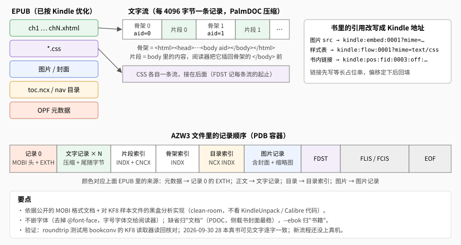

# AZW3 写出器

Kindle PW12 用 USB 传书只认 AZW3（KF8），不认 EPUB（2026-09-27 真机实测）。`crates/azw3` 把已经按 `kindle` 模式优化过的 EPUB 转成 AZW3，只做格式转换，不改内容。

书库生成 `kindle` 模式时自动调用它（先按和别的模式同一套规则优化出 EPUB，再转）；单独用是 `epub-to-azw3`（`./install.sh --tools` 装）：

```sh
epub-optimize --device=kindle 输入.epub 优化后.epub
epub-to-azw3 [--ebok] 优化后.epub 输出.azw3
```

AZW3 只是**产物**格式，不是输入：入库仍然只收 EPUB、CBZ。



## 来源：clean-room

- **公开文档**：MobileRead Wiki 的 MOBI 页面，包括 PDB 容器、MOBI 头、EXTH、尾随字节、INDX/TAGX、FLIS/FCIS/EOF。
- **黑盒数据分析**：KF8 特有的部分（片段/骨架/目录索引的标签、FDST、`kindle:pos`/`embed`/`flow` 地址、记录 0 的 8KB 填充）MobileRead 没有文档，都是从样本 AZW3 文件的字节推出来的。分析脚本在 `tools/kf8/`。
- **不看** KindleUnpack、Calibre 的代码。它们是 GPL-3.0，照抄会让产物变成 GPL 衍生作品。
- 读取侧 `azw3::read::{palm, kf8}` 也是 clean-room 实现，**只给写出器做往返自检和测试用**，不是输入格式（入库遇到 AZW3 照样拒收）。

## 怎么写

| 步骤 | 模块 | 做法 |
|---|---|---|
| 读 EPUB | `book.rs` | 元数据（OPF Dublin Core）、spine 里的 XHTML、CSS、图片（JPEG/PNG/GIF；静态 WebP 解码后转成 PNG，像素不变）、封面、目录（NCX，没有就用 EPUB3 nav 里 `epub:type` 含 `toc` 的那个，和清洗层同一份解析） |
| 排版 | `text.rs` | 每个 XHTML 拆成**骨架**（`<html><head>…<body aid="N"></body></html>`）和**片段**（body 里的内容），依次排成"骨架、片段、骨架、片段…"。CSS 各自一条流 |
| 改写引用 | `text.rs` | 图片 → `kindle:embed:资源序号`；样式表 → `kindle:flow:流序号`；书内链接 → `kindle:pos:fid:片段号:off:片段内偏移`（base32）。标签和属性用 `bookconv::html` 扫（属性值里有 `>` 也不会截断）；链接目标认 `id` 和 `<a name>`；路径和锚点先还原字符引用再百分号解码；书里原有的 `aid` 属性去掉 |
| 索引 | `indx.rs`、`container.rs` | 片段索引、骨架索引、目录索引（INDX + TAGX + CNCX） |
| 压缩 | `palmdoc.rs` | 每 4096 字节一条记录，PalmDOC 压缩（哈希链找回指，每个 3 字节前缀最多看最近 64 处），多字节字符跨记录时加尾随字节 |
| 组装 | `container.rs` | 记录 0（PalmDOC 头 + MOBI 头 + EXTH）、文字记录、索引、图片（含封面和高 330 的缩略图）、FDST、FLIS、FCIS、EOF |

**链接回填**：链接指向的偏移要等全部文档排完才知道，所以先写一个等长的占位串，并**记下占位串的位置**；排完后按位置回填。回填不改变任何偏移，也不会误改正文里恰好相同的文字。

**目录索引**：条目先放完第 0 层、再放第 1 层（和样本一致），父子关系用条目下标表示。去掉无效目录项后层级可能断档（0 直接到 2），读入时先修成每项最多比前一项深一级。

## 取舍

- **漫画写成固定版式**：OPF 里有 KindleGen 约定的 `<meta name="fixed-layout" content="true"/>` 时，这一组声明（`fixed-layout`、`book-type`、
  `orientation-lock`、`original-resolution`、`zero-gutter`、`zero-margin`）原样写成同名的 EXTH 记录 122–128（编号见 MobileRead Wiki 的 MOBI 页）。
  书库的 `kindle` 模式给漫画写上这组声明、画布是整屏 1272×1696（`bookconv::comicfxl`），Kindle 按 1:1 整页显示、离屏幕 1px
  （流式排版下 Kindle 强制留页边距做不到；2026-09-30 测试书截图逐像素对齐）。没有 `fixed-layout = true` 的书这组一概不写。
- **不嵌字体**：去掉 `@font-face`，字体交给阅读器设置。
- **`<head>` 里只留 title、meta、link、style、base**：EPUB 阅读器不显示 `<head>`，Kindle 却会把里面散落的文字、图显示在章首
  （《绝叫》原书每章 `<head>` 里漏进一段样式代码，Kindle 上满页代码，2026-09-30 真机）。正文不动。
- **SVG 图片、动画 WebP 不支持**：转换时给出警告，引用保持原样。静态 WebP 转成 PNG；漫画里的 GIF、WebP 页优化器已经转过了。
- **归类**：缺省"文档"（PDOC），侧载书的封面显示最稳；`--ebok` 归到"书籍"。书库生成时用缺省。
- **唯一 ID**：书库生成时由书的 id 和入库时间派生，重建出来还是"同一本书"，Kindle 上的阅读进度不丢。
  单独用 `epub-to-azw3` 时由 OPF 的唯一标识符派生（没有就用整份 OPF），时间取 `dcterms:modified`：同一本书每次转出来逐字节一样。
- 日漫（OPF spine 写了 `page-progression-direction="rtl"`）写 EXTH 527 = rtl（翻页方向在真机上还没专门看过）。
- 找不到目标 id 的链接、目录项会落到所在章节开头，并给出警告（书库生成时显示在这本书的输出里）。

## 验证

- `crates/azw3` 的单元测试和 `tests/roundtrip.rs`：用 `azw3::read` 读回来，核对索引、链接偏移、目录层级。
- `tools/kf8/textcheck.py 文件.azw3 源.epub`：EPUB 按 spine 顺序、AZW3 按片段顺序取正文的可见文字（去掉标签、注释、script/style，还原字符引用，不计空白），
  整本书的字符序列逐字比对，一致时报 `SAME`，不一致时报第一处差异、退出码 1。源 EPUB 用**优化后的**那份（AZW3 就是从它转的）。
- `tools/kf8/` 另有 `dump.py`（记录 0、MOBI 头、EXTH）、`indexes.py`（FDST、片段/骨架/目录索引），`kf8lib.py` 是它们共用的只读解析。
- **本机**（2026-09-30）：`~/Documents/ereader/books` 里 28 本文字书和一卷漫画按 `kindle` 模式优化 → AZW3，`textcheck.py` 都是 `SAME`（包括 134MB 的《金庸作品全集》）；
  196 页的《哆啦A夢全彩版》卷01 写成固定版式，每页 1272×1696 灰度，AZW3 约 107MB。
- **Kindle PW12 真机**（2026-09-27，当时的 AZW3 线，删掉之前）：测量书；《疯探》（封面、章标题独立一页、字号字体可调、目录跳转）；《桥头楼上》（节缩进挂在章下、跳转正确）；
  《ABC谋杀案》（注释标号跳转与返回）；135MB 漫画能打开、翻页正常。
- **Kindle PW12 真机**（2026-09-30，现在的产物）：文字书字号字体、分页、目录、注释跳转与返回 ✓（《绝叫》的两处问题修好后复验）；固定版式漫画整页铺满、离屏幕 1px ✓（测试书截图逐像素对齐，《哆啦A夢》目测）。
  逐条见[验证情况](typesetting.md#验证情况)。

改了会影响产物字节的地方，要把 `azw3::WRITER_VERSION` 加一（见[开发 · 版本号](development.md#版本号)）；怎么确认一次改动没改变产物，见[开发 · 真书回归检查](development.md#真书回归检查)。
