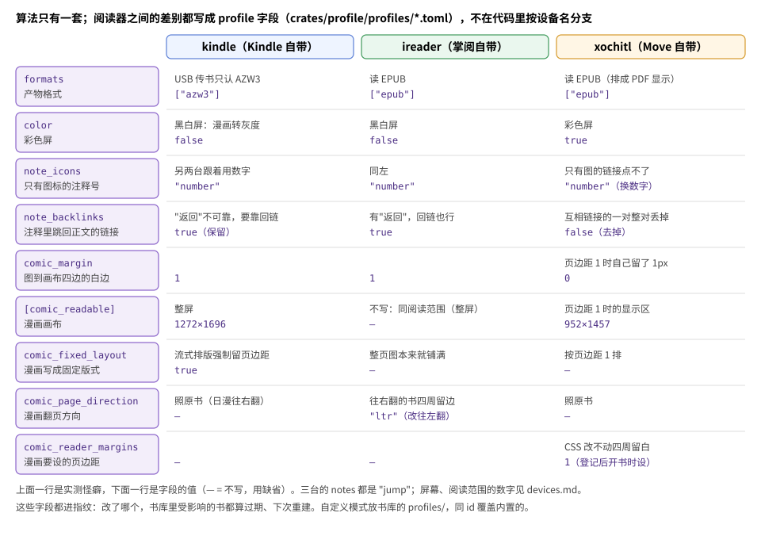
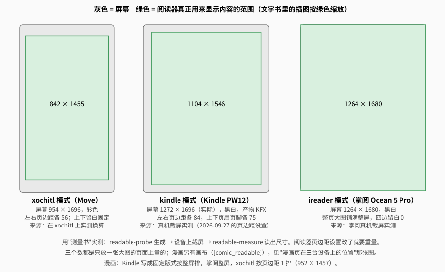
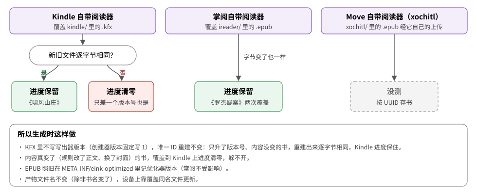

# 设备与阅读模式

## 阅读模式和它的字段

优化按**阅读模式**（profile）来：一种阅读软件在一块屏幕上的样子，一个模式出一份产物。每个模式是一个 TOML 文件，文件名就是 id（`--device=` 的值）。
内置的在 `crates/profile/profiles/`，编译时整个目录嵌进程序，**增删模式只要增删文件，不用改代码**。

| 模式 | 给谁读 | 产物 | 屏幕（截图像素） | 文字书阅读范围 | 漫画画布 | 黑白彩色 |
|---|---|---|---|---|---|---|
| `kindle` | Kindle Paperwhite 12 代签名版自带阅读器 | KFX（漫画固定版式） | 1272×1696，300ppi | 1104×1546 | 1272×1696（整屏，固定版式） | 黑白 |
| `ireader` | 掌阅 Ocean 5 Pro 自带阅读器 | EPUB | 1264×1680，300ppi | 1264×1680 | 1264×1680（整屏） | 黑白 |
| `xochitl` | reMarkable Paper Pro Move 自带阅读器 | EPUB | 954×1696，264ppi | 842×1455 | 952×1457（页边距 1） | 彩色 |

### 怪癖 → 字段

算法只有一套（`OptimizeOpts::for_profile`），阅读器之间的差别全写成字段，**不在代码里按设备名分支**。每个字段对应一条真机上踩到的怪癖：



| 字段（缺省） | 意思 | `kindle` | `ireader` | `xochitl` | 为什么（实测怪癖） |
|---|---|---|---|---|---|
| `formats`（必填） | 产物格式 | `["kfx"]` | `["epub"]` | `["epub"]` | Kindle 自带阅读器 USB 传书不认 EPUB；`kfx` 是先按同样规则优化出 EPUB 再转（AZW3 写出器 2026-10-09 删了，KFX 取代） |
| `color`（必填） | 彩色屏 | `false` | `false` | `true` | 黑白屏的漫画转 256 级灰度 |
| `[screen]`、`[readable.<格式>]` | 屏幕、真实可阅读范围（不写 = 屏幕） | 1272×1696、1104×1546 | 整屏 | 954×1696、842×1455 | 阅读器各自留页边距、页眉页脚，见[可阅读范围](#可阅读范围) |
| `notes`（必填） | 完整优化时注释怎么写：`"jump"` 普通链接、注释搬到章末；`"popup"` 再标上 `epub:type="noteref"` + `<aside epub:type="footnote">`。**只修复时不生效**（xochitl 只用它的搬移部分） | jump | popup | jump | 掌阅自带阅读器认弹窗（2026-10-05 真机）；xochitl 只认同文件跳转。Kindle 的弹窗由 KFX 写出器自己配（见[排版 · 注释](typesetting.md#3-注释完整优化弹窗小一号)） |
| `note_icons`（`"keep"`） | 只有图标的注释标号：保留图标，或换成上标数字。只修复时只在开了 `repair_note_links` 时生效 | number | number | number | xochitl 里只有图的链接点不了、CSS 限不住图标；另两台也用数字，都验证过能跳 |
| `note_backlinks`（`true`） | 保留注释里"跳回正文"的回链。只修复时同上 | 保留 | 保留 | 去掉 | Kindle 点注释后没有可靠的"返回"，要靠回链；xochitl 遇到互相链接的一对会整对丢掉（正向也点不动） |
| `comic_margin`（1） | 漫画的图到画布四边的白边（像素） | 1 | 1 | 0 | xochitl 页边距设成 1 后自己就留了 1px |
| `[comic_readable]`（= 阅读范围） | 漫画画布 | 1272×1696 | 不写 | 952×1457 | 漫画要贴屏幕边，画布和文字书的阅读范围不同 |
| `comic_fixed_layout`（`false`） | 漫画写成固定版式 | `true` | — | — | Kindle 流式排版强制留页边距（最小档左右 101px），固定版式才按画布 1:1 整页显示 |
| `background_images`（`false`） | 保留 CSS 背景图（`background` 简写拆成背景色、背景图、重复、位置等分项） | `true` | `true` | — | xochitl 不认 `no-repeat`，把背景图平铺满页盖住正文；掌阅不认 `background` 简写（2026-10-05 真机对照书），拆开写就正常 |
| `background_sizing`（`true`） | 保留背景图时也留 `background-size`、`background-attachment`；去掉时整页背景图（`body`/`html` 上的）按原书的尺寸意图预先缩好、一律不超出阅读范围（整张图看得见；v48、v49，见[排版 · 背景图](typesetting.md#1-解开字体字号行高的锁别的样式不动)） | 留 | 去掉 | — | 掌阅写了尺寸会把图挤变形、不写又按图自身像素显示（大图只露出一角），所以去掉尺寸、图预先缩好；Kindle 留着（和 Amazon 写法一致） |
| `css_rgba`（`true`） | 阅读器认 CSS 的 `rgba()` 颜色；`false` 时换成 `#rrggbb`（不透明的颜色不变，半透明按白底混合，全透明写 `transparent`；v49） | 认 | 不认 | 认 | 掌阅把 `rgba()` 那条声明整条作废（《绍宋》深红底色显示成白底），`rgb()`、`#rrggbb` 认（2026-10-06 真机测试书） |
| `caption_fit`（`false`） | 带图注、按满宽显示会超出一页的图给 `` 写行内宽度百分比，图和图注同页（v50，见[排版 · 插图](typesetting.md#8-插图)） | 开 | 开 | — | 掌阅、Kindle 不认多看图集，竖长的人物图撑满一页、图注掉到下一页；掌阅不认 `max-height`、`page-break-inside`，宽度百分比认（2026-10-06 真机 adb 截屏）；KFX 写出器只认图片宽度。xochitl 没测过（也不认行内样式） |
| `image_alpha`（`true`） | 阅读器能正确显示图片的透明通道；`false` 时正文 ``/SVG `<image>` 用到的、有透明像素的 PNG 先合成到白底（CSS 背景图不动；v50） | 不能 | 能 | 能 | Kindle（KFX）把透明处显示成黑色（《绍宋》章标题图，2026-10-06 真机），掌阅显示正确 |
| `text_repair_only`（`false`） | 文字书只修复：EPUB 3 规范整理和目录到节，文字、图片、样式一概不动；上面 `background_images` 到 `image_alpha` 这些文字书的规则都不生效，注释的规则只在开了 `repair_note_links` 时生效（见[排版 · 只修复](typesetting.md#只修复三个模式的文字书)） | `true` | `true` | `true` | 用户 2026-10-08 定：不动书里任何文字、图片、格式、样式。漫画不受影响 |
| `kindle_rules`（`false`） | 只修复的文字书照 Send to Kindle 的规则统一：标签缺省样式 `eink-ua.css`、正文字体用阅读器字体、body 左右边距不要、文字对比度 4.5（见[排版 · 只修复](typesetting.md#只修复三个模式的文字书)） | — | `true` | `true` | 用户 2026-10-08 定三台统一一套规则；Kindle 由 KFX 写出器照做 |
| `repair_note_links`（`false`） | 只修复时仍保证注释能点：注释搬进本章、改同文件锚点，按 `note_backlinks`、`note_icons` 处理 | — | — | `true` | xochitl 只认同文件 `#锚点`、只有图的链接点不了（用户 2026-10-08：xochitl 只保障注释可跳） |
| `comic_format`（不写） | 漫画另用一种产物格式（要在 `formats` 里） | — | — | — | 内置模式都不写（kindle 2026-10-05 曾写 `azw3`，KFX 固定版式真机通过后去掉），留给自定义模式；写了时是不是漫画按优化器的判定 |
| `comic_page_direction`（照原书） | 漫画翻页方向改成 `"ltr"`/`"rtl"` | — | `"ltr"` | — | 掌阅遇到往右翻的书，整页图四周留左右 92、上下 124px |
| `comic_reader_margins`（不写） | 漫画在阅读器里要设的页边距：写标记给登记脚本、文字页补回留白 | — | — | 1 | xochitl 四周留白 CSS 改不动，只有页边距设置管用（界面只有 28/56/112 三档） |
| `[deliver]`（不写 = 产物放电脑上） | 产物怎么送到设备（2026-10-07，见[使用指南 · 产物放在哪](usage.md#产物放在哪)）：`kind = "mtp"` + `mount`（jmtpfs 挂载点名）+ `dir`（存储根目录下的目录）；`kind = "xochitl"` + `hosts`（依次试的 `用户@地址`）+ `port`（Move 上书架服务的本机端口） | mtp：`kindle`、`documents` | mtp：`ireader`、`documents` | xochitl：`root@10.11.99.1`、`root@10.42.0.224`，8790 | 不影响产物内容，不进指纹 |

- 影响产物的字段都进指纹，改了哪个，受影响的书都算过期、下次重建；文字书、漫画分开算，只管一路的字段只进那一路（见[架构 · 指纹](architecture.md#指纹)）。不进指纹的：`name`、`[deliver]`（只管怎么传，不影响产物）。
- 表里 `background_images` 到 `image_alpha` 这几个字段是文字书完整优化时的规则，内置三个模式的文字书都只修复（`text_repair_only = true`），它们只对漫画（清洗层两路都过）和没开只修复的自定义模式起作用。
- **掌阅自带阅读器的词典**（2026-10-06 真机）：内置有道词典（存储根 `dict/` 下的 `c2170331.ydd`、`e2170331.ydd` 等），也能查在线翻译；自己的 **MOBI 词典直接拷进 `iReader/dict/`** 就能在查词里用（《牛津高阶英语双解》68MB、《现代汉语词典》9MB ✓，不用转格式；社区说法是单本不超过 100MB，没验证上限）。（`mobi-dict-to-stardict` 转 StarDict 是当初给 KOReader 用的，现在两台都不装 KOReader。）
- **掌阅自带阅读器的字体**（2026-10-06 真机）：字体都在共享存储的 `iReader/fonts/`，自带的（方正新书宋等，删了会自动重新下载）和自己导入的放在一起；**字体列表显示的就是文件名去掉扩展名**，不读字体里登记的名字，自带字体的文件名本来就是中文（`方正新书宋.TTF`）。所以导入的字体想显示中文名，就把文件改成中文名（`SourceHanSerifSC-SemiBold.otf` → `思源宋体 SemiBold.otf`）。阅读器设置（`text_book_config.db` 的 `fontFamily`）记的也是这个名字，改名后用到它的书要重新选一次字体。
- **掌阅的系统字体**（「系统 → 设置 → 字体样式」，管系统界面，和阅读器的字体列表是两套；2026-10-06 真机）：导入的字体按安卓的可更新字体存进 `/data/fonts/files/<随机>/<PostScript 名>.ttf`，**显示的是字体内部登记的中文家族名**（名字表 ID 1，语言 0x804），和文件名无关（方正姚体 → 「方正姚体」）。字体带了排版家族、排版子族（ID 16、17）时名字会被拆坏：更纱黑体（ID 1「更纱黑体 UI SC SemiBold」、ID 16「更纱黑体 UI SC」、ID 17「SemiBold」）显示成「SC SemiBold」。**只改名字表就好**：ID 1/4 改成「更纱黑体 UI」（英文「Sarasa UI」）、ID 2 改成 Regular、去掉 ID 16/17、换个新的 PostScript 名（ID 6，免得和已导入的那份冲突），字形、cmap、宽度等表逐字节不动（fontTools 改的），重新导入后显示「更纱黑体 UI」✓。
- **掌阅开 adb**：设置里藏了「关于本机」，要装「设置入口」小应用（代码在 koreader-setup 仓库的 `android-settings/`，独立的安卓应用，不需要 KOReader）打开它、连点版本号开开发者选项，再开 USB 调试；adb shell 是 root；每次开机 USB 调试被关。
- 不做成字段、各模式一律处理的怪癖：掌阅自带阅读器遇到文件名里有 `*`、`:` 这类字符的封面图（《春雪》《飘》原书的 `**::…jpg`），书架没有封面缩略图（2026-10-06），清洗时一律改名（见[排版 · 目录与其它修复](typesetting.md#其它修复)）。
- 写了不认识的字段、格式，`comic_page_direction` 写了别的值，都会报错，防止拼错后被悄悄忽略。例外：以前的 `ppi` 字段已去掉（没有代码用它），旧文件里写着照收、不报错。
- 屏幕、阅读范围、漫画画布都要写成竖屏（宽 ≤ 高），阅读范围和画布不能超过屏幕，否则报错。
- **按截图的像素写**：Kindle 截图是 1272×1696（设备实际的显示缓冲区），标称 1264×1680，写的是前者。
- **自定义模式**：放在书库的 `profiles/<id>.toml`，同 id 覆盖内置的；`booklib devices` 会列出来。id 不能以 `.` 开头、不能含逗号或斜杠（`--device=` 用逗号分隔，id 还要当目录名）；`profiles/` 里的隐藏文件跳过。

```toml
# crates/profile/profiles/ireader.toml（去掉了注释）
name = "掌阅自带阅读器（iReader Ocean 5 Pro）"
color = false
formats = ["epub"]
notes = "popup"
background_images = true
background_sizing = false
css_rgba = false
note_icons = "number"
caption_fit = true
text_repair_only = true
kindle_rules = true
comic_margin = 1
comic_page_direction = "ltr"

[screen]
width = 1264
height = 1680

[readable.epub]          # 段名跟产物格式走：kindle 写 [readable.kfx]
width = 1264
height = 1680

[deliver]
kind = "mtp"
mount = "ireader"
dir = "documents"
```

**不对应字段、所有模式统一处理的怪癖**（以后某台不一样了再做成字段）。「只修复也做」一栏是文字书现在还做不做（[排版 · 只修复](typesetting.md#只修复三个模式的文字书)）；漫画都做：

| 阅读器 | 怪癖 | 统一的处理 | 只修复也做 |
|---|---|---|---|
| xochitl | 正文链接只认同一文件里的 `#锚点` | 注释搬到同一文件的章末 | 只有 Move（`repair_note_links`，[排版 · Move：保证注释能点](typesetting.md#move保证注释能点)） |
| xochitl | 不认行内样式；`padding` 不认 | 居中、居右换成类；补留白用 `margin` | 不做 |
| xochitl | NCX 的 `dtb:uid` 和 OPF 不一致时不显示目录 | 对齐成一致 | 做 |
| xochitl | 背景图会平铺满页、盖住正文 | 去掉背景图 | 不做 |
| xochitl | 页边距 1 时，带类的 `<body>` 里图会被吃掉约 20pt 宽 | 漫画图页去掉 body 的类 | —（只管漫画） |
| xochitl | 找 NCX 只认 manifest 里 `id="ncx"` 的项，叫别的原生目录入口不出现 | NCX 的 manifest id 改成 `ncx` | 做 |
| xochitl | 封面条目 id 带点、又只有 `<meta name="cover">` 时取不到封面 | `<meta name="cover">` 和 `properties="cover-image"` 同时写 | 做（EPUB 3 规范整理） |
| xochitl | 严格 XML：同一标签两个 `id` 整章空白，OPF 不合法整本只排 1 页 | 合并重复 `id`，XHTML、OPF 一律修成合法 XML | 做 |
| 三台 | 不支持 CSS 断字 | 规则留着，不插软连字符 | —（只修复不加断字规则） |

其它实测行为（不需要处理）：Kindle 侧载书归"文档"（PDOC）时封面最稳；Kindle 书旁 `.sdr` 里的进度文件只写不读（AZW3 时代的 `.azw3f`；KFX 的 `.yjf` 见[附录](#自带阅读器之间能不能同步进度2026-09-30-真机)）；掌阅用中文字体显示英文时弯引号是全角宽；xochitl 每本书排出的 PDF 最后多一页空白、页边距设置只对单本书、USB 网页上传有体积上限（见 [xochitl · 传书与上传](xochitl.md#传书与上传)）。xochitl 的怪癖来由、细节和验证程度集中在 [xochitl 阅读器踩坑](xochitl.md)。

### 为什么这样分

- **按设备自带的阅读器分模式**：Kindle 单独一个，因为 USB 传书不认 EPUB（认 AZW3、KFX，现在出 KFX）、强制留页边距、漫画要写成固定版式；掌阅屏幕和 Kindle 一样是 7 英寸 300ppi 黑白屏，但读 EPUB、整页图铺满整屏；Move 是彩色屏、怪癖最多。
- 旧的设备 id（`kindle-pw12-sig`、`ireader-ocean5-pro`、`rmpp-move`、`rmpp-move-koreader`、`koreader`）已经不是模式了，书库里它们的旧产物不再管理。来龙去脉见[决定记录](decisions.md)。

## 可阅读范围



**原理**：`[screen]` 是整块屏幕，但阅读器要留页边距、页眉页脚，真正显示内容的区域更小。图按这个区域缩放，才能正好放下，不会被阅读器再缩一次或留出白条。

- 有实测值就用实测值（`[readable.<格式>]`），没有就退回整屏。
- **阅读器里的页边距设置变了，阅读范围也会变**，要重新量。
- 程序里不写死屏幕数字，一律从模式读。

### 各模式的数字

**`kindle`：文字书 1104×1546，漫画整屏 1272×1696。**
- 2026-09-27 用测量书（当时转成 AZW3）截屏实测：左右页边距各 84，上下页眉页脚各 75。KFX 是同一个阅读器、同样的页边距设置，沿用这组数（没单独量过）。
- 页边距调到最小后左右还有 101px，所以流式排版下离屏幕 1px 做不到；漫画写成固定版式，Kindle 按画布 1:1 整页显示：测试书截图和页面图逐像素对齐，四边偏差 0（2026-09-30）。
- 测量书里比页面窄的图靠左，实际文字书里的插图不靠左（2026-10-01）。

**`ireader`：1264×1680（整屏）。**
- 2026-09-27 截屏实测：只放一张大图的页面，掌阅把图铺满整屏（连页眉页脚区域也盖住），四边留白 0，所以 1px 白边就是离屏幕 1px。图文混排时图受正文页边距限制，不适用。
- 书声明了往右翻（`page-progression-direction="rtl"`）时不铺满，四周留左右 92、上下 124px（2026-09-30：只差这一个属性的两本测试书，一本铺满、一本留边；固定版式、页面写法都不影响）。所以漫画改成往左翻，之后测试书截图离屏幕 0–1px。

**`xochitl`：文字书 842×1455，漫画 952×1457。**
- 默认页边距 56：宽 = 954 − 2×56；高按固定的上下留白换算（2026-09-21 实测）。改成 28 档 → 宽 898。
- 读 xochitl 排出的 PDF 核实（2026-09-29）：整页图原像素放在 (56, 112)，离屏幕左右 56、上 112、下 129px；`@page{margin:0}`、负外边距、去行高都不起作用，只有页边距设置能缩左右。
- 页边距设成 1 时图框左上角在 (1, 112)、宽 952、高 1457：952×1457 的页原样显示，离屏幕左右各 1px、上 112、下 127px（上下是 xochitl 固定留的）；文字页的字离边约 58px。

怎么用这些数字做到离屏幕 1px，见[排版 · 离屏幕边缘 1px](typesetting.md#离屏幕边缘-1px三种做法)。

### 在真机上测量

用"测量书"：书里有一张竖长和一张横宽的纯黑大图，阅读器会把它们等比缩小到放得下为止。竖长图显示的高度就是可用高度，横宽图的宽度就是可用宽度。

```sh
# 1. 生成测量书（Kindle 还要转成 KFX）
readable-probe 测量书.epub
cargo run --release -p kfx --bin epub-to-kfx -- 测量书.epub 测量书.kfx   # epub-to-kfx 不随 install.sh 装

# 2. 拷到设备上，用要量的阅读软件打开，翻到"竖长图""横宽图"两页各截一张屏

# 3. 从截图里找最大的黑色区域，输出可以直接贴进 TOML
readable-measure --device=kindle 竖长.png 横宽.png
```

给了 `--device` 就按它的产物格式写段名（Kindle 是 `[readable.kfx]`，其余 `[readable.epub]`）；没给写 `[readable.epub]` 并提示。贴进对应的模式文件，注释里写明测量日期和条件（哪个阅读软件、页边距设置）。

## 加一个阅读模式

1. 写 `<id>.toml`：`name`、`color`、`formats`、`notes`、`[screen]`。
2. 在真机上用那个阅读软件量可阅读范围，写进 `[readable.<格式>]`；量不了先不写，按整屏处理。
3. 把阅读器的特殊行为记进上面的表；需要不同处理的做成字段，不在算法里按模式名写分支。
4. 真机上看过文字书和漫画，再在[验证情况](typesetting.md#验证情况)里写"✓"。

## 重拷书以后进度还在不在

**这是"覆盖产物后进度保不保留"的唯一出处**，别处都链到这里。规则或书有更新时，重新生成的产物文件名不变（除非书名变了），`sync` 直接覆盖设备上的旧文件（Kindle、掌阅；Move 见下表）。覆盖以后（2026-10-06 真机，当时是手工拷；2026-10-07 起 `sync` 用同样的方式覆盖）：



| 设备 | 结果 | 我们怎么配合 |
|---|---|---|
| Kindle 自带阅读器（KFX） | **字节有任何不同就清零**（只差写进书里的写出器版本号也一样，《绍宋》），**逐字节相同才保留**（《啸风山庄》）。`.sdr/*.yjf` 里的 `lpr` 是阅读位置，书换了以后从头重新记 | KFX 里不写写出器版本（创建器版本固定写 `1`），容器 id 重建不变；内容没变的书升版本后重建出来逐字节相同。内容真变了（规则改了正文、换了封面）的书覆盖后进度清零，躲不开。见 [KFX · 阅读进度](kfx.md#阅读进度2026-10-06-真机) |
| 掌阅自带阅读器（EPUB） | **字节变了也保留**：同一本《罗杰疑案》只改 `META-INF/eink-optimized` 的版本号、重新打包覆盖，两次都还停在原来的位置 | 2026-10-09 起书里不再记版本号（标记只写 `full`/`core`），升版本后内容没变的书逐字节相同、不重传 |
| Move（xochitl） | **进度回到开头**（2026-10-09《绍宋》两次原地替换）：替换时正开着的书被关掉；再打开整本重新排版，页面表转成新格式（`.content` 的 `formatVersion` 1 → 2、`cPages`，旧排版多出的 435 页标成已删除），进度落回开头附近。新内容显示正常（以前「排过版的书原地换文件仍显示旧内容」的反例这次没出现）。之后退出再打开照常保存进度（《绍宋》《罗杰疑案》实测） | 仍原地替换（保留 uuid）：保住所在文件夹、书架上不多一本；加新删旧进度一样丢。替换后把旧进度写回去要在书架服务里做（不在本仓库） |

- **文件名要稳定**：覆盖靠同名文件。书名变了产物文件名才跟着变：`sync` 传一份新名字的、删掉旧名字的（Move 上进回收站），进度不会跟过去。
- 几台之间不能同步进度，见下面[附录](#自带阅读器之间能不能同步进度2026-09-30-真机)。

## KOReader

**现状：两台都不装 KOReader（2026-10-06 用户定）**，三台都用自带阅读器，读 `sync` 直接传上去的产物（Kindle：KFX，掌阅、Move：EPUB）。2026-10-02～10-05 Kindle、掌阅曾日常开机直接进 KOReader（独占）；10-05 Kindle 上 `koreader/` 不在了（像是重置过）。下面是当时的记录，留作参考（当时产物还放在电脑上的 `ireader/` 等目录里）。

- **读哪份产物**：KOReader 读 `ireader/` 的 EPUB（KOReader 不认 AZW3、打不开 KFX），拷到存储根的 `books/`（KOReader 的起始目录）。
- **没有单独的模式**：`ireader` 的阅读范围是在掌阅自带阅读器上量的，KOReader 里没单独量，漫画离屏幕是不是 1px 没验证。
- **进度同步**：两台的 KOReader 经自建的同步服务（KOReader 的 kosync 协议）按**文件名**认书、同步进度（当时要求 `ireader/` 产物文件名稳定的原因之一；现在的原因见[上一节](#重拷书以后进度还在不在)）。服务端归 vksight 仓库，设备上的设置在 koreader-setup 仓库。
- **词典**：用自己手上的 MOBI 词典，经本仓库的 `mobi-dict-to-stardict` 转成 StarDict（网上现成的 StarDict 版是未授权转制，不用）。现在掌阅自带阅读器直接用 MOBI 词典（见上面[字段](#怪癖--字段)下的说明），`mobidict` 暂时保留（用户 2026-10-06：别删）。
- **设备上的配置**（个人设置、手势、字体、插件、开机独占、USB 传书、前光）都在单独的仓库 **koreader-setup**，本仓库不管。
- Move 上不用 KOReader：屏幕刷新由 xochitl 那一层控制，翻页闪得厉害。

自带阅读器之间不能同步进度，见附录。

## 附录：调研

### xochitl 怎么存 EPUB 和阅读进度（2026-09-29 真机摸底，只读）

Move 系统版本 20260827；数据目录 `/home/root/.local/share/remarkable/xochitl/`，每本书一个 UUID、一组同名文件：

| 文件 | 内容 |
|---|---|
| `<uuid>.epub` | 传上去的原书，原样保存 |
| `<uuid>.pdf` | **xochitl 按当前设置把整本书排成的 PDF**，屏幕上显示的是它（阅读位置 = PDF 页码） |
| `<uuid>.content` | JSON：`fileType: "epub"`、排版设置（`fontName`、`lineHeight`、`margins`、`textScale`）、`pageCount`、`pages`、`redirectionPageMap` |
| `<uuid>.metadata` | JSON：`visibleName`（书名）、**`lastOpenedPage`（阅读进度，从 0 起：记 80 = 屏幕上第 81 页）**、`lastOpened`、`lastModified` |
| `<uuid>.epubindex` | 二进制（Qt 数据流）：头部有页面尺寸、字号、页边距、行距、字体名；之后按 EPUB 里的文件分组，记每个文件从 PDF 第几页开始、文件里各锚点在第几页——EPUB 位置 ↔ PDF 页码的对照表 |
| `<uuid>.local`、`.pagedata`、`.thumbnails/` | 本地标记、每页模板、缩略图 |
| `<uuid>.tombstone` | 删掉的书留下的标记 |

- 翻页后马上写 `.metadata`（书没关也写）。
- 改字号、字体、行距、页边距会整本重排：PDF、总页数、对照表都换新的。
- 用户没开 reMarkable 云同步。

### 自带阅读器之间能不能同步进度（2026-09-30 真机）

**不能原生同步**：Kindle 的云同步只管亚马逊推送的书，掌阅的云同步只在掌阅账号内，都没有公开接口互通。退一步"电脑当中转、连线时对齐"也只做得到一个方向：

| 设备 | 读进度 | 写进度 |
|---|---|---|
| Kindle（未越狱） | ✓ 现在出 KFX：进度在书旁 `.sdr/*.yjf` 的 `lpr`（如 `AUQAAAAAAAAA:3184`），怎么换算成全书位置没研究；真正的进度看来记在系统数据库里（MTP 看不到），见 [KFX · 阅读进度](kfx.md#阅读进度2026-10-06-真机)。（AZW3 时代是 `.sdr/*.azw3f` 的 `lpr`、`fpr`，值是 AZW3 解压后正文的字节偏移，能换算成第几个字；只有打开过的书才有） | ✗ 改文件 Kindle 不认、之后还会覆盖掉；删书再拷回也当新书从头开始 |
| 掌阅（未 root） | ✗ 共享存储里没有进度文件，`iReader/backup/ireader2.db` 是加密的；当时 ADB 没开（后来开发者模式能打开，adb shell 是 root，没再查） | ✗ |
| Move（xochitl） | ✓ `.metadata` 的 `lastOpenedPage` + `.epubindex` 对照表 | 可能能：像漫画页边距那样让 xochitl 自己设（没试） |

所以自带阅读器之间最多做到"连上电脑时，把 Kindle 的进度换算后推给 Move"（AZW3 时代的设想），没有做。当时日常的进度同步靠 KOReader（见上，现在不装了）。
