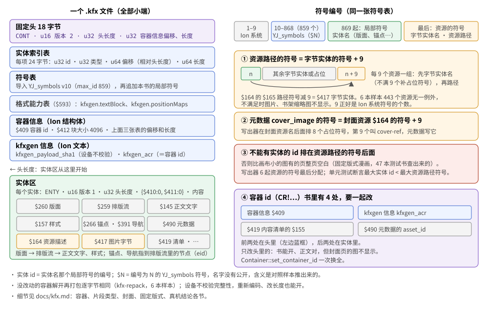

# KFX

Kindle 自带阅读器的新格式（增强排版）。2026-10-05 开始做 clean-room 的 EPUB → KFX 写出器，当天接进书库：`kindle` 模式出 KFX（文字书流式、漫画固定版式）。代码在 `crates/kfx`（Ion 编解码、容器读写、写出器，模块见[架构 · kfx 模块](architecture.md#kfx-模块)），命令 `epub-to-kfx`、`kfx-dump`、`kfx-repack`。

这篇按"怎么查出来的"记：先是容器和片段的结构，再是逐项对照样本推出的写法，最后是写出器本身和真机结论。真机结论没特别说明的都是 Kindle PW12、固件 5.19.6；2026-10-06 固件自动升到 5.20.1，之后看的会注明。

## 术语和样本代号

| 词 | 意思 |
|---|---|
| 实体（片段） | 容器里的一条记录：一个 id、一个类型（`$N`）、一段内容（Ion，或图片、字体的原始字节）。"片段"指同一个东西，按类型说时常用 |
| 符号、符号编号 | Ion 里的名字都存成编号：1–9 是 Ion 系统符号，10–868 是 Amazon 的共享符号表 `YJ_symbols`（v10，859 个；本文写成 `$N`，N 就是编号），869 起是本书自己的局部符号（实体名、资源路径等） |
| 实体 id | 实体名那个局部符号的编号（索引表里的 `u32 id`） |
| eid | 节点 id（`$155`），排版流里每个节点、锚点、目录都靠它指位置 |
| 版面、排版流 | 版面（section，`$260`）约等于 EPUB 的一个 spine 文件；排版流（storyline，`$259`）是版面里的内容树 |
| 资源路径 | 图片、字体资源描述里的 `$165`（字符串，同时也是一个局部符号），见[封面](#封面2026-10-05-真机) |
| PDOC / EBOK | 元数据 `cde_content_type`：PDOC 是"文档"（Send to Kindle 推下来的个人文档就是），EBOK 是"书籍"。写出器写 PDOC |
| 容器 id | `CR!…`，书里存了 4 处，要一起改，见[真机结论](#真机结论kindle-pw12固件-5196) |
| w7、w8、ss5 | 写出器拷到真机看的测试版本编号（w 是《ABC谋杀案》那一轮、ss 是《绍宋》那一轮），只在本文出现 |
| t1、对照 33/34/41、63/64、结构 21/22 | 改样本做的真机实验编号，内容在出现处写着 |
| 实验 1～10 | 见[删除实验](#删除实验2026-10-05-真机) |



## 资料来源（clean-room）

- **公开规范**：容器里的数据全是 [Amazon Ion](https://amzn.github.io/ion-docs/) 二进制（Apache-2.0 公开规范），编解码只照它写。
- **样本**：Kindle 上 Send to Kindle 推下来的个人文档（`documents/Downloads/Items01/*.kfx`，PDOC，明文，没有 DRMION 外壳）。
- **不能看的**：KFX Input/Output、DeDRM_tools、Calibre 的代码，以及照这些代码写的讲解（比如 deepwiki 上"KFX Format Handling"一类页面）——看了等于间接移植 GPL。
- 片段类型和属性名在 Amazon 的共享符号表 `YJ_symbols`（样本里是 v10，859 个）里，**没有公开的名字**；写出器只需要编号，含义靠样本对照推。下面都用编号 `$N` 写，括号里是推测的含义。

## 容器（样本 2026-10-05 读出）

全部小端：

| 偏移 | 内容 |
|---|---|
| 0 | `CONT` |
| 4 | u16 版本（2） |
| 6 | u32 头长度（实体数据从这里开始） |
| 10 | u32 容器信息偏移、u32 容器信息长度 |
| 18 起 | 实体索引表、符号表、格式能力表、容器信息，位置都由容器信息给出 |

- 容器信息之后、实体区之前是 kfxgen 信息（Ion **文本**）：转换器版本、`kfxgen_payload_sha1`（＝实体区的 SHA-1，设备不校验，写出器照样更新）、`kfxgen_acr`（＝容器 id）。
- **容器信息**（Ion 结构体）：`$409` 容器 id（`CR!…`），`$410`/`$411` 压缩、DRM 方案（样本都是 0），`$412` 块大小（4096），`$413`/`$414` 索引表偏移、长度，`$415`/`$416` 符号表偏移、长度，`$594`/`$595` 格式能力表偏移、长度。
- **索引表**：每项 24 字节 `u32 id, u32 类型, u64 偏移（相对头长度）, u64 长度`。
- **符号表**：`$ion_symbol_table`，导入 `YJ_symbols` v10（max_id 859），再追加本书的局部符号（片段名，像 `c2U3`、`s5G`、`content_12`）。实体里的 Ion 共用这张表。
- **格式能力**（`$593`）：`kfxgen.textBlock` v1、`kfxgen.positionMaps` v2。
- **实体**：`ENTY`、u16 版本（1）、u32 头长度，头是 Ion `{$410:0, $411:0}`，后面是内容（Ion；图片类 `$417` 是原始字节，样本里是 JPEG）。

## 片段类型（样本《ABC谋杀案》，275 个实体）

| 类型 | 个数 | 推测的含义 |
|---|---|---|
| `$145` | 40 | 正文字符串池：`{name, $146:[段落文字…]}` |
| `$259` | 40 | 排版流（storyline）：容器树，每个节点有 `$155` 位置 id、`$157` 样式、`$159` 类型，文字用 `$145:{name:<池>, $403:<下标>}` 引用 |
| `$260` | 40 | 版面（section），指向排版流 |
| `$157` | 22 | 样式：CSS 换成编号属性，长度是 `{$307:数值, $306:单位}`，字体名是原文（`仿宋`、`黑体`），语言 `zh-cn` |
| `$164` / `$417` | 1 / 1 | 图片资源描述（`image/jpg`、宽高）/ 图片原始字节 |
| `$258`、`$538` | 1 / 1 | 阅读顺序、文档级数据 |
| `$264`、`$265`、`$550`、`$609`、`$621` | 各 1 | 位置映射（`kfxgen.positionMaps`） |
| `$266` | 36 | 锚点 |
| `$389`、`$391`、`$395` | 1 / 4 / 1 | 目录、导航 |
| `$490` | 1 | 书的元数据：书名、作者、语言、`cde_content_type`（PDOC）、`ASIN`/`content_id`、`book_id` |
| `$585` | 1 | 转换器标记：`reflow-style`、`cn-reflow-language`、`yj_jpegxr_sd` 等 |
| `$597` | 40 | 附加信息 |
| `$419` | 1 | 容器内容清单 |

段落节点上的 `$696` 是一串小整数，长度跟文字相关，含义未知（可能是给中文排版的字符分类）。

## EPUB ↔ KFX 对照（2026-10-05，《ABC谋杀案》）

样本对应的原书在 `~/Documents/ereader/books/中文小说/`（6 本都在），按文字把 KFX 的 3044 个文字节点配回 EPUB 元素，只有 4 个没配上。EPUB 的 40 个 spine 项对应 40 个版面（`$260`）。另外跑了《罗杰疑案》（3095 个节点，没配上 2）、《绍宋》（45249，没配上 16）、《平凡的世界》（12178，没配上 346，待查）；《杀死一只知更鸟》一个文字节点都没找到，结构不一样，待查。6 本的样式里一共出现约 70 个属性，大多数还没对上。下面是从《ABC谋杀案》推出来的，**置信度中**，要用别的书和最小测试书核对。

**节点**（`$259` 里的）：`$159` 是节点类型，`$269` 是文字段落，`$270` 是容器（有边框、背景的块，比如带背景色的 `h1`：容器里再套一个 `$269` 放文字）。`$790` 是标题级别（`h1`→1、`h2`→2、`h3`→3）。`$155` 是位置 id。

**样式属性**（`$157`，`$173` 是样式名）：

| 属性 | CSS | 例子 |
|---|---|---|
| `$11` | font-family | `"仿宋"`（原样字体名） |
| `$16` | font-size | `{1.29167, $505}`（`$505`＝em） |
| `$13` | font-weight | `$361` bold、`$350` normal（2026-10-05 改正，原先写反了；原书 `blod` 这种错值按标签缺省，`h2` 是 bold） |
| `$34` | text-align | `$320` center、`$59` left、`$61` right |
| `$36` | text-indent | 2em → `{6.25, $314}` |
| `$42` | line-height | 按全书正文行高归一：正文是 `{1.0, $310}`（《ABC谋杀案》全书一个行高，所以一律 1.0；《绍宋》正文 1.5em → 1.0、行高 1em 的标题 → 0.667、没写行高的容器 normal 1.2 → 0.8） |
| `$47`/`$49` | margin-top/bottom | `{0.833333, $310}`（1em） |
| `$48`/`$50` | margin-left/right | `{1.302, $314}`（5pt） |
| `$52`/`$54` | padding-top/bottom | `{2.5, $310}`（3em） |
| `$19` | color | `4278190080`＝`0xFF000000`（ARGB） |
| `$70` | background-color | `0xFF01A0EA` |
| `$91`/`$96` | border-bottom-style/width | `$331` dotted；1.5px → `{0.675, $318}` |
| `$10` | 语言 | `zh-cn`（来自 `xml:lang`） |
| `$761` | ？ | `[$760]`，只出现在标题类样式上 |

**单位**：`$310`＝**本元素行高的倍数**（行高 1.0 的段落上 1lh＝1.2em：1em → 0.833333；行高 0.8 的容器上 7%＝2.24em → 2.333，行高 0.667 的标题上 0.5em → 0.625，2026-10-08《绍宋》）；`$314`＝百分比，按页宽 32em、1em＝12pt 换算（2em → 6.25%，5pt → 1.302%，`margin-top:30%` → 9.6em → 8.0lh）；`$318`＝pt（1px＝0.45pt）；`$505`＝em。

**px**：外边距、内边距、边框宽度都按 1px＝0.45pt（1em＝12pt）换算（《绍宋》`margin:-10px` → -0.3125lh）；字号的 px 照 CSS（16px＝1em）。

**UA 样式表**：没写外边距的 `<p>` 照样有上下 1em（《绍宋》正文段间 0.8333lh，原书 `p` 没写外边距）；写出器照 HTML 规范的 UA 样式表给 `p`、`pre`、`dl`、`blockquote`、`figure`、`h1`–`h6`（字号、外边距；左右 40px 按 0.45pt＝1.5em）。

**`$45: true`**＝`white-space: nowrap`（《绍宋》居中的诗句）；**`$349`**＝透明（全透明的边框颜色，`border: 35px solid rgba(0,0,0,0)` 加 border-image 的信件框；Amazon 不写 border-image，只留透明边框占位）。

**还没对上的**：见下面[Send to Kindle 的样式规则](#send-to-kindle-的样式规则)的「没照做」「不清楚」两部分（2026-10-08 写出器 11 前这里列的 `$569`、半粗、纯黑颜色、百分比都已经弄清并照做了）。

**外边距折叠由转换器做掉**：同一个 `p.bodycontent`（margin 1em 0）按位置得到不同样式：普通段落只有上边距 0.8333lh；章节最后一段多一个下边距；标题后的第一段上边距取前后两个边距里大的那个。写出器要自己做折叠。合成的边距放在哪一块：后一块有上边距时放在后一块的上边距，后一块没有上边距时留在前一块的下边距（《绝叫》「目录」标题的 1em 下边距、《绍宋》章号 `p.j11` 的 2px，2026-10-08）。

**别的书补充的**（《绍宋》《杀死一只知更鸟》）：

- 单个 `<br>` 是段落文字里的 `\n`，不拆段；连续两个 `<br>` 拆成两个 `$269`（《绍宋》卷首页：两段都带 `$790: 1`）。
- 行内样式是段落上的 `$142: [{$143: 起点, $144: 长度, $157: 样式}]`（字符下标，`\n` 也算一个）。
- **嵌入字体保留**：《绍宋》用 `@font-face` 嵌的字体，`$11` 变成 `j01-001-juan` 这种资源名。
- `body` 的背景色、背景图变成外层 `$270` 容器的样式（`$70` 背景色，`$479` 指向另一个样式，`$484`/`$547` 待查）。
- 全图片的书（《杀死一只知更鸟》福德姆图像小说版，277 页 JPEG）：每页一个版面，版面带图片宽高（`$66`/`$67`）、`$156: $326`、`$140: $320`；排版流里只有一个 `$271` 图片节点，`$175` 指向 `$164` 资源描述（`image/jpg`、`$422`/`$423` 宽高、`$165` 资源路径），图片字节在 `$417`。
- 《平凡的世界》没配上的 346 个节点：设备上的 KFX 是从另一版 EPUB 转的（诗句文字都不一样，比如「鱼儿水儿水上漂」/「鱼儿水上飘」），不算转换器的行为。

**`$696` 是分词**：一串「间隔, 长度」对，比如 `书名：ABC谋杀案` → `[0,2, 0,1, 0,3, 0,3]`，切成「书名 / ： / ABC / 谋杀案」。应该是 `cn-reflow-language` 给中文断行、选词、查词典用的。写出器要不要带、不带会怎样，要上真机试。

## Send to Kindle 的样式规则

2026-10-08 用户要求「理清楚 Send to Kindle 所有规则，完善写出器，并据此统一掌阅、Move 的规则」。方法：同一版 EPUB 分别经 Send to Kindle 和我们的写出器转成 KFX，按文字配对文字节点、逐属性汇总差异，再回原书 HTML/CSS 找成因（`tools/kfx/s2kcmp.py` 一本、`tools/kfx/s2kbatch.py` 一批：按书名在书目录里找原书，生成我们的 KFX 再比）。样本：用户从书库发的 **24 本文字书**（2026-10-08 先 21 本，后加《风起陇西》《狼厅》《消失的爱人》）（配上率 97%–100%，发的是和现在只修复产物等价的 EPUB；v51 产物比出来的差异更多，排除了）加一卷漫画，另有早先的《绍宋》旧版、列表表格测试书、固定版式样本。21 本合计的差异节点从第一轮的 53 万降到 19 万，剩下的绝大多数是下面「等价」里的写法。21 本测试书文字池逐字不变，漫画逐字节不变。

**照做的**（写出器 11）：

| 规则 | 依据（例子） |
|---|---|
| **字号按全书正文字号归一、相对根**：正文（字数最多的字号）写 1.0，别的按比例；`$505` 是根字号的倍数，不是父节点的 | 《啸风山庄》正文 1.167em 不写、1.083em 写 0.928；《疯探》正文 1.25em，没写字号的容器写 0.8、里面 1.2em 的作者行写 0.96 |
| **行高写成长度（`%`、em、px、pt）的按 CSS 算成绝对值往下继承**；归一后下限 0.6 | 《疯探》body `line-height:130%`、作者行写 0.833；《揭露人性》卷号算出 0.4、写 0.6 |
| **body 的左右外边距、内边距不写**；文件里有块的左（右）外边距是负的，这一侧照旧加到每块上 | 《人生海海》《张居正》body `margin:0 5pt` 不写；《罗杰疑案》章标题 `margin:-2em` 两侧都留、`-11.198%`=(-4em+5pt)/32；《平凡的世界》只有左边 `-1em` 的文件只留左边 |
| **左右外边距、内边距写包含块宽度的百分比**；长度按 CSS 的实际宽度算（body 的百分比边距算进去） | 《雪国》body 左右 1%，段落 1% 写 0.98%；表格单元格 0.2em 写 0.375% |
| **首行缩进：自己或祖先（含 body）有左右边距、内边距、边框时写百分比**，否则 em | 《人生海海》body 有 5pt，正文 2em 写 6.25%；《绍宋》旧版 body 没写，2em 照写 |
| HTML 表现属性当最低优先级的样式：块的 `align`、`<center>`、`<font size/color/face>`（size 1–7 = 10–48px，绝对字号） | 《福尔摩斯》`<p align="justify">`、`<font size="1">` 0.625、`size="7"` 3.0 |
| 整段只有行内元素（可以几层）时，最里层的文字样式并进段落；`<a>` 的颜色留在链接上 | 《人生海海》「版权信息」`<span class="大字"><span class="bold">`、《金庸》`<p><b>注…</b></p>` |
| 带背景、边框的块写成容器套文字时，里面的文字只写对齐；容器不写对齐 | 《罗杰疑案》带背景色的章标题 |
| 正文字体（字数最多的）写 `default`，嵌入了的也一样；备选整串照写（小写、逗号连接）；缺字体文件的照写原名 | 《疯探》`default,st,宋体,zw,sans-serif`、《绍宋》新版嵌入的 NotoSerifSCLight、《平凡的世界》FZLanTingSong 都写 `default`；《春雪》注释的 `ZY-KAITI` 照写 |
| 样式表写了 `font-weight` 的照写（normal 也写 `$350`）；`<b>`/`<strong>` 写 `$362`（bolder）；600 写 `$360` | 《罗杰疑案》`font-weight:normal` 的 h1；《金庸》《克莱因壶》的 `<b>` |
| **文字颜色和背景的对比度至少 4.5:1（WCAG）**：比背景暗的按比例压暗，比背景亮的往白调，这个方向到头还不够就反过来；没有背景按白页面；底下只有背景图的不调；缺省的黑字在深背景上也调 | 《阿加莎》白页面上 `#f5ac00` → `#9d6e00`、`#c87860` → `#a86551`，橙底 `#f0a200` 上的白字 → `#454545`，深蓝 `#0168b7` 上的黑字 → `#e4e4e4`（都是刚到 4.5 的值）；《雪国》背景图上的白字照写 |
| 没有背景处的近黑文字颜色不写；不透明的纯白背景不算背景 | 《疯探》`background-color:#ffffff` 的页不出容器 |
| 链接（`<a>`，有没有 href）的颜色写成 `$576`/`$577: {$19: 颜色}` | 《人生海海》目录 `color:#00C` |
| 块的宽度照写（百分比或 em）、带 `$546: $377`，em 宽度另加 `$65: 100%`；左右外边距 auto 的写 `$580`（都 auto `$320`、只有右 auto `$59`、只有左 auto `$61`）；有宽度的包裹层写成容器 | 《阿加莎》`width:3em;margin:2.5em auto 1.8em -2em` 的靠左小色块；《金庸》60% 宽的图注框 |
| `min-height` → `$62`，`height` 也写它；`box-shadow` → `$496`、`text-shadow` → `$497`（`{$498 颜色, $499 x, $500 y, $501 模糊}`） | 《恶女的告白》`min-height:2em`、《消失的爱人》扉页 `height:6em`；《雪国》注释框；《阿加莎》卷号 |
| CSS 的 148 个颜色名都认（以前只认 9 个）、`transparent` | 《狼厅》`color:brown` 写 `#a52a2a` |
| `word-break: break-all` → `$569: $570`；标题样式带 `$761: [$760]`；透明度舍去小数；边框的黑色不写；折叠后的外边距在后一块没有上边距时留在前一块 | 《绍宋》《绝叫》（第一轮） |

顺带修掉的老毛病：包裹层里只有一个 `margin:0` 的 `<p>` 时，`<p>` 自己的样式被包裹层的盖掉（《春雪》`<li><p class="footnote">` 注释的字号、缩进、行高都丢了）；列表项只有文字时同样丢过。

**等价、没照做的**（显示一样）：字号、行高是 1.0 时 Amazon 有时不写（规律没弄清）；`letter-spacing:0`、写明的 `font-style:normal`（`$12: $350`）、`font-variant:normal`（`$583: $349`）、`text-transform:none`（`$127: $383`）、`text-decoration:none`（`$23`/`$27`/`$554: $349`）Amazon 照写，我们不写；字体资源名 Amazon 叫 `j01-001-bangshu`，我们叫 `bangshu`；没有背景的包裹层 Amazon 有时也出容器（《绍宋》新版章名外的两层 div），我们摊平成边距。

**没照做的**：父子外边距折叠（Amazon 把容器里第一个子块的上边距并进容器，《消失的爱人》扉页；《绍宋》卷首语的背景容器真机已经 ✓，不动）；只有内边距的段落（《绍宋》旧版章号）Amazon 不套容器，我们套（2026-10-05 真机溢出）；图片的 em 宽度（《揭露人性》）、`$135`/`$788: $353` 不知道是什么。

**掌阅、Move 统一成同一套**（profile `kindle_rules`，`bookconv::wash::kindle_rules`，2026-10-08）：上面多数规则是把 CSS 换成 KFX 的写法，EPUB 阅读器照 CSS 排本来就是这样。会让 Kindle 和按 CSS 排的阅读器看起来不一样的，改进掌阅、Move 的书里（只改值、删声明，不加选择器）：标签缺省样式（`eink-ua.css`）、正文字体用阅读器字体（整条 `font-family` 去掉）、body 左右边距不要（负外边距那一侧照留）、文字对比度 4.5（按规则算：规则里写了背景色的按它；没写的只调亮度 ≤ 0.5 的颜色，白字浅灰多半压在背景图上）。**没统一的**：字号、行高按正文归一（Kindle 是阅读器的字号、行距设置当正文；掌阅、Move 按书里写的，各自的设置能调）；首行缩进写百分比（只在阅读器字号和 32em 不同时才看得出）；空段折边距。21 本测试书在掌阅、Move 两个模式下可见文字逐字一致、目录不变、XHTML 合法，22 本共改了 1700 处声明。真机：掌阅看过五本 ✓，Move 没看（见[排版 · 验证情况](typesetting.md#验证情况)）。

### 三台和 Send to Kindle 的一致性

`tools/kfx/s2kdev.py <Amazon KFX 目录> <书目录> <工作目录>`（2026-10-08 用户要「同步核查 xochitl、kfx、掌阅三者与 send to kindle 的一致性」）：每本书生成 kindle / ireader / xochitl 三份产物，Kindle 取写出器的 KFX，掌阅、Move 取 EPUB 按 CSS 原样算出的样式（`epub-to-kfx --styles`，`kfx::epub_text_styles`：和写出器同一套层叠，但不做 Kindle 专有的变换），都折算成和阅读器字号设置无关的量（字号、行高相对正文；上下边距按正文 em；缩进按本元素 em；左右边距按页宽 %；颜色、字体、粗细、斜体、对齐），按文字配对后逐项比。**掌阅、Move 量的是 EPUB 交给阅读器的样式，阅读器自己的怪癖不在其中**（真机看过的只有掌阅的五本，见 typesetting.md）。

24 本、约 50 万个文字节点，逐项一致率：

| 项目 | Kindle | 掌阅 | Move |
|---|---|---|---|
| 字号、粗细、斜体、对齐 | 100% | 100% | 100% |
| 行高 | 100% | 99.9% | 99.9% |
| 上边距 / 下边距 | 99.3% / 99.9% | 99.3% / 99.9% | 99.3% / 99.9% |
| 缩进、颜色 | 99.9% | 99.9% | 99.9% |
| 左边距 / 右边距 | 99.9% / 100% | 98.7% / 100% | 98.7% / 100% |
| 字体 | 99.9% | 99.4% | 99.4% |

三台共有的差异：空段折边距（Kindle 写出器 12 起照 Amazon 折，掌阅、Move 按 CSS 排一个空行；《金庸》《平凡的世界》《消失的爱人》）、Amazon 给没有背景的包裹层出容器（《绍宋》新版章名）、字体资源名。只有掌阅、Move 有的（共用样式表做不到逐元素、逐文件）：body 边距 Kindle 按文件定、EPUB 按字数多数定（《雪国》《平凡的世界》少数文件差 ≤5pt）；正文字体 Kindle 写 `default`、EPUB 只能删声明，删了会继承外层元素的字体（《啸风山庄》外层 div 的 AR MingU30 Light，两台都没装这个字体，显示上应当一样）；行高下限 0.6（《揭露人性》卷号）；背景色在外层元素上时文字对比度（《阿加莎》少数章标题）。

查出来修掉的：KFX 写出器颜色名不全（`brown`）；掌阅、Move 的正文字体判断（以前只看段落自己和 `p`/`body` 规则，《平凡的世界》字体写在 body 的类上认不出、ABC 把「楷体」当正文删了）——改成按继承逐元素算、按块统计字数（同 KFX）；body 边距（以前书里任一处有负外边距就全书都留，《雪国》《平凡的世界》）——改成按字数多数；不是 UTF-8 的样式表整份跳过（《啸风山庄》的 Big5 `CSS.css`）——改成单字节读写；`eink-ua.css` 插在 `<head>` 里时，书的 `<link>` 写在 `<head>` 前面的文件里排到了书的样式后面、盖掉书里的 `p{margin:0}`（《金庸》）——改成插在第一个样式表前面。

## 列表、表格、边框（2026-10-05 测试书）

样本来源：用户用 Send to Kindle 发了一本合成的测试书（`KFX样本-列表表格边框`：21 种列表、6 种表格、20 种边框和 hr、文字装饰），取回 Amazon 转出的 KFX 逐项对照；《绍宋》样本里的 10 个表格也对得上。

**列表**：`$276` 列表 → `$277` 列表项。只有文字的列表项本身就是文字节点（`$277` 带 `$145`）；里面有段落、子列表的是容器，子节点照常。

| 字段 | 含义 |
|---|---|
| `$100` | 列表符号：`$340` disc、`$342` circle、`$341` square、`$343` decimal、`$344`/`$345` 小写/大写罗马、`$346`/`$347` 小写/大写字母（upper-latin 同 `$347`）、`$736` cjk-ideographic、`$791` lower-greek、`$796` decimal-leading-zero |
| `$104` | 列表上是 `start`，列表项上是 `value` |
| `$551: $552` | `list-style-position: inside` |

`reversed` 被忽略。`list-style:none` 的列表不写成列表：一个缩进 1.5em（`$48` 4.688%）的块套普通段落。嵌套 `ul` 的缺省符号同浏览器（圆点 → 空心圆 → 方块）。

**表格**：`$278` 表 → `$151` 表头 / `$454` 表体 / `$455` 表脚 → `$279` 行 → `$270` 单元格（`$156: $323`）→ 段落。结构层（表头、表体、行）没有样式；每个节点都有自己的位置 id，各占 1 个位置。

| 位置 | 字段 | 含义 |
|---|---|---|
| 表节点 | `$150` | `border-collapse: collapse`（布尔） |
| 表节点 | `$456`/`$457` | `border-spacing` 水平/竖直（缺省 2px＝0.9pt） |
| 表节点 | `$152` | 列宽 `[{$56: 宽度}, …]`（首行单元格的 `width`） |
| 表样式 | `$56` | 宽度（`width:80%` → 80%，有时换算成 em） |
| 单元格样式 | `$148`/`$149` | colspan/rowspan |
| 单元格样式 | `$633` | 竖直对齐：`$58` top、`$320` middle（缺省）、`$60` bottom |
| 标题 | `$269` 节点 `$615: $453`、样式 `$761: [$453]` | `<caption>`，里面套文字 |

《绍宋》的表上还有 `$629: [$581, $326]`、`$630: $632`、`$700`、`$683`，测试书里有的表有、有的没有，含义不明，写出器不写（真机不影响显示）。

真机（2026-10-05，写出器第 2 版）：测试书四章、《绍宋》附录的阶梯表、《雪国》译者表格和章末中文编号注释、《啸风山庄》年表都能打开、显示正常 ✓。电脑上：20 本文字书新旧写出器的文字逐字一致。`$585` 里有 `yj_table`、`yj_table_viewer` 两条转换器标记。

**边框**：四个方向的顺序和外边距一样是「上、左、下、右」，四边相同写「全部」那一组。

| | 全部 | 上 | 左 | 下 | 右 |
|---|---|---|---|---|---|
| 颜色 | `$83` | `$84` | `$85` | `$86` | `$87` |
| 样式 | `$88` | `$89` | `$90` | `$91` | `$92` |
| 宽度 | `$93` | `$94` | `$95` | `$96` | `$97` |

样式：`$328` solid、`$329` double、`$330` dashed、`$331` dotted、`$334` groove、`$335` ridge、`$336` inset、`$337` outset。宽度 1px＝0.45pt（thin/medium/thick＝0.45/1.35/2.25pt），em 原样。黑色不写颜色。圆角 `$459`～`$462`（左上、右上、左下、右下；右上和左下的先后没对出来）。段落自己有边框时写成容器套文字（同背景色）；行内元素的边框写在区间样式上。

**顺带对出来的**：内边距 `$53` 是左、`$55` 是右（以前写反了）；`<hr>` 是 `$596` 节点（上下外边距 0.5em，`width`、边框写在样式里）；下划线 `$23`、删除线 `$27`、上划线 `$554`（都取 `$328`）、small-caps `$583: $369`、字间距 `$32`（em）、下标 `$44: $371`；`<pre>` 是一段带 `\n` 的文字、字体 `monospace`。

## 固定版式（2026-10-05 测试漫画）

样本：合成的 8 页测试漫画（大字页码、四边 1px 框线），先用 `epub-optimize --device=kindle` 优化成固定版式 EPUB（`comicfxl`），从左往右、从右往左各一本，Send to Kindle 后取回 Amazon 的 KFX。图像小说版《杀死一只知更鸟》那个样本其实是流式的（每页一个版面放一张图），不是固定版式。

| 位置 | 写法 |
|---|---|
| 元数据 `$490` | `kindle_capability_metadata`：`yj_fixed_layout: 1`、`continuous_popup_progression: 0`；`kindle_ebook_metadata` 只有 `book_orientation_lock: portrait`（来自 OPF 的 `orientation-lock`） |
| 文档数据 `$538` | `$433: $385`（流式的书没有），没有字号、行高；`$560` 翻页方向（`$557` 从左往右、`$559` 从右往左，两本样本只差这一处）、`$192: $376` |
| 每页的版面 `$260` | `$66`/`$67` 画布宽高（OPF `original-resolution`，1272×1696）、`$434: $441`、`$16: 16.0`（裸浮点数）、`$560`、`$192`、`$156: $326`、`$140: $320`、`$159: $270` |
| 排版流 `$259` | 只有一个 `$271` 图片节点，样式 `{$56: 1272.0, $57: 1696.0, $546: $377}`（宽高是浮点数） |

**比画布小、比例不一致的图**（2026-10-06，47 本测试书真机，样本 `target/kfx-samples/`）：
- 照 Amazon 转的异形页样本（Send to Kindle 发合成 EPUB 取回）写：整页容器 `$270`（样式 {画布宽高, `$546: $377`, `$476: true`, `$183: $488`}）里放图片节点（样式 {宽, 高, `$58` 上, `$59` 左, `$183: $324`}，裸浮点数）。按 CSS 推测 `$183` 是 position（`$488` relative、`$324` absolute）、`$476` 像 overflow:hidden。写出器第 6 版起固定版式每页都这样写；图片节点不超过图本身、保持比例缩进画布并居中（Amazon 会放大，我们不放大）。
- **空白页：书里有实体的 id 排在资源路径的符号后面。**
  - 现象：比画布小的图有的页整页空白。同一个文件每次打开都是那几页；删掉几个无关实体，空白就换一页；不跟图片字节、尺寸、样式、偏移走；画布大小的页从不空白。
  - 原因：以前资源的符号（字节实体名、`resource/…`）先分配，目录锚点 `$266`、导航 `$391` 后分配，于是这些实体的 id 排在资源路径符号后面。Amazon 的书从不这样排。拿 Amazon 的样本逐项换成我们的写法——去掉缩略图、辅助数据、位置点、页码表、转换器标记、替代文字，换成我们的 eid 编法、元数据、字段顺序、第一页结构，删掉缩略图资源——都正常；**只有加上 id 排在路径符号后面的锚点会出空白页**（`$538`、符号表的 `max_id` 不相干）。
  - 修法：写出器第 6 版把资源的符号放到最后分配（单元测试断言最大实体 id 小于最大资源路径符号）。原来空白的 4 本测试书、没补白的《哆啦A夢》卷04（962×1283 两页）、《绍宋》都正常 ✓。
- 查清之前优化器一度把固定版式的漫画页一律补成画布大小（v41），修好后撤掉（v42，用户定）：比画布小的页由写出器居中。17 卷真书里只有《哆啦A夢》卷04 三页不是画布大小（962×1283 两页、272×384 一页）。
- 排查方法：用 `kfx` crate 的 `Container::parse`/`to_bytes` 在样本上逐项删改（换容器 id 和书名当成不同的书），每本只差一样，真机看哪几页空白。

Amazon 转固定版式时还把大图缩到最长边 1448、给比缩略图大的图另存 288×384 的页面缩略图（`$214`，`$585` 里有 `yj_thumbnails_present`）；写出器都不做。

**2026-10-06 固件 5.20.1 真机（写出器 6、优化器 v42）**：三本都能开、书架封面 ✓；福尔摩斯（册 → 作品 → 部 → 章）、《啸风山庄》（章挂在「【第一部】」下）目录层级和跳转 ✓；《哆啦A夢》卷04 不补白的 962×1283 两页居中 ✓；页面浏览里的缩略图正常（不写 `$214` 也行）。

## 阅读进度（2026-10-06 真机）

覆盖书的文件时：**逐字节相同 → 进度还在**（《啸风山庄》），**字节有任何不同 → 进度清零**，哪怕只差写进书里的写出器版本号（《绍宋》）。`.sdr/*.yjf` 里的 `lpr`（如 `AUQAAAAAAAAA:3184`）是阅读位置，书换了以后 Kindle 从头重新记；真正的进度看来记在系统数据库里（MTP 看不到）。
所以书里的创建器版本（`creator_version`、`kfxgen_package_version`）固定写 `1`，写出器版本只进书库指纹：升版本后内容没变的书生成逐字节相同的 KFX（优化器升版本只改 EPUB 里的 `META-INF/eink-optimized`，KFX 不读它，也逐字节相同）。三台的对比见[设备 · 重拷书以后进度还在不在](devices.md#重拷书以后进度还在不在)。

**容器 id（唯一 ID）怎么来的**：书库生成时取**书库的书 id**（12 位十六进制，按十六进制读成整数，`generate.rs` 的 `kfx_id`），容器 id、`content_id`、`book_id` 都由它派生（`kfx::write::container_id`），书里 4 处一致；同一本书重建不变，OPF 唯一标识符相同的两本书（同一模板做的书）也各是各的。写出器 8 换成书 id 派生后真机 ✓（2026-10-06 全部重拷，书架封面、封面页、目录跳转正常）。`epub-to-kfx` 不给 `--id` 时由 OPF 唯一标识符的 fnv64 哈希派生（`epubbook` 的 `stable_id`；标识符口径见[架构](architecture.md)的 `wash::opf::unique_identifier`）。
历史（2026-10-06 修，写出器 8，用户定）：以前书库取 `meta.id` 的前 16 位，12 位的书 id 永远取不到，书库也退回 OPF 标识符的哈希。修了以后书库的 `kindle/` 产物字节全变，Kindle 上进度清零（用户接受）。

## 背景图（2026-10-05《绍宋》样本）

原书 `body.bq/juan/jsy` 的背景图，Amazon 写在包住整页内容的 `$270` 容器样式上：

| 属性 | 含义 |
|---|---|
| `$479` | 背景图：`$164` 图片资源的名字 |
| `$484: $487` | `no-repeat` |
| `$547: $378` | `background-attachment: fixed` |
| `$480`/`$481` | 位置 x/y（`bottom` → 50%、100%） |
| `$482`/`$483` | 尺寸宽/高（`100%` 只写宽，`cover` 宽高都写 100%） |
| `$70` | 背景色（原有） |

写出器照写；`url()` 按样式表自己的路径解析。优化器在 kindle、ireader 模式保留背景图（profile 的 `background_images`），`background` 简写拆成分项；kindle 保留尺寸和 `fixed`（`background_sizing`），ireader 去掉、整页背景图改为按尺寸意图预先缩好（v48，见[排版](typesetting.md#1-解开字体字号行高的锁别的样式不动)；kindle 产物不受影响）。PNG（`$284`）真机能显示（样本里没有 PNG，Amazon 都转成了 JPEG XR）。

**Kindle 只在容器（内容）范围里画背景**，不按整页铺：带不带 `fixed`、尺寸都一样；Amazon 自己转的《绍宋》同样几页也是这样（卷首页只露出图的一角，比我们的还少），所以这是阅读器的行为，写出器和 Amazon 一致。

**整页背景（2026-10-08，重新拿到 Amazon 版《绍宋》后）**：Send to Kindle 在 `background-size: cover` 的页面背景容器（`body.jsy` 卷首语，6 处）的**节点**上写 `$645: {$58: 0%, $59: 0%, $60: 100%, $61: 100%}`（字段顺序在 `$157` 后、`$159` 前），没写尺寸的（卷首页）、`100%` 的（制作说明）不写。写出器 10 照写，真机卷首语整页背景 ✓。试过也给 `fixed` 又写了尺寸的（制作说明）、没写尺寸的（卷首页）写，制作说明真机仍没有背景，用户说不改了，撤回（2026-10-08）；制作说明、卷首页的背景仍只画在内容范围里（Amazon 版的写法也是这样）。

（以下是 2026-10-06 的记录）**让背景铺满一页（2026-10-06，没做，以当前为准）**：试过照固定版式样本（`amz-异形页.kfx` 里的 `$56`/`$57` 宽高、整页容器样式 `{$56, $57, $546: $377, $476: true, $183: $488}`、版面模板 `$66`/`$67`）给流式书的背景容器定一页高、或叠整页图片节点，做了 6 本测试书；用户定**以当前为准**（只在内容范围画背景，和 Amazon 版一致），测试书和生成工具都删了。流式样本、Amazon 版《绍宋》已不在设备上；以后要再试，得先重新拿到带整页背景的 Amazon 流式样本。

真机（2026-10-05）：Kindle《绍宋》卷首页、卷首语、制作说明的背景图显示在内容范围里，封面和 PNG 小图都在 ✓（Amazon 版对照截图同样）；掌阅（EPUB）拆开写后背景图整页显示、贴底的位置也对，深色底色不显示（白底黑字）。

## 位置映射（《ABC谋杀案》推出来的，置信度中）

- **位置**：全书一条位置轴。文字节点占"字数"个位置（`\n` 算一个），别的节点（版面模板、容器、图片）各占 1 个。
- `$265`（全书一个）：每个版面 `{$174: 版面, $184: 起点, $144: 长度}`，首尾相接。
- `$264`（全书一个）：每个版面用到的节点 id（`$155`）升序，连续的写成 `[起点, 个数]`。
- `$609`（每个版面一个，名字和版面相同，对应格式能力 `kfxgen.pidMapWithOffset`）：版面内"位置 → 节点"游程，`[前进, 新节点 id]`；只写数字表示前进这么多、节点 id 加一；最后一项 `[前进, 0]` 收尾。例：`[[0,3090],[1,325],[1,40],[4,333],9,14,6,9,15,[22,0]]`，加起来 81＝版面长度。
- `$621` 和 `$550`（全书各一个，等长，样本 3379 项）：位置点。第 k 个位置点在全书位置 `$621[k]`，即节点 `$550[k].$155` 的第 `$550[k].$143` 个字。段内间隔多数是 50，也有 24～66 的，取点规则还没弄清（猜是"阅读位置"(location) 用的）。

## 删除实验（2026-10-05 真机）

从《ABC谋杀案》删掉某一类片段，看 Kindle 还能不能开，以此判断最小写出器必须写哪些片段：

| 实验 | 删掉的 |
|---|---|
| 1 | 全部 `$696` 分词 |
| 2 | 位置映射 `$264`、`$265`、`$550`、`$609`、`$621` |
| 3 | 附加信息 `$597`、转换器标记 `$585`（`$419` 清单里同时去掉它们的名字） |
| 4 | 以上全部 |

结果：**1、3 能开，一切正常**（选词、查词典也正常）；**2、4 打不开**，Kindle 提示重新下载。所以分词、`$597`、`$585` 都可以不写，位置映射必须有（至少其中一部分）。实验 5～9 每次只删一类位置映射：删 `$264`、`$265`、`$609` 打不开（提示重新下载）；删 `$550`、`$621` 能开。实验 10 把 `$550`+`$621`、分词、`$597`、`$585` 一起删：**能开，正文、封面、进度条、「转到」都正常**。

**最小写出器要写的片段**：`$145` 正文、`$157` 样式、`$259` 排版流、`$260` 版面、`$258` 阅读顺序、`$538` 文档数据、`$264`/`$265`/`$609` 位置映射、`$164`/`$417` 图片、`$266` 锚点、`$389`/`$391`/`$395` 导航、`$490` 元数据、`$419` 清单。分词、`$550`/`$621`、`$597`、`$585` 先不写。

## 封面（2026-10-05 真机）

- **元数据 `cover_image` 也按「符号编号 − 9」找**：6 本样本一律写 `e6`，按名字看它有时是插图、有时是锚点，但 `e6` 的符号编号减 9 都正好是各自的封面 JPEG `$164`。写出器在封面资源名后面排 8 个占位符号，第 9 个是 `cover-ref`，元数据写它。
- **图片字节按符号编号找**：`$164` 的资源路径（`$165`，字符串，同时也是本地符号）的**符号编号减 9**，就是图片字节实体（`$417`）的符号编号；`$419` 清单 `$253` 里写的依赖也是它。6 本样本 443 个资源无一例外。只改资源路径（对照 34）或只给字节实体改名（对照 33）缩略图就没了；只在符号表末尾加个没人用的符号（对照 41）没事。9 正好是 Ion 系统符号的个数。写出器按每 9 个资源一组分配：先字节实体名，不满 9 个用占位符号补齐，再资源路径。
- **缩略图按名字找**（待核实，可能只是 Amazon 的命名习惯）：文档数据 `$538` 里有 `$597: {$614: 名字}`，封面图片字节的实体（`$417`）就叫「这个名字 + `-ad`」（样本 `c2CP` / `c2CP-ad`）。`$597` 实体本身删掉也不影响（删除实验 3），把 `c2CP-ad` 改名缩略图就没了（对照「结构 21」）。
- 彩色、1080×1755、455KB 的 JPEG 能当缩略图（对照「结构 22」）；Amazon 样本里的 JPEG 都是灰度、都在 131KB 以内，但这不是必需的。
- 「减 9」照做后（w7）书里第一页的封面图出来了，书架缩略图还没有；再按上面第一条排 `cover_image`（w8）后书架缩略图也有了 ✓（见[写出器](#写出器kfxwriteepub-to-kfx)的真机记录）。
- 写出器第 1～4 版缩略图都没有：图片实体叫 `resource/img0` 或 `img0-ad`，`$538` 里也没有 `$597`。

## 注释弹窗

样本《罗杰疑案》（原书是普通链接：`<a id="zw1" href="#zhu1"><sup>[1]</sup></a>` ↔ 章末 `<p class="fncontent"><a id="zhu1" href="#zw1">[1]</a>…`，没有 `epub:type`）：

- 正文里的注释标号：链接区间 `{$143, $144, $616: $617, $179: 锚点, $157: 上标样式}`。`$616: $617` 标"这是注释引用"。
- 注释正文：段落节点上 `$615: $618`，段首有个链接区间指回正文标号；和引用在同一个版面（章末）。
- Amazon 靠"互相链接的一对"认出注释。写出器同样配（`mark_notes`）：正文链接指到**后面**的一个块（按全书阅读顺序，注释在另一个文件里也行），那个块**开头**的链接指回这个正文链接的 id，就是一对；回链那一侧不算。《罗杰疑案》配出 13 对，和 Amazon 一样。现在文字书只修复、注释不搬，原书的标号和回链原样留着，写出器直接配；注释排在引用前面、或者没有回链的配不上，就是普通跳转。
- 真机（2026-10-05，《罗杰疑案》v38 优化后）：点标号弹出注释窗口、内容完整；章末注释段落还在，段首「[1]」点了跳回正文 ✓。

## 间距设置（2026-10-05 真机）

固件 5.18.3 起「Aa → 字体 → 间距」有段间距、字间距、字符间距。**中文书不开**：Amazon 自己转的 ABC（Send to Kindle）也不能调；同一本书把语言（元数据 `language` 和样式 `$10`）都改成 `en` 就能调。改成 EBOK 不能调，而且书架缩略图没了。`$585` 转换器标记和这无关（有没有都不能调）。**开关只看元数据的 `language`**：只改元数据（63）能调、中文显示正常；只改样式（64）不能调。代价是长按查词默认弹牛津（右下角可手动切到现代汉语词典）。用户选了中文书一律写 `en`，写出器照做（`meta_language`）。

## 真机结论（Kindle PW12，固件 5.19.6）

- **2026-10-05**：把样本做等长替换（书名、版权页一处文字、`ASIN`/`content_id`/`book_id`/容器 id 各改一位），拷到 `documents/` 根目录：能打开，书架书名、正文改动都生效。说明侧载 PDOC 可用，**容器没有签名或完整性校验**。
- **2026-10-05 重新编码**：经 `kfx` 写出器重新编码（文件变短 15 字节，所有偏移长度重算；一段文字字数不变、字节 8→24；书名变短）：能打开，书名、改的文字都对，翻页、目录正常。
- **容器 id 要处处一致**：`$409` 之外，kfxgen 的 `kfxgen_acr`、`$419` 内容清单的 `$155`、`$490` 的 `asset_id` 也存着它（样本共 4 处）。只改 `$409` 和 kfxgen、清单里还是旧 id 时，书能开、正文对，但**封面页的图不显示**；4 处统一后显示（t1 等长替换 4 处都改过，封面也显示）。推测阅读器按清单的容器 id 找图片资源。`Container::set_container_id` 一次换全。
- 容器读写（`kfx-repack`）：设备上全部 6 本样本（268～19372 个实体，含 85 册合集）解开再打包逐字节相同（Ion 编码取最短表示，和 Amazon 一致）。

## 写出器（`kfx::write`，`epub-to-kfx`）

输入是 `epub-optimize --device=kindle` 优化过的 EPUB。按最小集合写片段（见删除实验），按上面推出来的规则写样式、位置映射。

- **支持**：段落、`h1`–`h6`（`$790` 级别 + 标题导航）、行内样式（粗体、斜体、颜色、字号、字体名、上下标、行内背景、下划线删除线上划线、small-caps、字间距、行内边框）、列表、表格、边框与圆角、`<hr>`、`<pre>`（见「列表、表格、边框」）、`<br>`（段内 `\n`）、带背景或内边距的块写成容器套文字、外边距折叠、块级图片、只有一张图的文档写成整页图片版面、封面（缩略图 + 第一页）、书内链接（`$142` 区间 + `$266` 锚点）、注释弹窗（见「注释弹窗」）、目录（按 nav/NCX 层级嵌套）、嵌入字体（样式里用到、书里有 `@font-face` 和 TTF/OTF 文件的：`$262` 字体片段 `{$11 字体名, $12 字形, $13 字重, $15 宽度, $165 资源路径}` + `$418` 字体字节，符号编号同样差 9；正文字体除外，见下一条）。
- **固定版式**：OPF 有 `fixed-layout`（优化器给漫画写的）时整本按固定版式写，见「固定版式」。
- **正文字体写 `default`**（以前叫「正文字体没嵌入时不写字体名」）：字数最多的字体没有嵌入（书里只写了系统字体名）时，样式里不写它，正文和表格都用阅读器设置的字体（《啸风山庄》正文写着没嵌入的「AR MingU30 DemiBold」，Kindle 换成了别的字体，和没写字体的表格对不上）。写出器 11 起写成 `default`（Send to Kindle 的写法，阅读器用自己的字体），不再整个不写：不写时会继承父节点的嵌入字体；正文字体**嵌入了的也写 `default`**（Send to Kindle 对《绍宋》新版的 NotoSerifSCLight、《平凡的世界》的 FZLanTingSong 都这样）。
- **背景图**：见「背景图」。
- **图片宽度**（写出器 9，2026-10-06）：图片节点的样式写 CSS 的**百分比**宽度（`$56`，单位 `$314`，和表格宽度同一种写法），行内 `style` 和样式表里的都算；em、px 等别的单位不写。以前图片一律不写宽度，Kindle 按图自身大小显示。用途：优化器给带图注的竖长图写的 `width:P%`（[排版 · 插图](typesetting.md#8-插图)），图和图注同页。**没有图片宽度的 Amazon 样本**，是按表格样本推的，Kindle 认不认、按什么算百分比（推测是内容区宽度）要真机看。不写高度（`height` 不收）。测试书里 8 本的 KFX 因此变了（同一份优化后 EPUB 新旧写出器对比）：《绍宋》476 个图片节点 475 个带宽度（每章标题图 `img.logo{width:40%}`、简介页人物图 60%/61%），《揭露人性的推理神作》219 个里 201 个（Amazon 来源的 `kindle-cn-bodycontent-image-alone40` 等），阿加莎全集 124 个里 121 个，《雪国》28 个里 19 个，《平凡的世界》12 个，金庸全集 5 个、《罗杰疑案》2 个、《春雪》1 个；以前这些图都按自身大小显示，Kindle 上看起来会变，覆盖后进度清零。
- **没有文字的元素当锚点**（写出器 7，2026-10-06）：`<span id=…></span>`、`<div id=…></div>` 和图片自己的 id 挂到文档顺序里下一个块的开头（在文末的挂到最后一块末尾）。以前直接丢掉，链接、目录退回文件开头：《福尔摩斯探案全集》1102 处（目录页「第一册」点了停在目录页开头），配不上的注释也因此没有弹窗。23 本测试书只有福尔摩斯变了（1101 个锚点位置、目录、115 个版面多配上注释弹窗，正文文字不变）。真机 ✓（2026-10-06 福尔摩斯目录与跳转）。
- **CSS 数值**（写出器 7）：`rgb()`/`rgba()` 认百分比；负字号作废；字号 0 不再写出 NaN。写出器 8 补 `#rgba`/`#rrggbbaa`（透明度和 `rgba()` 一样写进 ARGB 的最高字节）。
- **CSS 解析**（写出器 8）：声明用优化器同一个 `bookconv::html::css_decls` 切（引号里的转义、`url(data:…;…)`、坏引号退回按分号切），`*color` 这类 IE 写法照旧不收；`@font-face` 块用 `wash::font_face_re` 找。选择器优先级按 Selectors 规范：`:not()`/`:is()`/`:has()` 取参数里最高的，`:where()` 算 0，`:nth-child(2n+1)` 这类括号里的字不再计成标签，单冒号的 `:before`/`:first-line` 等算伪元素。
- **审计修复**（写出器 12，2026-10-08）：CSS 字符串按规范遇换行结束（落单引号不再让后面的规则全废）、没收尾的块在文末收尾；行内 `style` 的 `url()` 按文档路径解析；`background:none`、只写颜色的 `background` 简写重置背景图；行内元素中途遇到块或图片时区间截断后接着开（以前 panic 或错位）；`<ul>`/`<ol>` 里直接放的文字、图片不丢；固定版式取不到图的页登记成空页；正文字体字数打平时结果确定；元数据 `issue_date` 只写到年、月的补齐（`2019` → `2019-01-01`）。24 本测试书和一卷漫画只有《风起陇西》《绍宋》因日期变了（覆盖后进度清零），别的逐字节不变。
- **空段折成下一段的上边距**（写出器 12，2026-10-08 用户定照 Amazon）：只有 `&nbsp;`、全角空格、`<br/>` 的段落（场景空行）和段落之间单独的 `<br/>` 不出节点，下一块的上边距在外边距折叠之后再加 0.6 × 空段自己的行高（`BLANK_LINE_FOLD`）。Amazon 的数据：《绝叫》空段约 0.594 行高、《金庸》`<p><br/></p>` 约 0.595 × 1.7em、段落间单独的 `<br/>` 0.72em（＝ 0.6 × 缺省行高 1.2em），三处都合 0.6；《消失的爱人》文件开头的空段对不上，文件末尾的空段不折。只有普通空格的 `<p> </p>` 按 CSS 排不出行，不折。以前整段丢掉、不折，场景空行在 Kindle 上没了。24 本测试书 14 本变了，文字节点逐个相同，只有空段后面那段的上边距变大（《绝叫》0.833→1.433lh）。没真机看。
- **`@media`**（写出器 8）：按 Media Queries 规范求值，`<link>`/`<style>` 的 `media` 属性同样处理。媒体类型收 `all`、`screen`、`amzn-kf8`，别的（`print`、`amzn-mobi`…）不成立；`not`/`only`、逗号列表（任一条成立）照规范（`not amzn-mobi` 成立）。特性 `width`/`height`（阅读范围）、`device-width`/`device-height`（屏幕）、`aspect-ratio`、`device-aspect-ratio`、`orientation`（都可带 `min-`/`max-`）、`color`/`monochrome`（只知道黑白屏 color 位数是 0）按调用方传入的阅读模式求值（`MediaEnv::for_profile`：KFX 阅读范围、屏幕、黑白彩色；书库按生成的模式，`epub-to-kfx --device=`，缺省 `kindle`），长度认 `px` 和绝对单位（1in＝96px），CSS 1px 按设备 1 像素算——**Kindle 自己怎么算没核实**。求值不了的（`em` 等相对单位、`resolution`、范围写法 `(width >= 600px)`、`or`）和写错的那一条不收，带 `not` 也不收。以前只要条件里有 `screen`/`all` 就整块收下、特性条件不看（`screen and (max-width: 480px)` 也收）。测试书里都没有 `@media`，产物不变。
- **内存和速度**（2026-10-06，产物逐字节不变）：《北斗之拳》卷01 峰值内存 1.45→0.73GB；金庸全集 0.87→0.56GB、1.7→0.7 秒；阿加莎全集 3.3→1.4 秒。之后改成从文件按块读、不先把整本优化结果读进内存：《死亡筆記》卷04（257MB）733→488MB，金庸全集 543→419MB。试过 LTO：fat 构建慢 3～4 倍、运行无可测收益，没开。
- **还不支持**：分词 `$696`、位置点 `$550`/`$621`（不写也能开，"位置"数字是否准确没核对）。
- **改正过的**：字重 `$361` 是 bold、`$350` 是 normal（第 1～8 版写反了）；内边距 `$53` 是左、`$55` 是右（写出器第 2 版改正）。
- **猜的、没验证的**：GIF 的格式编号（`$286`；PNG 的 `$284` 2026-10-05 真机验证过）、斜体 `$12: $382`、`$538` 的 `max_id`（写成最大节点 id + 1）、二级以下标题导航的类型编号（`$802` 起）。
- **符号编号的三条硬规矩**（缩略图、图片能不能显示全看它，见「封面」）：资源路径的符号 = 字节实体的符号 + 9；`cover_image` 的符号 = 封面资源的符号 + 9；没有实体的 id 排在资源路径的符号后面（资源符号最后分配，见「固定版式」）。

真机（2026-10-05，《绍宋》v38 优化后，ss5）：每章开头无空白页；章名、卷名、书信用嵌入的装饰字体 ✓；括注跟正文字体、小一号 ✓；段间距、字间距、字符间距可调 ✓（元数据语言 `en`）。

真机（2026-10-05，《ABC谋杀案》v37 优化后，w8）：能打开；书架缩略图、第一页封面 ✓；章节标题（带背景色的 h1 不溢出）、首行缩进、段距 ✓；目录页链接跳转 ✓；Kindle 目录两级（章下面的节）✓。

## 工具

```sh
cargo run --release -p kfx --bin kfx-dump -- 书.kfx              # 容器信息、片段类型统计、每类第一个片段
cargo run --release -p kfx --bin kfx-dump -- --type=157 书.kfx   # 某类片段全部（--full 不截断）
cargo run --release -p kfx --bin kfx-repack -- 入.kfx 出.kfx     # 解开再打包，报告是否逐字节相同
cargo run --release -p kfx --bin epub-to-kfx -- [--id=N] [--device=kindle] 优化过的.epub 出.kfx   # 写出器；--id 固定唯一 ID（同一本书的几个测试版本要用不同的 id），--device 给 @media 求值
python3 tools/kfx/pair.py 书.kfx 原书.epub                        # 按文字配对，汇总「EPUB 标签+类 → KFX 节点类型:样式」
python3 tools/kfx/tree.py 书.kfx 3                               # 按阅读顺序打印第 3 个版面的节点树
```

三个命令都认 `-h`/`--help`；退出码 `0` 成功、`1` 用法错、`2` 读写或转换失败（`kfx-repack` 相同与否看输出的那行字）。`tools/kfx/` 的 Python 脚本只做分析（照 Ion 公开规范另写的解码器，也认 `-h`），产品代码用 `crates/kfx`。改了写出器怎么回归见[开发 · KFX](development.md#kfx)。

## 下一步

1. ~~Rust 的 Ion 二进制编解码 + 容器读写~~（2026-10-05 完成，`crates/kfx`；重新编码真机 ✓）。
2. 用设备上 6 本样本和原书对照推片段和属性的含义（已开始，见上）；不够的再用最小测试 EPUB（样本来源待用户定）。
3. ~~最小写出器~~（2026-10-05，真机 ✓ 见「写出器」）；~~注释弹窗、嵌入字体、列表、表格、边框~~；~~接进书库~~（2026-10-05 用户定：`kindle` 模式出 KFX）；~~漫画固定版式~~、~~背景图~~（2026-10-05，真机 ✓）。
4. ~~写出器 7 的无文字锚点（《福尔摩斯探案全集》目录页、注释弹窗）上真机看~~（2026-10-06 真机 ✓）。
5. ~~容器 id 的已知问题~~（2026-10-06 用户定修，写出器 8：书库取书 id，见「阅读进度」；真机 ✓）。
6. 还没写的：分词 `$696`、位置点 `$550`/`$621`（见「写出器 · 还不支持」）。
