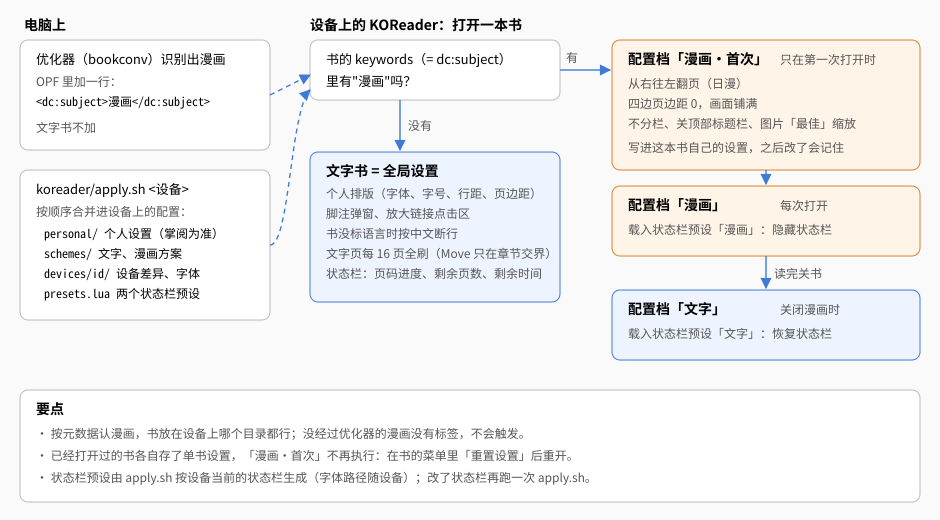
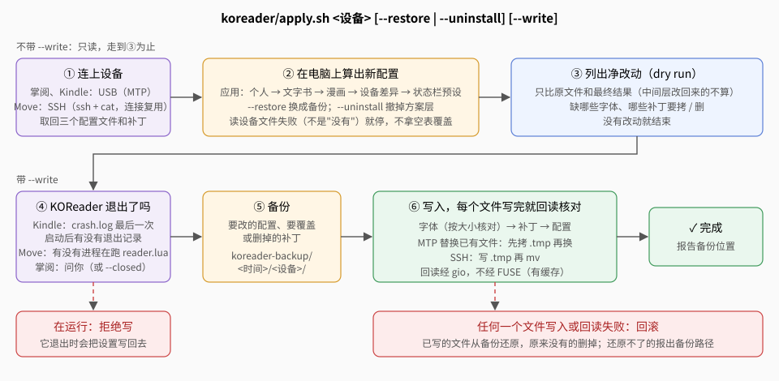

# KOReader 配置

Kindle Paperwhite 12 签名版、掌阅 Ocean 5 Pro 上用 KOReader 读 `koreader` 阅读模式的 EPUB。KOReader 的配置写成仓库里的文件（`koreader/`），
用 `koreader/apply.sh` 经 USB（MTP）应用到设备上：写之前能看到改哪些键，重复应用不会越改越多，两台设备保持一致；写坏了能还原，不要了能撤掉。

reMarkable Move 上的 KOReader 2026-09-29 起不再管（Move 只用自带阅读器，原因见[设备与可阅读范围](devices.md#为什么这样分)）：`apply.sh` 不再支持 Move（SSH 那条路删了），
以前写进 Move 的 KOReader 设置留在设备上，要清理得自己在设备上处理。



## 目录里有什么

| 文件 | 写进设备上的 | 内容 |
|---|---|---|
| `personal/settings.reader.patch.lua` | `settings.reader.lua` | 个人设置，以掌阅为准：排版（霞鹜文楷、字号 17、页边距、行距）、页眉页脚、中文排版微调、停用的插件、界面字体等五十多项 |
| `personal/gestures.patch.lua` | `settings/gestures.lua` | 个人手势（见下文「手势」） |
| `schemes/text.settings.patch.lua` | `settings.reader.lua` | 文字书方案：注释弹窗、分页相关的样式调整、断行、刷新等（见下） |
| `schemes/comic.settings.patch.lua` | `settings.reader.lua` | 漫画方案的自动切换规则 |
| `schemes/profiles.patch.lua` | `settings/profiles.lua` | 三个配置档：「漫画·首次」「漫画」「文字」 |
| `schemes/kosync.patch.lua` | `settings/kosync.lua` | 阅读进度同步（见[进度同步](#进度同步)） |
| `devices/<设备 id>/settings.reader.patch.lua` | `settings.reader.lua` | 随设备不同的：状态栏字体的文件路径 |
| `devices/<设备 id>/device.conf` | — | 设备在 MTP 下叫什么、KOReader 目录在哪、怎么判断 KOReader 退没退出、要有哪些字体 |
| `presets.lua` | `settings.reader.lua` | 按设备当前的状态栏生成两个状态栏预设 |
| `patches/*.lua` | `patches/` | KOReader 用户补丁（启动时执行）：`2-ui-font-size.lua` 界面默认字号整体小 2 号；`2-footer-preset-reclaim.lua` 载入状态栏预设时连"状态栏覆盖正文"一起切（漫画用满整屏高度） |
| `apply.sh` | — | 应用、还原（`--restore`）、撤销（`--uninstall`），见[怎么应用](#怎么应用) |
| `check.sh` | — | 离线检查，不碰设备（见[改了配置之后](#改了配置之后)） |
| `snap.sh`、`snap/2-snap.lua` | — | 用本机 KOReader 按设备配置逐页截图（见[开发 · 在电脑上预览 KOReader 分页](development.md#在电脑上预览-koreader-分页)） |
| `lib.sh` | — | 几个脚本共用：分层顺序、合并、设备读写（MTP）、判断 KOReader 退没退出 |
| `luaser.lua` | — | 读写 KOReader 配置文件，以及合并规则：标量覆盖、表递归合并、纯数组（如页边距 `{ 10, 10 }`）整体替换、值为 `"__DELETE__"` 的删键 |
| `merge.lua`、`diff.lua`、`unmerge.lua` | — | 合并一层补丁；两份配置的净差异（中间层改过、后面又改回来的键不算改动）；撤销方案层 |

这里的设备 id 是 `kindle-pw12-sig`、`ireader-ocean5-pro`（`devices/` 下的目录名）。两台读的都是书库的 `koreader` 阅读模式的产物，设备 id 和阅读模式 id 不是一回事。

**不同步的**（留在各设备自己的配置里）：书目录、最近打开的文件、设备标识、休眠和自动关机（Kindle 专有）、Android 专用的设置
（音量键、系统字体、`cover_image_*`——它所属的插件在 Kindle 上会被 KOReader 自动停用）、更新源。

## 文字书方案

全局设置就是文字书方案，任何没有单书设置的书都用它。排版照个人设置，另加这几项（用户 2026-09-28 选定，2026-09-29 补了分页、注释字号和进度同步）：

| 设置 | 值 | 作用 |
|---|---|---|
| `footnote_link_in_popup` | 开 | 点注释号在底部弹窗显示注释，不跳页 |
| `footnote_popup_relative_font_size` | -2 | 弹窗里的注释比正文小 2（正文 17 → 15，约小一号；用户 2026-09-29 定"注释比正文小 1 号"） |
| `link_prefer_footnote` | 开 | 中文书的注释常没有 `epub:type`，放宽"是不是注释"的判定 |
| `larger_tap_area_to_follow_links` | 开 | 上标注释号太小，放大点击范围 |
| `swipe_to_go_back` | 开 | 跟着链接跳过去之后，左→右滑回原处；没有跳转记录时就是上一页，翻页不受影响 |
| `text_lang_fallback` | `zh-CN` | 书没标语言时按中文断行（缺省 `en-US`） |
| `full_refresh_count` | 16 | 文字页每 16 页全刷一次（缺省 6）。带图片的页 KOReader 缺省就每页全刷 |
| `wifi_enable_action` | `turn_on` | 进度同步要能自己开 Wi-Fi：Kindle 上这项不是 `turn_on` 时，KOReader 启动时会把自动同步关掉。Android（掌阅）不受这项影响 |

**撤掉的样式调整**（`style_tweaks` 里只存开着的项，删掉 = 关；这几项以前在个人设置里开着）：

| 样式调整 | 为什么撤 |
|---|---|
| `docfragment_page-break-before_avoid `（「避免章末空白页」，键名末尾的空格是 KOReader 源码里就有的） | 它让每个文件开头不换页，把优化器按标题拆开的文件又连成一片——**KOReader 里节与节不分页的根因**。优化器靠"拆文件"分页（见[排版 · 章节分页](typesetting.md#4-章节分页)），KOReader 在每个文件开头换页 |
| `h1_page-break-before_always`、`h2_…`、`h3_…`（H1–H3 前换页） | 副标题会和章标题分到两页（优化器让副标题留在章标题页） |
| `footnote-inpage_epub`、`inpage_footnote_font-size_smaller`（页内注释） | 把注释排到引用它的那页页底；我们要点开弹窗，注释留在章末 |

**验证情况**：2026-09-29 用 `koreader/snap.sh` 在电脑上的 KOReader 里看过，撤掉以后章、节都从新的一页开始；**掌阅、Kindle 真机上还没看**。注释弹窗和字号也还没在真机上看。

## 漫画方案

**怎么认出漫画**：优化器识别出漫画后，在 OPF 里加 `<dc:subject>漫画</dc:subject>`（`bookconv::comic_detect::COMIC_SUBJECT`）。
KOReader 把 `dc:subject` 读成书的 keywords，配置档的自动执行按"书的元数据包含 漫画"触发。所以书放在设备上哪个目录都行，
不用把漫画和小说分开放。（2026-09-28 在 Kindle 上核实：书的单书记录里 `doc_props.keywords` 就是 `dc:subject` 的内容。）

打开一本漫画时：

- **「漫画·首次」**只在这本书第一次打开时执行（配置档的"书是新的"条件）：从右往左翻页、四边页边距 0、关顶部标题栏、
  图片用「最佳」缩放、翻页模式、不分栏（一屏一页；全局设置是两栏）。这些写进这本书自己的设置，之后在书里改了（比如国漫、美漫关掉「反转翻页方向」）会记住。
  漫画缺省按日漫从右往左（用户 2026-09-28 定）；KOReader 不读 OPF 的 `page-progression-direction`，只能这样设。
- **「漫画」**每次打开都执行：载入状态栏预设「漫画」，隐藏状态栏和进度条，画面用满整屏高度。

关闭漫画时执行**「文字」**：载入状态栏预设「文字」，状态栏恢复原样。

**状态栏预设**：载入预设会整张换掉状态栏设置，连字体文件路径一起（源码 `ReaderFooter:loadPreset`），而字体路径随设备不同，
所以预设不写死，由 `presets.lua` 在每次应用时按设备当前的状态栏生成：「文字」= 现在的状态栏，「漫画」= 同样的设置但隐藏。
在设备上改了状态栏，再跑一次 `apply.sh` 让预设跟上。

**已知限制**

- 已经打开过的书各自存了单书设置，「漫画·首次」不会再执行：在书的菜单里「重置设置」后重开。
- 2026-09-28 之前生成的漫画没有漫画标签：重新生成（`booklib build`，优化规则 v24 起会把它判为过期）并拷到设备上才会触发。
- 漫画读到一半 KOReader 崩了、没走到"关书"，状态栏会一直隐藏，打开再关闭任意一本漫画就恢复。
- 每次切换状态栏预设会弹一条"已载入预设"的小提示。
- **隐藏的状态栏本来仍占着底部高度**（2026-09-29 本机 KOReader 截图，1264×1680 屏上 39px）：crengine 的下页边距 = 页边距 + 状态栏高度，
  除非开着"状态栏覆盖正文"（`footer.reclaim_height`，源码 `ReaderTypeset:onSetPageMargins`）。这个开关不能全局开：文字书状态栏一直显示，开了会压住正文最后一行。
  所以只在「漫画」预设里开（`presets.lua`）；但 KOReader 载入预设时不切它、也不重算页边距，要配用户补丁 `patches/2-footer-preset-reclaim.lua` 补上这两步。
  修好后本机实测整页图最大 1260×1670（左右各留 2px、底部 10px，是 KOReader 自己留的，来源没查到），`koreader` 模式的阅读范围就按这个写。
  之前书里写了 `img { width:100% }` 的漫画（乱马这类）会被竖向压扁约 2%，现在画布和可用区域一致，不再压扁。**真机上还没看**。
- **KOReader 不放大小图**：渲染 DPI 96 时 `` 按原像素尺寸显示，只有书里写了 `width:100%` 才铺满（没写宽度、`height:100%`、`max-width:100%` 都不放大）。
  所以优化器把比屏幕小的漫画页预先放大（见[排版与优化规则 · 漫画](typesetting.md#漫画)）。

**截图检查（`koreader/snap.sh`）**：全新的 KO_HOME 第一次开书时封面浏览插件会弹一个模态提示（"Book info cache database updated."），
配置档在开书时发出的设置事件全被它吞掉，截出来的漫画还是文字书的排版（两栏、有页边距和状态栏）。snap.sh 在临时配置里停用了这个插件（2026-09-29）。
设备上这个提示只在第一次建库时出现一次。

## 进度同步

掌阅、Kindle 读的是同一份产物，用 KOReader 自带的进度同步插件（kosync）在两台之间接着读。`schemes/kosync.patch.lua` 写进设备的 `settings/kosync.lua`
（键名按 KOReader v2026.07 的 `plugins/kosync.koplugin/main.lua` 核过）：

| 设置 | 值 | 作用 |
|---|---|---|
| `custom_server` | `https://sync.vksight.com` | 自己的同步服务器（见下文） |
| `checksum_method` | 1（按文件名） | 按文件名认书，不按文件内容：优化规则一升级、书重新生成，文件字节就变，按内容认会把进度断开；产物文件名只跟书名走，重新生成不变 |
| `auto_sync` | 开 | 自动同步 |
| `sync_forward` | 1（问一下） | 别的设备读得更靠后：问要不要跳过去 |
| `sync_backward` | 3（不跳） | 别的设备读得更靠前：不跳 |

后两项是插件的缺省值，也写出来：设备上还没有 `kosync.lua` 时只写前两项，插件会拿到空的策略、什么都不做。

- **服务器是自己的 `sync.vksight.com`**：KOReader 官方的 `sync.koreader.rocks` 2026-09-29 不响应（Cloudflare 接得住、后面的源站不回，同一项目的主页正常；
  KOReader 的问题列表里它以前也宕过几次）。服务端是本仓库的 `crates/kosync`（Rust，协议按 kosync 插件的 `api.json` 和客户端代码核对，
  用本机 KOReader 自带的 `KOSyncClient` 测过），部署文件和步骤在 vksight 仓库 `ops/kosync/`。**注册接口关着**，账号在服务器上建：
  `ssh -t vksight 'sudo -u kosync /usr/local/bin/kosync useradd <用户名> --data=/var/lib/kosync'`，设备上只点「登录」。
- **账号不进仓库**：用户名、密钥由插件在登录时写进设备上的 `kosync.lua`（合并时这些键不动）。
- **文件名要一致**：两台设备上同一本书的文件名一样才认得出，所以都拷同一份 `koreader/` 产物、不要在设备上改名。
- **位置可能差一点**：KOReader 记的进度是 xpointer（第几个文件里的哪个元素）。优化规则改了、书重新生成后，同一个 xpointer 可能落到稍微不同的地方，甚至相邻的节。
- `--uninstall` 会撤掉这几项（它属于方案层），登录信息不动。
- 2026-09-29 真机：设备登录 sync.vksight.com、上传进度成功（服务器日志核对）；两台之间接着读还要看。怎么用见[使用指南 · 进度同步](usage.md#koreader-的阅读进度同步)。

## 手势

两台一样（`personal/gestures.patch.lua`，属于个人设置，`--uninstall` 不撤）。阅读界面（2026-09-29 定）：

| 手势 | 动作 |
|---|---|
| 长按左上角 | 退出 KOReader |
| 长按右上角 | 休眠 |
| 长按左下角 | 截屏 |
| 长按右下角 | 全刷（清残影） |
| 点左上角 | 回文件管理器 |
| 点右上角 | 书籍目录 |
| 点左下角 | 开关触屏（锁屏防误触） |
| 点右下角 | 交换翻页键方向 |
| 左边缘上滑 / 下滑 | 前光调亮 / 调暗（按滑动距离连续调） |
| 右边缘上滑 / 下滑 | 暖光调暖 / 调冷（设备没有暖光硬件时不起作用） |

去掉了 KOReader 缺省的短斜滑全刷。其余是 KOReader 缺省：点左右两侧翻页、点中间开菜单、双击左右两侧跳 10 页等。漫画打开时自动反转翻页方向（见[漫画方案](#漫画方案)）。

文件管理器：长按左下角截屏、长按右下角全刷、长按右上角交换翻页键；去掉了短斜滑全刷、点左下角开关前光。

`gestures.lua` 是 KOReader 第一次运行时从缺省整份复制出来的，每个手势是一张"动作表"，合并是递归的：换动作时补丁里要把原来的动作写成 `"__DELETE__"`，不然新旧两个动作都在。

## 怎么应用

先连上设备（USB，解锁屏幕），
**在设备上退出 KOReader**——它退出时会把内存里的设置写回文件，运行中改了会被盖掉。

```sh
koreader/apply.sh kindle-pw12-sig              # 只列出会改哪些键、缺哪些字体和补丁（dry run，什么都不写）
koreader/apply.sh kindle-pw12-sig --write      # 写入
koreader/apply.sh ireader-ocean5-pro --write --closed   # 掌阅：声明已退出 KOReader（不给 --closed 就在终端里问）

koreader/apply.sh kindle-pw12-sig --restore --write                    # 还原成最近一次备份
koreader/apply.sh kindle-pw12-sig --restore=2026-09-28_153012 --write  # 还原成指定的备份（备份目录名）
koreader/apply.sh kindle-pw12-sig --uninstall --write                  # 撤掉方案设置和补丁，个人设置保留
```



`--write` 时：

1. **KOReader 退没退出**。Kindle 看 `crash.log`：最后一次启动（`It's KOReader!`）之后有没有 `Tearing down UIManager`。
   Android 上从电脑看不出来，要你确认——
   **用 KOReader 菜单里的「退出」关**，在最近任务里划掉不一定结束进程（2026-09-28 掌阅实测：划掉后写入的 `fontmap`，
   被仍在运行的 KOReader 存设置时整份覆盖掉了）。不在终端里运行时不会问，要加 `--closed`。
2. **备份**：要改的配置文件、要覆盖或删掉的补丁，存到 `~/Documents/ereader/koreader-backup/<时间>/<设备 id>/`（`KOREADER_BACKUP` 可改目录）。
3. **写入**，顺序是字体 → 补丁 → 配置，每个文件写完就读回来核对：
   - 字体：设备上缺的（`device.conf` 的 `FONTS`）从本机 `~/Documents/ereader/fonts/` 拷（`KOREADER_FONTS` 可改目录），按大小核对；
   - 补丁、配置：逐字节核对。MTP 不支持覆盖写，替换已有文件时先拷一份 `.tmp` 再换。
4. **任何一个文件写入或核对失败，就把这次已经写过的全部还原**（从备份拷回，原来没有的删掉），还原不了的会报出备份路径。

读设备上的配置失败（连接不稳，而不是设备上没有这个文件）时直接停下，不会拿空表去合并、把整份配置冲掉。

**撤销（`--uninstall`）**撤掉的是文字书/漫画方案、设备差异、两个状态栏预设和 `patches/` 里的补丁；**个人设置和字体保留**。
每个被撤的键：设备上现在的值如果还是当初写进去的，就还原成第一次应用前的值（取最早的那份备份），没有备份就删掉、由 KOReader 用缺省值；
之后在设备上手改过的键不动。补丁只删内容和本仓库一致的，在设备上改过的留着。

**回读为什么要经 gio**：gvfs 的 FUSE 路径（`/run/user/<uid>/gvfs/…`）对读过的文件有缓存，用 gio 换掉文件后，经 FUSE 读到的还是旧内容
（2026-09-28 Kindle 实测：写进去 19524 字节，经 FUSE 读回 11487 字节——旧文件的大小；经 gio 读回正确）。

### 改了配置之后

```sh
koreader/check.sh                    # 两台设备都查；只查一台：koreader/check.sh kindle-pw12-sig
koreader/check.sh kindle-pw12-sig 目录   # 拿一份从设备拷回的 KOReader 目录当起点
```

离线检查，不碰设备：对空目录（或给定的副本）应用两遍，第二遍必须没有净改动；结果能被 Lua 读回；分页、弹窗注释要撤的样式调整确实撤掉了，进度同步的设置对；撤销后方案和预设都没了、个人设置还在，
而且有原始配置时能还原到"原始配置 + 个人设置"；补丁能编译、`device.conf` 语法正确；序列化和合并的边界情况（inf/nan、大整数、布尔键、数组替换）。

## Kindle 开机直接进 KOReader

`koreader/kindle-boot/`（2026-09-29 Kindle PW12 签名版真机：装上、重启后开机直接进 KOReader ✓；Wi-Fi、退出回自带界面、USB 拷书还没确认）：开机后自动打开 KOReader，并停掉亚马逊自带界面（书城、广告、自带阅读器都不跑，省电省内存）；
退出 KOReader 时 KOReader 的启动脚本（`koreader.sh --framework_stop`）会把自带界面拉回来。要求 Kindle 已越狱、装了 KOReader。
这台 Kindle（2026-09-29 查）是用 KindleModding 的包管理器 kpm 装的 KOReader，书库里的「KOReader」是一本脚本书（`documents/KOReader.sh`），没有 KUAL，
所以装上/卸掉也做成两本脚本书（以 root 运行）；装了 KUAL 的机器也可以在 KUAL 菜单里点。

```sh
koreader/kindle-boot/deploy.sh            # 列出要拷的文件（dry run）
koreader/kindle-boot/deploy.sh --write    # 拷进 Kindle：extensions/koreader-boot/ 和 documents/ 里的两本脚本书
# 拔掉 USB，在 Kindle 书库里点开「KOReader 开机启动：装上」，看到「装好了」后重启 Kindle
```

- 开机任务要写进根分区的 `/etc/upstart/`，电脑经 MTP 写不到，只能在 Kindle 上以 root 执行一次（`mntroot rw` 写完再 `mntroot ro`）。
- **每次开机只启动一次**：KOReader 退出时自带界面重新启动，会再触发一次开机任务；用 `/tmp`（内存盘）里的标记挡掉，不然永远退不出 KOReader。
- **逃生口**：自启的 KOReader 没正常退出就关机（卡死后长按电源键重启、没电）→ 下次开机跳过自启、停在自带界面，只跳一次。
- **关掉**：从电脑删 U 盘根目录的 `koreader-boot.enabled`（`deploy.sh --disable --write`）；彻底卸：书库里点「KOReader 开机启动：卸掉」，再 `deploy.sh --remove --write`。
- **退出后回到独占方式**：书库里点「KOReader（独占）」（`deploy.sh` 一起拷过去的脚本书），和开机自启一样停掉亚马逊界面再打开 KOReader；书库里原来那本「KOReader」是普通方式（亚马逊界面留在后台）。重启 Kindle 也行。
- **KOReader 运行时插 USB 没反应**（2026-09-29 真机）：KOReader 在 Kindle 上运行时故意挂起系统的 USB 服务（它自己就在要交给电脑的那块存储上，源码 `Kindle:usbPlugIn`），和停不停界面无关。拷书、跑 `apply.sh` 前先在 KOReader 菜单里「退出」，回到自带界面再插，能识别（真机确认）。
- 停掉自带界面后 KOReader 看起来能联网（登录官方同步服务器时报的是"服务器错误"而不是"没有网络"），登录自己的服务器成功后才算确认。有人报告停界面的做法在某些机型上启动失败，出问题就先关掉自启。
- **系统自动更新没有屏蔽**（用户定：自己控制联网）。自动更新可能让越狱和 KOReader 失效，联网时留意。

## 阅读背景

`koreader/backgrounds/`（2026-09-29，用户要"再生纸质感"）：`make.py` 生成可无缝平铺的灰度纹理，`apply.sh` 拷到设备的 `backgrounds/`，
设备层配置 `cre_background_image` 指向它（KOReader 菜单里没有这个设置；路径是设备上的绝对路径，所以写在 `devices/<id>/`）。只对 EPUB 等流式排版的书有效。

- **底色保持纯白**：墨水屏本来就是类纸的漫反射，整体压暗只会降低文字对比度。纹理只有细纤维和小杂点，用屏幕能精确显示的几级浅灰（238、221、少量 204），
  16 级灰度屏不会把它抖动成斑块。
- `recycled-light.png`（非白像素 1%）、`recycled-medium.png`（2.4%，现在用它：用户 2026-09-29 觉得浅的太淡）。想换：改 `devices/<id>/settings.reader.patch.lua` 里的文件名再 apply；不想要：删掉那一行。
- 本机 KOReader 截图确认能生效（`snap.sh --extra=补丁.lua` 可以叠加这类设置预览）；**真机上的观感要你看**。

## SimpleUI（主页插件）

两台都装了第三方插件 SimpleUI（`simpleui.koplugin` v2.7.1，MIT，[GitHub](https://github.com/doctorhetfield-cmd/simpleui.koplugin)）：主页（在读的书、最近的书、阅读统计）、底部导航栏、顶栏。
它的设置存在自己的文件 `settings/simpleui/sui_settings.lua`，归 `personal/simpleui.patch.lua` 管（个人设置层，两台统一，`--uninstall` 不撤）。

- **启动进主页**：个人设置 `start_with = "homescreen_simpleui"`（原来写死的 `filemanager` 会把插件第一次运行时设的主页改回去）。
- **中文**：个人设置 `language = "zh_CN"`。插件跟 KOReader 的界面语言走，自带简体中文翻译（939 条缺 1 条）；Kindle 上 KOReader 原来跟系统是英文。
- **字体**：插件用 KOReader 的界面字体表，`fontmap` 已统一成霞鹜文楷，不用另设。
- **省电，去掉时钟**：主页时钟模块（`simpleui_hs_clock_enabled = false`）和顶栏时钟（`simpleui_topbar_config` 里 `clock = "hidden"`）都关。
  停在主页、书库时时钟每分钟重画一次，墨水屏每分钟局部刷新、唤醒一次处理器。顶栏配置要整张写全：只写 `clock` 一项，插件会把没写的电池、Wi-Fi 也当隐藏。
- 自动检查更新缺省关着（插件不会自己联网），不用管。
- 主页布局（模块、顺序、底栏按钮）：在掌阅上调好后收进 `personal/simpleui.patch.lua`，再同步到 Kindle。

## 字体

配置里只写字体名（正文）或字体文件路径（状态栏）。每台设备要有的字体文件列在 `device.conf` 的 `FONTS`，缺的 `apply.sh` 从本机字体目录拷：

| 字体 | 用在 | 两台设备（用户 2026-09-28 统一） |
|---|---|---|
| 霞鹜文楷 Medium `LXGWWenKai-Medium.ttf`（排版族名 LXGW WenKai） | 正文（`cre_font = "LXGW WenKai"`） | 都是这个文件；Regular 字重不放（放了 KOReader 很可能按族名选 Regular） |
| 京華老宋体 v3.0 `京華老宋体v3.0.ttf`（族名 KingHwaOldSong） | 状态栏（按文件路径指定，见 `devices/<id>/`） | 都是这个文件 |

**界面字号**：所有设置项等界面文字小 2 号（用户 2026-09-28）。界面各处的缺省字号写死在 `font.lua` 的 `Font.sizemap`
（设置菜单每一项 22、菜单底栏 20、标题 26、提示 24……），KOReader 没有覆盖它的设置，所以用用户补丁 `patches/2-ui-font-size.lua`
把整张表每项减 2。`2-` 开头的补丁在界面管理器加载之后、文件管理器和阅读界面打开之前执行（`reader.lua`），对全部菜单生效。
自己指定字号的列表不受影响：文件列表、目录、书签（各自菜单里的「字号」）、键盘。补丁只在 KOReader 启动时读，拷的时候它在不在运行都行；
不要了删掉设备上的文件，或在 KOReader 菜单里停用用户补丁。Android 上 F-Droid 渠道的 KOReader 不执行用户补丁。

**界面字体**（菜单、按键、标题、提示）也是文楷 Medium（用户 2026-09-28）。KOReader 菜单里没有这个设置，但启动时会读
`settings.reader.lua` 的 `fontmap` 覆盖 `frontend/ui/font.lua` 里写死的界面字体表（`reader.lua`「User fonts override」，在界面管理器
加载之前，对全部界面生效）；写在个人设置里。**2026-09-28 掌阅真机确认生效**（Kindle 已写入，还没看过）。等宽的四项（快捷键、按键帮助、输入框、代码）不换，文楷不是等宽，换了对不齐。
不用写用户补丁（`patches/`）：早期补丁（`1-`）在设备模块加载之前执行，引用界面字体模块会打乱初始化顺序。

本机字体目录 `~/Documents/ereader/fonts/` 里放这两个文件，`apply.sh` 发现设备上缺哪个就拷哪个；不会删设备上的字体（撤销时也不删）。

## 键名怎么核

网上流传的 KOReader 配置模板里有不少键在 KOReader 里并不存在，写进去会被静默忽略。本目录的每个键都按设备上 KOReader
（Kindle 上是 v2026.07.2）的 Lua 源码核过：设备上 `koreader/frontend/`、`koreader/plugins/` 就是源码，拷回电脑 grep。
`G_reader_settings:readSetting("键")` 这类调用就是全局设置的键；配置档能用的动作在 `frontend/dispatcher.lua` 的 `settingsList`。
KOReader 升级后键名可能变，改配置前重新核一遍。
