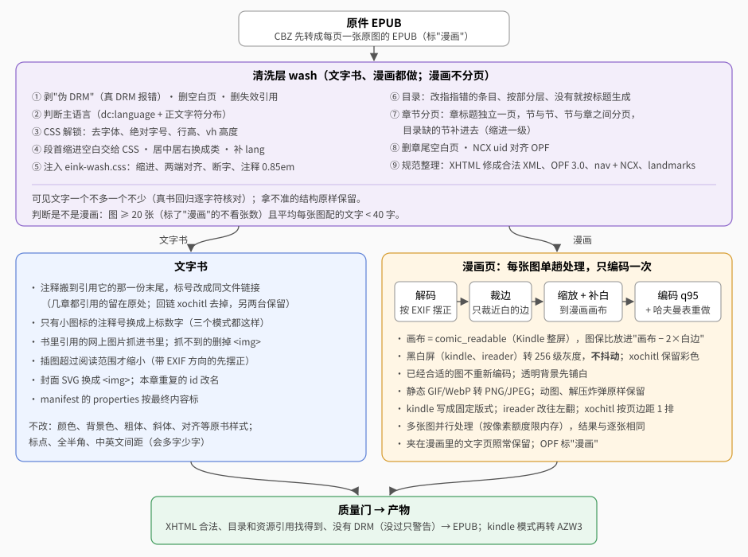
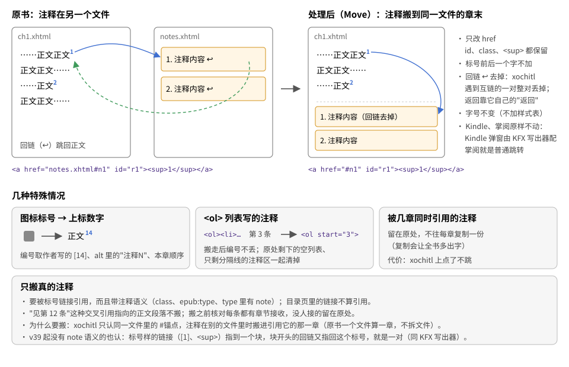
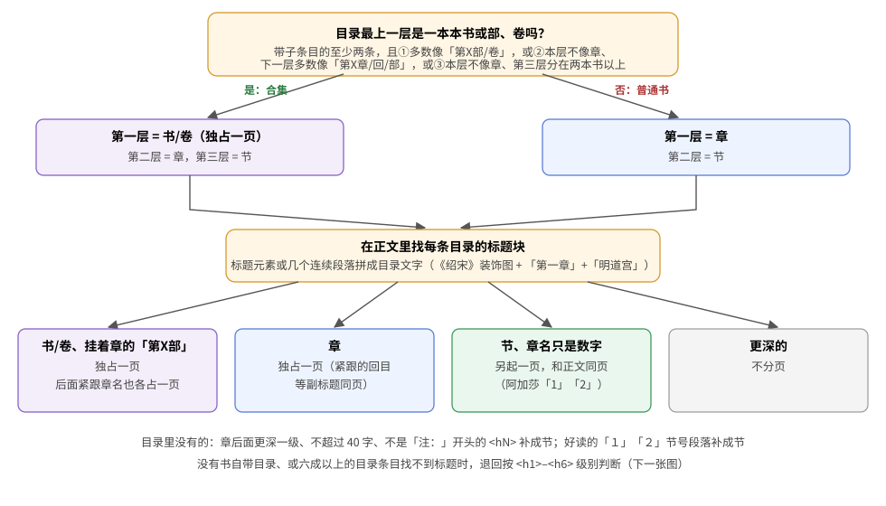
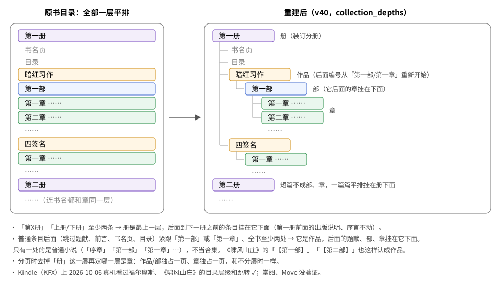
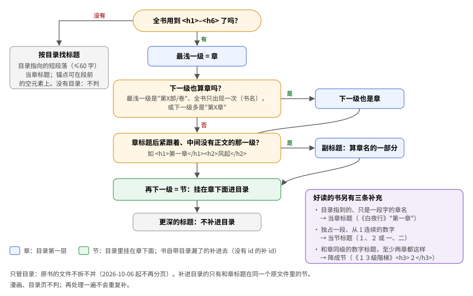
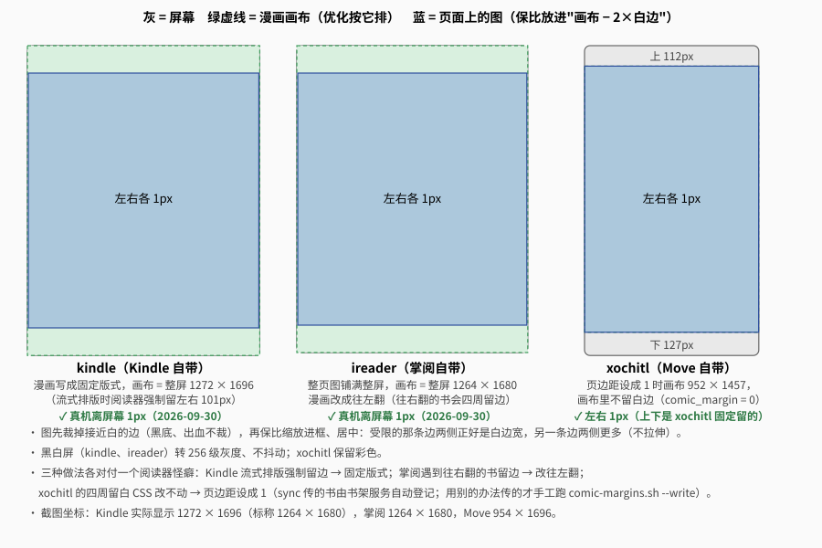

# 排版与优化规则

`booklib build` 对每本书做了什么，以及为什么。三个模式用同一套规则，差别都在模式的配置里（见[设备与阅读模式](devices.md)）；`kindle` 模式最后再把优化好的 EPUB 转成 KFX（文字书流式、漫画固定版式，见 [KFX](kfx.md)），只转格式。
实现在 `crates/bookconv`：清洗层 `wash/`、优化器 `optimize/`、图片 `imgopt.rs`。

## 底线

- **不改书的内容**：文字一个不多、一个不少；图片还是原来那张，只为适配屏幕缩放；作者的强调（颜色、加粗）保留。
- **拿不准就不动**：只处理能确认的情况，认不出的结构原样保留。
- **以真机为准**："规范允许"不等于"阅读器能用"；一台上验证过的不能推到另一台（见[验证情况](#验证情况)）。

改了影响正文的规则，要按[开发 · 真书回归](development.md#真书回归)用全部测试书回归。

## 文字书

### 1. 解开字体、字号、行高的锁，别的样式不动

书自带的 CSS 常把字体、字号、行高写死，阅读器里调了也没用。清洗层只解开这些"锁"，颜色、背景色、粗体、斜体、对齐等原书样式一律保留：

| 声明 | 处理 |
|---|---|
| `font-family` | 去掉，字体交给阅读器；**例外**：书里用 `@font-face` 嵌了文件、又不是正文字体的保留（章名、卷名、书信这些装饰字体，见下面「嵌入字体与批注」） |
| `font-size` | 绝对大小（`px`、`pt`、`medium` 这类）去掉；相对大小（`em`、`%`、`smaller`）保留，标题、小字的层次跟着阅读器字号缩放。例外：作用在正文整体上的（`body`、`html`，不带类的 `p`、`div`）相对大小也去掉，否则阅读器里设的字号不是正文的实际字号 |
| `font` 简写 | 拆开：字体、字号、行高去掉，粗体、斜体、小型大写保留 |
| `line-height` | 去掉（写死的行高让阅读器的行距设置不起作用） |
| 段落（`p`、`div`）的上下边距 | 去掉，段与段之间靠首行缩进区分（`epub-optimize --keep-spacing` 保留）；左右边距保留 |
| `body`、`html` 的边距 | 去掉，页边距交给阅读器 |
| `background` 简写 | 只留颜色，背景图去掉（xochitl 会把背景图平铺满页、盖住正文）。保留背景图的模式（kindle、ireader，profile 的 `background_images`）拆成背景色、背景图、重复、位置等分项（掌阅不认简写；渐变、`image-set()` 也归背景图，v44）；ireader 再去掉尺寸和 `fixed`（`background_sizing = false`：`background-size` 把图挤变形），kindle 保留。KFX 里怎么写见 [KFX · 背景图](kfx.md#背景图2026-10-05绍宋样本) |
| `background-image` | 去掉（同上）；保留背景图的模式不动 |
| `background-size`、`background-attachment` | ireader 去掉（同上） |
| 用 `vh` 写的高度 | 去掉（占满一屏的书名页加上页眉页脚会溢出成空白页） |

- 样式表、`<style>` 块、`style=""` 三处都按这张表处理（`cssunlock.rs`）。
- `@import`、`@charset` 原样保留；`@font-face` 不动；规则前的 `/* 注释 */` 不当选择器看。

**嵌入字体与批注**（[决定记录](decisions.md#2026-10-05)，`wash/fonts.rs`）：正文和批注不用嵌入字体，批注比正文小一号；其余内容可以用嵌入字体。

- **正文字体**：全书段落覆盖字数最多的那个字体（《绍宋》是宋体）。它的 `font-family` 照旧去掉。
- **保留的字体**：书里嵌了文件、不是正文字体、而且用在批注以外的地方（《绍宋》保留 juan、letter、bangshu 等 7 个；kuohao 只用在括注上，不留）。系统字体名（楷体、黑体、Times New Roman）没嵌文件，照旧去掉。
- **批注**：①注释块（选择器含 footnote/fnote）字体一律去掉、字号 0.85em（原有规则）；②以「注：」「注1：」「按:」「批注」这类开头的段落；③用了书里嵌入的单独字体、被括号包住（括号在里面或紧挨在外面）的行内元素。②③加 `eink-annot` 类，`eink-wash.css` 里 `span.eink-annot`/`p.eink-annot`/`div.eink-annot` 跟着阅读器字体、字号 0.85em。不用 `!important`（xochitl 不认），靠"标签加类"的优先级和排在最后胜过书里的 `span.kuohao`。
- ③只认嵌入字体：真书回归里系统字体名的括号文字多是正文的一部分——《飘》括号里的心理旁白、各书括号里的外文原名——缩小字号就改了原书。
- 不把灰字改黑、不把细字加粗：那是改颜色字重，不是解锁（[决定记录](decisions.md#2026-09-29)）。

### 2. 按语言排版

语言取 OPF 里的 `dc:language`，没有就看正文字符分布。

| | 中文 | 英文等西文 |
|---|---|---|
| 首行缩进 | 2em | 1.2em |
| 每章第一段 | 照常缩进 | 顶格 |
| 对齐 | 两端对齐 | 两端对齐 |
| 自动断字、避免孤行寡行 | — | 规则写着，**三台自带阅读器都不生效** |
| `<html lang>` | 缺了就补 | 缺了就补 |

- 书里用 `align=` 或行内样式写的居中、居右，换成 `eink-center`/`eink-right` 类（xochitl 不认行内样式，这样也能居中）。
- **中文段首的缩进空白去掉**（全角空格、`&nbsp;`），缩进统一由 CSS 给 2em。原因：xochitl 会把段首全角空格折叠掉，全角空格宽度还跟着字体变。这是唯一会去掉的字符，而且只在后面跟着文字或图片时去；**只有空白的段落**（书里当场景空行用的 `
&nbsp;
`）原样保留。
- 全文件没有 `
`、正文全靠 ` ` 换行的（至少 4 个 ` `），按 ` ` 分成段落，首行缩进才有地方加；有一处拿不准就整个文件不动。
- 英文每章第一段换成 `
` 顶格；原书的首字放大、斜体等强调类保留，只去掉写了缩进的类。
- 断字规则单独写成一条 CSS，阅读器不认只丢这一条；不往正文里插软连字符（那是加字符）。英文书词间偶有大空隙，也保持两端对齐。
- **不做**改动正文字符的事：全半角标点纠正、中英文之间加空格。

### 3. 注释：点标号跳到章末，比正文小一号

注释搬到本章末尾，正文里的标号改成同一文件里的锚点。**标号原样保留**：只改链接地址（`href`），原来的 `id`、`class`、外面的 `` 都不动，前后一个字不加。

- **为什么要搬**：xochitl 只认同一文件里的 `#锚点`。原书一个文件算一章（不拆文件，见[章节与目录](#4-章节与目录)），注释在别的文件里时搬进引用它的那一章末尾。
- **回链**（注释里点一下跳回正文）：`kindle`、`ireader` 保留，改成同文件锚点——Kindle 点注释后没有可靠的"返回"，要靠它；`xochitl` 去掉——它遇到互相链接的一对会整对丢掉，返回靠 xochitl 自己的"返回第 X 页"。由模式的 `note_backlinks` 决定。
- **只有图标的标号换成上标数字**（模式的 `note_icons = "number"`，三个模式都是）：xochitl 里只有图、没有字的链接点了没反应，CSS 也限不住图标大小。编号依次取注释开头作者写的 `[14]`、图标 alt 里的"注释N"、本章顺序。这是唯一多出来的字（[决定记录](decisions.md#2026-09-29)）。
- **`<ol><li>` 写的注释**搬走后保留编号（写成 `<ol start=N>`）；原处剩下的空列表、只剩分隔线的注释区清掉。
- **被几章同时引用的注释留在原处**：不然每章复制一份，全书多出字。代价是这类注释在 xochitl 上点了不跳（跨文件链接）。
- **同一章里两条注释 id 相同**时只搬第一条，后面的留在原处（v44；以前只放得回一条，《绝叫》丢过一条注释）。
- 注释正文 `0.85em`（五号→小五），跟着阅读器字号缩放；每条注释不拆到两页（长过一页的照常断开）。
- 只搬**被引用的注释**：块带注释语义（`class`、`epub:type`、`type` 里有 note），**或者和标号互相链接**——标号样的普通链接（`[1]`、`①`、`` 里的）指到这个块，块开头的回链又指回这个标号（v39，和 KFX 写出器同一个认法；《罗杰疑案》的注释是 `
<a id="zhu1" href="#zw1">[1]</a>…`，没有 note 语义）。块的锚点可以在块自己身上，也可以在段首的 `<a id>` 上。目录页里的链接不算引用；"见第 12 条"这种交叉引用指向的正文段落不搬；没人接收的注释留在原处，不会搬丢。
- **呈现方式**由模式的 `notes` 决定：`jump`（`kindle`、`xochitl`）是普通链接 + 章末 `
`；`popup`（`ireader`）是标号加 `epub:type="noteref"`、注释写成 `<aside epub:type="footnote">`，掌阅点标号弹窗，章末注释照常显示。**同文件的注释**：跳转模式留在原处；弹窗模式也搬到章末、写成 `<aside>`，阅读器才弹窗。
- `kindle` 虽然是 `jump`，KFX 里照样有弹窗：写出器按"互相链接的一对"自己认注释（见 [KFX · 注释弹窗](kfx.md#注释弹窗)），所以 kindle 保留回链。

### 4. 章节与目录

**不分页，原书的文件结构原样保留**（2026-10-06 用户定，[决定记录](decisions.md#2026-10-06)）：一个 XHTML 文件不拆、不并，章标题和正文是不是同一页由原书和阅读器决定。v45 以前按标题把文件拆开（书/卷、章标题独占一页，节与节之间分页），已撤掉。

**目录不变，至少索引到节**：仍按下面的规则定出书/卷、章、节，目录按这几级嵌套，书自带目录漏掉的节补进去。目录条目原来指向拆出来的文件的，现在指向原文件里那个标题的 `#id`（标题没有 id 的补一个：章 `eink-ch-N`、节 `eink-sec-N`）。代价是目录常常跳到一个文件的中间，阅读器能不能准确停在锚点那一页要真机看（见[验证情况](#验证情况)）。

- **看不见的标题不当章标题**：写着 `display:none` 或 `hidden` 的标题只给目录定位（《绍宋》每章开头的 `<h2 style="display:none;">`，看得见的章名是后面的图和段落），不当章、节，也不补进目录。

**哪一级是书/卷、章、节：按书自带目录的层级**（v38，`wash/chapters.rs` 的 `toc_driven`）。

| 目录 | 判定 | 目录里 |
|---|---|---|
| 书/卷 | 最上一层是一本本书或部、卷（下面挂着章）时的最上一层；章那一层或更深处挂着子条目的「第X部/卷」（福尔摩斯全集《恐怖谷》、《白城恶魔》「第一部 凝固的音乐」） | 最外层，章挂在它下面 |
| 章 | 书/卷的下一层（普通书是最上一层）。章名写成普通段落的也认：在正文里从锚点（没锚点就从文件开头）往后拼标题元素或连续段落，拼成目录文字就是标题块，前面只隔着装饰图的图也算进去（《绍宋》） | 只指到文件、标题却在文件中间的（好读的书名页后面才是「第一章」、合集里书名和第一章在同一个文件），补 id、目录改指过去 |
| 章名只是数字 | 看实际显示的标题（阿加莎「1」「2」、《深夜小狗》的质数章、《月亮和六便士》「二」） | 按节处理：目录里已经有了，不再补 |
| 副标题 | 目录里没有、紧跟章标题、中间没有正文的 `<hN>`，**这一级在全书每一处都这样**（金庸的回目）；某一处后面是正文就不是（《射雕》附录 `<h2>` 后面紧跟 `<h4>祖先</h4>` 是第一节） | 算章名的一部分，不另成一条 |
| 节 | 章的下一层；目录里没有、跟在章后面的更深一级 `<hN>`（不超过 40 字、不是「注：」开头——金庸用 `<h5>` 排回末注释）；好读的「１」「２」节号段落 | 挂在章下面一层；目录里没有的补进目录 |
| 更深的 | | 不补进目录 |

- **目录里一层的兄弟条目中有「第X部」而它下面没有子条目时**，把它后面到下一个「部」之前的条目缩进到它下面（`nest_parts_among_siblings`；全书一层平排的另由「分部重建」处理）。
- **和章平排的节号条目**（《13級階梯》：「第一章　出獄　　１」「　　２」「　　３」）：带着第 1 节的章（目录标签末尾是「１」，或章名后面单独一段「１」）后面跟着一串从 2 起连续的数字条目，全书至少两章这样才算节，缩进到章下面。只有一串的（《克莱因壶》「著作权使用契约书」后的「01」…「44」）、普通章名后跟数字章的（《深夜小狗》「前言」后的 2、3、5）都是章。
- **一层平排的合集目录**（福尔摩斯全集：「第一册」「书名页」「目录」「暗红习作」「第一部」「第一章……」…「四签名」「第一章……」…，连书名都和章同一层）认两种信号（v40，`collection_depths`）：
  「第X册」「上册/下册」至少两条时，各册是最上一层，后面到下一册之前的条目挂在它下面（第一册前面的出版说明、序言不动）；
  普通条目后面（跳过题献、前言、书名页、目录这类）紧跟「第一部」或「第一章」——编号从头开始——全书至少两处时，这样的条目是作品，后面的题献、部、章挂在它下面，到下一个普通条目为止（短篇一篇篇平排在册下面）。
  只有一处的是普通小说（「序章」「第一部」「第一章」…），不当合集。部下面挂着它后面的章。结果：册 → 作品 → 部 → 章。《啸风山庄》的「【第一部】」「【第二部】」也这样认成作品，章挂到各部下面。
  定章节时最上一层带子条目的多数是「第X册」，这一层只是装订分册，去掉它再定哪一层是章。

  

**没有书自带目录、或六成以上的目录条目在正文里找不到标题时**，退回按全书实际用到的 `<h1>`–`<h6>` 判断，见下图和下面几条。

| 角色（退路） | 判定 | 目录里 |
|---|---|---|
| 章 | 最浅一级。最浅一级是"第X部/卷"、全书只出现一次（书名），或下一级多是"第X章"时，下一级也算章 | 一条 |
| 副标题 | 紧跟章标题、中间没有正文的那一级（`<h1>第一章</h1><h2>风起</h2>`） | 算章名的一部分 |
| 节 | 章（和副标题）的下一级 | 挂在章下面；漏了的补进去 |
| 更深的标题 | | 不补 |

**没有 `<hN>` 的书**：目录指向的短段落（≤60 字）当标题。锚点可以在段落上，也可以在段落前紧挨着的空元素上（MOBI 转来的书常写成 `
<b>第一章</b>
`）。原书用 ` ` 夹在正文里的"标题"认不出，不处理。

**好读的书**有几种特殊写法，各补一条规则：

- **章名只是一段字，就当章标题**。例：《白夜行》第一个正文文件的 `<h3>` 是书名，"第一章"只是一行字。条件：书自带目录指到这个文件、标签和某一段文字相同、这个文件的 `<hN>` 里又没有这段字。这段前面还有内容（书名页）时补个 id、目录改指到它（`文件#eink-ch-1`）。
- **独占一段的连续数字，就当节标题**。例：好读的节号是独占一行的 `１`、`２`（或 `一`、`二`）。条件：全书没有节一级标题；1–3 位数字或一到九十九的中文数字；在第一个标题之后、从 1 开始严格连续、至少两个、每节后面至少 50 字正文。目录样的一串数字、不从 1 开始的楼层号、断号的都不算。
- **只出现在版权页、目录页的那一级不算节**。例：《ABC谋杀案》h2 只用在单独成页的「版权信息」「目录」，真正的节是 h3「1」「2」。节一级的标题一个也没有跟在同文件的章标题后面时，节换成更深一级里跟在章标题后面的那一级（v37）。
- **和章同级的数字标题，至少两章都这样时降成节**。例：《１３級階梯》节标题是单独成文件的 `<h3>２</h3>`，和章标题 `<h3>第一章　出獄</h3>` 同级，第 1 节是章标题后单独一段 `１`。降级后目录里挂到章下面。全书只有一串的（《月亮和六便士》`<h3>二</h3>`…`<h3>五十八</h3>` 是章）不动。

**目录里的节**：书没有目录时，生成的目录按标题级别嵌套。书有目录但漏了节，把缺的节按阅读顺序插到所属章下面（只补和章标题在同一个原文件里的节，单独成文件的"内容简介"之类不补），指向 `原文件#节标题的 id`。目录里已有的、和章平排的节缩进到章下面；章标签末尾重复的第一节节号（`第一章　出獄　　１`）去掉。改目录时只换 NCX 的 `navMap`，原条目的 id、页码表都保留。漫画、目录页不判；再处理一遍不会重复补。

### 5. 章尾不多出空白页

删掉每个文件末尾没有可见内容的空段落和换行（被链接指到的保留）；包住文件结尾的容器去掉下边距和"之后分页"。

### 6. 目录与其它修复

- **目录指错位置的改指**：有的书 NCX 整体错位（《占星术杀人魔法》点"第一章"跳进登场人物表）。只改能核实的：目标处文字不是以条目标题开头，而且能找到唯一一处以这个标题开头的地方。核实不了的不动。
- NCX 的 `dtb:uid` 和 OPF 的唯一标识不一致时改成一致（reMarkable 不一致就不显示目录）。
- 没有目录的书按标题生成目录；"名字 + 编号"（`第一章 1`）拆成章、节两级，`Chapter 1`、`卷 一` 不拆。
- 自带目录全是一级、里面有"第X部"时，按部重建成两级；已经分好层级的不动。
- 目录文件只认 `*.ncx`、名字正好是 `nav.xhtml`/`nav.html` 的、或 OPF 里标了 nav 的。
- 同一章里重复的 id，第二个起改名，指向它的链接仍指第一个。
- 删掉没内容的空白页、指向不存在文件的引用。
- **文件名里有安卓存储不能用的字符**（`*:?"<>|\` 和控制字符）的文件改名（坏字符换 `_`，撞名加 `-2`），OPF 清单、正文链接、CSS 的 `url()` 一起改（v43，`wash::safe_names`）。掌阅上《春雪》《飘》的封面图叫 `**::**::…jpg`，书架没有封面缩略图；改名后真机封面都有了 ✓。原书 nav 里没编码的 `****:*::.xhtml` 链接也要改（通用的改链接工具把带 `:` 的当书外链接跳过）。只改文件名部分，目录名不动。
- **网上的图**（``）：抓下来，按 EXIF 方向摆正后按阅读范围缩放、放进书里；**抓不到的（包括超过 20MB 的）删掉这个 ``**——设备不联网，留着只是断图（[决定记录](decisions.md#2026-09-30)）。
- 封面页是 `<svg>` 包一张图（整页只有这张图）时换成 ``：有的阅读器不显示 SVG 封面。
- 质量门会报出正文里指向不存在锚点的链接（包括同文件的 `#x`），只告警，不拦。

### 7. 一律升级到 EPUB 3

清洗的最后一步（`wash/normalize.rs`），文字书和漫画都做，只改格式，可见文字不动：

- **OPF**：`version="3.0"`；补 `dcterms:modified`，值固定 `2000-01-01T00:00:00Z`（原书有就用原书的）——不取当前时间，产物逐字节确定；保证唯一标识指向一个有内容的 `<dc:identifier>`；缺 `dc:language` 就补；EPUB 2 的 `opf:role` 等写法改成 `<meta refines>`。
- **目录**：`toc.ncx` 保留（xochitl 靠它找目录）；没有 nav 的按 NCX 生成 `nav.xhtml`，只有 nav 的反过来生成 NCX；`<guide>` 同时写成 nav 里隐藏的 `landmarks`。
- **manifest 的 `properties`**：按最终内容标 `svg`、`mathml`、`scripted`、`remote-resources`。
- **XHTML 修成合法 XML**：DOCTYPE 换成 `<!DOCTYPE html>`；`&nbsp;` 这类命名实体换成数字引用；裸 `&`、`<` 转义；XML 不允许的控制字符去掉（《金庸全集》原书一处 U+0010）；空元素自闭合、属性补引号、根元素补命名空间；多余的闭合标签只在去掉后整份完全配平时才去。

## 漫画

判断标准：图片 ≥ 20 张，且平均每张图配的字少于 40；OPF 标了"漫画"的（CBZ 转出来的都标）不看张数。

**每张图只解码一次、只编码一次**：解码 → 按 EXIF 摆正 → 裁边 → 缩放 → 补白 →（黑白屏转灰度）→ 编码。已经合适的图不重新编码。

### 通用做法

- **按画布排版**：画布是模式的 `[comic_readable]`（没写就是阅读范围）。裁过边的图保比缩放进"画布 − 2×白边"，居中放在画布大小的白底上；白边是模式的 `comic_margin`（缺省 1px）。只按比例缩放，不拉伸不压扁。
- **只裁接近白的边**（各通道 ≥ 235）：扫描页的白框裁掉；黑底页、彩色出血不裁，不会被换成白边。
- **按 EXIF 方向摆正**：带方向标记的扫描页、照片先把像素摆正，再按摆正后的宽高排。不管阅读器认不认 EXIF，看到的都一样。
- **黑白屏（`kindle`、`ireader`）转 256 级灰度，不抖动**：设备显示时自己会换算成屏幕的级数，事先抖动只多一层损失。全彩漫画也转（屏幕是黑白的，早晚要转成灰；《哆啦A夢全彩版》卷01 灰度版小 25%）。用 Rec.709 亮度权重。`epub-optimize --keep-color` 可关掉，用来比较。
- **彩色屏（`xochitl`）保留彩色**。
- **比框小的 JPEG 页放大**到框（Lanczos3，质量 95，最多 3 倍）：按原像素显示的阅读器上，小页就是一小块。
- **PNG 不放大**：按图自己的比例补白到画布的宽高比，阅读器把整页放大到屏幕后白边仍约 1px。
- **已经排好的页原样保留**：再优化一遍不会一代代重编码。
- **JPEG 质量一律 95**，编完把哈夫曼编码表按这张图重做（`jpegopt.rs`）：只改打包方式，解码逐像素相同（逐页按符号流核对，有一点不同就用原来的），同画质小 7%–16%。不换会改像素的编码器（[决定记录](decisions.md#2026-09-29)）。
- 短边不到阅读范围宽度 1/3 的小图（装饰图、页码图）只裁边、转灰度，不缩放不补白。
- 大页照常处理（死亡笔记的跨页有 3600 万像素），只有文件头声明超过 6400 万像素的（多半是解压炸弹）原样保留。
- 静态 GIF 转 PNG，WebP 有损的转 JPEG、无损的转 PNG（条目名不变，OPF 的 `media-type` 跟着改）；动图原样保留。透明背景先铺白底。
- 夹在漫画里的文字页照常保留；OPF 加 `<dc:subject>漫画</dc:subject>`（已有就不加）。
- **CBZ**：图片按文件名自然序（`page_2` 在 `page_10` 前）每页一张；第一页就是封面。

### 离屏幕边缘 1px：三种做法

1px 指图到**屏幕边缘**的距离，不是到阅读范围边缘。三台阅读器各有一个怪癖挡着，各用一种办法绕过去（测得的具体数字见[设备 · 可阅读范围](devices.md#可阅读范围)）：

| 模式 | 挡着的怪癖 | 做法 |
|---|---|---|
| `kindle` | 流式排版下强制留页边距（最小档左右还有 101px） | 漫画写成**固定版式**（`comic_fixed_layout`，`comicfxl.rs`）：OPF 写上固定版式声明、每页加 `viewport`，画布是整屏 1272×1696；KFX 写出器据此写成固定版式（见 [KFX · 固定版式](kfx.md#固定版式2026-10-05-测试漫画)） |
| `ireader` | 书声明了往右翻（日漫都这样）时，整页图四周留边 | 漫画改成**往左翻**（`comic_page_direction = "ltr"`）：宁可日漫也往左翻，换整页铺满 |
| `xochitl` | 四周留白 CSS 改不动，只有页边距设置管用 | 漫画按**页边距 1** 排（画布 952×1457，画布里不留白边），拷书后跑 `xochitl/comic-margins.sh --write` 登记（见[使用指南](usage.md#move-上的漫画登记页边距)）。上下留白是 xochitl 固定的，做不到 1px |

xochitl 设成页边距 1 以后，同一本漫画里的文字页也跟着贴边，所以文字页、混排页的字左右补回默认档的留白；有图的页去掉 `<body>` 的类（带类的 body 里图会被吃掉约 20pt 宽）。见 `comicpad.rs`。

## 验证情况

**这张表是"验证过没有"的唯一出处。** 三台都是设备自带的阅读器：

| 规则 | Kindle | 掌阅 | Move（xochitl） |
|---|---|---|---|
| 字号字体可调 | ✓ | ✓ | ✓ |
| 章标题独立一页、节分页（v44 及以前；v45 起不分页） | ✓ | ✓ | ✓ |
| 目录里节缩进、跳转（v44 及以前：节是拆出来的单独文件） | ✓ | ✓ | ✓ |
| 不分页、目录跳到文件中间的锚点（章、节准确停在标题那一页，v45） | 未验证 | 未验证 | 未验证 |
| 注释跳转与返回 | ✓（靠原书回链） | ✓ | ✓（返回靠 xochitl 自己的"返回"） |
| 注释弹窗 | ✓（KFX，2026-10-05《罗杰疑案》；AZW3 时代是跳转） | ✓ 认 `epub:type="noteref"` + `<aside epub:type="footnote">`（2026-10-05《春雪》弹窗版，章末注释照常显示；`ireader` 模式随即改成弹窗。v39 起没有 note 语义、靠回链配对的注释也弹：《罗杰疑案》真机 ✓） | — |
| 场景空行保留 | ✓ | ✓ | ✓ |
| 图标注释号换成数字 | ✓ | ✓ | ✓ |
| 英文首段顶格、缩进 1.2em | ✓ | ✓ | ✓ |
| 英文自动断字 | ✗ 不认 | ✗ 不认 | ✗ 不认 |
| EPUB 3 | —（读 KFX） | ✓ | ✓（目录在，隐藏的 landmarks 不显示） |
| 漫画离屏幕 1px | ✓ 固定版式（测试书截图逐像素对齐） | ✓ 往左翻（截图 0–1px） | ✓ 左右 1px（上下做不到） |
| 日漫从右往左翻 | ✓（固定版式） | 改成往左翻 | — |
| 隐藏标题不切空白页（v38；v45 起不切页，这行只是历史） | ✓（KFX） | ✓ | 未验证 |
| 装饰字体保留、批注跟正文字体小一号（v38） | ✓（KFX） | ✓ | 未验证 |
| 按目录层级分页：书/卷、章独占一页，节和数字章同页，目录三层（v38；v45 起不分页，目录层级不变） | ✓（KFX） | ✓ | 未验证 |
| 一层平排的合集目录重建成册 → 作品 → 部 → 章（v40） | ✓（KFX，2026-10-06 福尔摩斯、《啸风山庄》） | 未验证 | 未验证 |
| 文件名里的 `*`、`:` 改名后书架有封面（v43） | 未验证 | ✓（2026-10-06《春雪》《飘》） | 未验证 |
| 背景图保留（kindle、ireader） | ✓（KFX 只在内容范围画，Amazon 版同样） | ✓（拆成分项后整页显示） | —（去掉） |

- Kindle 一列：2026-10-05 起读 KFX；前几行（到"漫画离屏幕 1px"）是 2026-09-30 AZW3 时代看的，KFX 上文字书 v37/v38、漫画固定版式另外看过（见 [KFX](kfx.md)），没有逐行重看。
- 文字书各行是 2026-09-30 用当时的产物看的（《疯探》《桥头楼上》《绝叫》《克莱因壶》《占星术杀人魔法》《哆啦A夢》）；Move 另外读了它排出的 PDF 核对。英文两行是 2026-10-01 用 Gutenberg 的 *The Adventures of Sherlock Holmes* 看的。
- 场景空行只对 `&nbsp;`、全角空格的空段落有效：原书写成 `
 
`（普通空格）的按 CSS 标准高度就是 0，哪台都不显示（《克莱因壶》），这是原书的写法，没改。
- v38 三行是 2026-10-05 用《绍宋》（卷 → 章，章名是装饰图加段落）和《揭露人性的推理神作》9 册合集（书 → 章 → 节，含数字章名的《深夜小狗》）看的；Kindle 那一列是 KFX（自带阅读器），掌阅读的是 `ireader` 模式的 EPUB。
- 掌阅用中文字体显示英文时弯引号是全角宽（字体问题）。xochitl 每本书最后多一页空白，是它自己加的。

**还没在真机上验证的**：

- v45 不分页（2026-10-06）：目录点章、节跳到文件中间的 `#id`，三台能不能准确停在标题那一页——Kindle（KFX 里是位置 `$155`/`$143`）、掌阅、Move（xochitl 把 EPUB 排成 PDF 显示，锚点落到哪一页由它算）都没看。注释在跳转模式（kindle、xochitl）下同文件的留在原处、不再跟着节走，弹窗不受影响。章标题不再独占一页，原书怎么排就怎么显示。
- 2026-10-03 的改动：注释标号保留原 `id`（Kindle、掌阅上回链指向 `#fnref1` 这类原书写法的书，现在应能跳回）、`<ol>` 注释保留编号、漫画只裁接近白的边。
- 比框小的 JPEG 页：Kindle、掌阅自带阅读器会不会自己放大，没单独看过（我们事先放大了，所以不影响结果）。
- KFX 写出器 7（2026-10-06）：没有文字的元素和图片的 id 当锚点挂到下一个块——《福尔摩斯探案全集》1101 处锚点、目录跳转、多配上的注释弹窗变了，没上真机。
- 英文断字：规则写着，三台都不生效。

**电脑上已核对**（不算真机验证）：测试书里全部文字书和一卷漫画，三个模式的产物可见文字和原书逐字符对得上、XHTML 全部合法；AZW3 时代 `kindle` 模式的 AZW3 和优化后的 EPUB 可见文字逐字一致（2026-09-30）。KFX 没有逐字比对的工具，靠写出器的单元测试和新旧写出器产物逐字节比（见[开发 · KFX](development.md#kfx)）。
