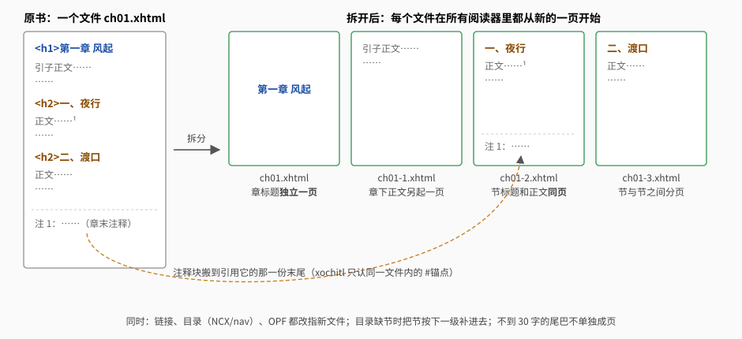

# 排版与优化规则

`booklib build` 对每本书做的事，以及背后的理由。实现在 `crates/bookconv`：清洗层 `wash/`、优化器 `optimize/`、图片 `imgopt.rs`。

## 底线

- **不改书的内容**：文字一个不多、一个不少；图片还是原来那张，只为适配屏幕缩放；作者的强调（颜色、加粗）保留。
- **拿不准就不动**：规则只处理能确认的情况，识别不了的结构原样保留。
- **以真机为准**："规范允许"不等于"阅读器能用"，一个阅读器上验证过的不能推到别的阅读器（验证情况见文末）。

改了影响正文的规则，要按[开发 · 真书回归检查](development.md#真书回归检查)用全部测试书回归。

## 文字书

### 1. 不锁字体、字号，别的样式不动

书自带的 CSS 常把字体、字号、行高写死，阅读器里调了也没用。清洗层只解开这些"锁"，颜色、背景色、粗体、斜体、对齐等原书样式一律保留（用户 2026-09-29 定）：

| 声明 | 处理 |
|---|---|
| `font-family` | 去掉，字体交给阅读器 |
| `font-size` | 绝对大小（`px`、`pt`、`medium` 这类）去掉；相对大小（`em`、`%`、`smaller`）保留，标题、小字、上标的层次跟着阅读器字号一起缩放。例外：作用在正文整体上的（`body`、`html`，不带类的 `p`、`div`），相对大小也去掉，否则阅读器里设的字号不是正文的实际字号 |
| `font` 简写 | 拆开：字体、字号、行高去掉，粗体、斜体、小型大写保留 |
| `line-height` | 去掉（写死的行高让阅读器的行距设置不起作用，2026-09-27 用户定） |
| `background` 简写 | 只留颜色，背景图去掉（xochitl 不认 `no-repeat`，会把背景图平铺满页、盖住正文） |
| `background-image` | 去掉（同上） |
| 用 `vh` 写的高度 | 去掉（占满一屏的书名页加上页眉页脚会溢出成空白页） |

- 样式表、`<style>` 块、`style=""` 三处都按这张表处理（`crates/bookconv/src/cssunlock.rs`）。
- 样式表开头的 `@import`、`@charset` 原样保留，不影响后面规则的清洗；`@font-face` 里的声明不动（嵌入的字体还在，只是正文不再被锁在它上面）。
- 以前会把灰色文字改成纯黑、把细字重提到 400，2026-09-29 起不做了：这是改颜色和字重，KOReader 有自己的对比度、字重设置。

### 2. 按语言排版

语言取 OPF 里的 `dc:language`，没有就看正文字符分布。

| | 中文 | 英文等西文 |
|---|---|---|
| 首行缩进 | 2em | 1.2em |
| 标题后第一段 | 照常缩进（中文书的习惯） | 顶格 |
| 对齐 | 两端对齐 | 两端对齐，加自动断字，避免孤行寡行 |
| `<html lang>` | 缺了就补 | 缺了就补 |

- 书里用 `align=` 属性或行内样式写的居中、居右，换成 `eink-center` / `eink-right` 类。类选择器的优先级高于 `p{}` 规则；xochitl 不认行内样式，这样也能居中。
- 英文断字那条规则单独写成一条 CSS，阅读器不认时只丢这一条。**还没用英文书在真机上验证过**（测试书都是中文）。
- 中文书每个段落开头用来缩进的空白（全角空格 U+3000、不换行空格 `&nbsp;`）去掉，缩进统一由 CSS 给出精确的 2em。原因：xochitl 会把段首的 U+3000 折叠掉（变成没有缩进），KOReader 按字体宽度画它（换个字体缩进就变）。这是唯一会去掉的字符，只限段首的缩进空白。
- 全书没有一个 `
`、正文全靠 ` ` 换行的文件（至少 4 个 ` `，每段都是完整的行内内容），按 ` ` 分成 `
`，首行缩进才有地方加；有一处拿不准，整个文件不动。
- 英文每章第一段顶格：这一段换成 `
`。书的样式表里写了 `text-indent` 的类从这个 div 上去掉（不然缩进又回来了），其它类（斜体、小型大写、颜色等作者的强调）保留，行内样式只去掉 `text-indent`。**还没用英文书验证**。
- **不做**改动正文字符的事：全半角标点纠正、中英文之间加空格。这会违反"文字一个不多一个不少"。

### 3. 注释：KOReader 弹窗、xochitl 跳转，比正文小一号

注释统一搬到本章末尾，正文里的注释标号改成同一文件内的锚点链接。**标号原样保留**：上标、数字、图标都不动，前后一个字不加（2026-09-29 起不再在标号后加 `[N]`，用户定：严格说多了字符）。
怎么看注释由阅读模式（profile 的 `notes`）决定：

| | KOReader（`notes = "popup"`） | xochitl（`notes = "jump"`） |
|---|---|---|
| 点标号 | 底部弹窗显示注释 | 跳到章末注释，用阅读器的"返回"回来 |
| 标号 | `<a epub:type="noteref">`（KOReader 据此认出注释） | 普通 `<a href="#id">`（xochitl 不认 `epub:type`，不带） |
| 章末的每条注释 | `<aside epub:type="footnote">` | `
` |

- 注释正文用相对单位 `0.85em`，比正文小一号（五号→小五是 0.857），跟着阅读器字号一起缩放。KOReader 弹窗的字号另由 KOReader 配置设成比正文小 2（见 [KOReader 配置](koreader.md#文字书方案)）。
- 每条注释带 `eink-note` 类，样式表里是 `page-break-inside: avoid`：一条注释不会被拆到两页（长过一页的阅读器照常断开）。
- 用小图标当标号的书，图标加 `eink-noteicon` 类，限成一个字高（没写宽高的图标两个阅读器都按图片像素画，会撑成一大块）。**还没在真机上看过**。
- 只搬**被引用、而且带注释语义**（`class`、`epub:type`、`type` 里有 note）的注释块（`aside`、`p`、`li`、`div`）。"被引用"指注释标号链接或跨文件的链接；目录页、导航文档里的链接不算，也不往这些页里搬。
- 搬之前核对每条注释都有章节接收，没人接的留在原处，不会搬丢。
- 注释按（所在文件, id）区分，两个文件里同名的 `id="n1"` 不会互相覆盖。
- 没搬的注释（原书没写注释语义），KOReader 靠自己的规则猜：上标里的数字链接一般能认成注释弹窗。**认不出的**：注释正文写成标题的（《金庸作品全集》的注释是 `<h5>`，KOReader 规定目标在标题里就不算注释），点了是跳转。
  可以用 `koreader/snap.sh 书.epub --links` 在电脑上查一本书里每个链接在 KOReader 里是弹窗还是跳转（见[开发与测试](development.md)）。

### 4. 章节分页

用户要求：**章标题独立一页；节标题和正文同页；节与节之间、节与章之间都分页。**

做法是**按标题把章节文件拆成多个文件**，每个文件从新的一页开始。不用 CSS `page-break-*`，因为各阅读器对它的支持不一致。
KOReader 要关掉「避免章末空白页」样式调整才会在每个文件开头换页（开着时拆开的文件又连成一片，节与节不分页），配置里已经关了，见 [KOReader 配置](koreader.md#文字书方案)。

**怎么判断哪一级是"章"、哪一级是"节"**：看全书实际用到的 `<h1>`–`<h6>`。

| 角色 | 判定 | 效果 |
|---|---|---|
| 章（Title） | 最浅一级。如果最浅一级是"第X部/卷"、全书只出现一次（书名），或者下一级多是"第X章"，下一级也算章 | 独立一页 |
| 副标题 | 紧跟在章标题后、中间没有正文的那一级（如 `<h1>第一章</h1><h2>风起</h2>`） | 和章标题同页 |
| 节（Section） | 章和副标题之后的下一级 | 新起一页，和正文同页 |
| 更深的标题 | | 不分页 |

全书一个 `<h1>`–`<h6>` 都没有时，退回用书自带目录指向的短段落当标题。原书用 ` ` 夹在正文里的"标题"识别不了，保守不处理。

**好读式结构**（2026-09-28，《白夜行》节不进目录）：好读的书每章一个文件，第二章起章名在 `<h3>`；第一个正文文件的 `<h3>` 却是书名，"第一章"只是一行字；节号是独占一行的 `１`、`２`（或 `一`、`二`）。两条补充规则：

- **段落章名**：书自带目录只指到某个文件、标签和文件里某一段的文字相同，而这个文件的 `<hN>` 里没有这段文字时，这段也当章标题（级别取目录标签对得上的 `<hN>` 里最常见的那一级；一个都对不上就不补）。它前面还有内容（书名页）时，给它补 `eink-ch-N` 的 id，目录改指到它。于是书名页、"第一章"各占一页。
- **数字节号**：全书没有节一级的标题时，独占一段、只有 1–3 位数字（阿拉伯、全角）或一到九十九的中文数字的段落，在同一文件的第一个标题之后、从 1 开始严格连续、至少两个、每节后面都有至少 50 字正文，就当节标题（级别取比全书标题更深的一级）。目录样的一串数字（中间没有正文）、不从 1 开始的楼层号、断号的都不算。
- **和章同级的数字标题**（2026-09-28，《１３級階梯》）：节标题是单独成文件的 `<h3>２</h3>`、`<h3>３</h3>`，跟章标题 `<h3>第一章　出獄</h3>` 同级，第 1 节是章标题后面单独一段 `１`，书自带的目录是平的（`第一章　出獄　　１`、`　　２`、`　　３`）。紧跟在章标题后面、同级、从 1 连续编号（或从 2 开始、章标题后第一段就是 `１`）、每节都有正文、一章至少两节的数字标题，**全书至少两章都这样**才降成节：不再单独占一页（此前 `２` 被当成章，单独一页只有一个字），跟正文同页；`１` 那一段也当节标题。全书只有一串的（《月亮和六便士》`<h3>二</h3>`…`<h3>五十八</h3>` 是章）不动。

**部标题后面紧跟章标题**（2026-09-28，《雪人》`<h3>第二部</h3>` 后面紧跟一段"10 粉筆"）：部、章各占一页。"章标题后面只跟着很短的文字就不另起一页"这条是给书名页的作者行用的，章名再短也是一章，不适用。

**没有 `<hN>` 的书**按目录找标题：目录指向的短段落（≤60 字）当标题。锚点可以在段落自己身上，也可以是段落前面紧挨着的空元素（MOBI 转来的书常写成 `
<b>第一章</b>
`，2026-09-28《福尔摩斯探案全集》此前因此整本没分页）。

**拆开后要处理的事**：

- 全书指向被拆文件的链接（正文、目录页、NCX、OPF）都改指到目标所在的那一份。
- 切点处还没闭合的外层元素，前一份补上闭合标签，后一份重新打开。
- **注释搬移**：xochitl 只认同一文件内的 `#锚点`。拆开后"注释标号 → 章末注释"会跨文件，所以把注释块搬到引用它的那一份末尾。
  只搬真的注释：目标块本身或外层带注释语义，或者在文件最后一份、后面除了别的注释没有正文。"见第 12 条"这种交叉引用指向的正文段落不搬。
- 拆出来的某一份没有文字（只有装饰图、分隔线），或者注释搬走后只剩一个标题，就并回前一份。章标题后面只跟着不到 30 字（比如书名页的作者行）也不单独成页。
- 漫画、目录页不拆。已经拆过的书再处理不会再拆。

**目录里的节**：书没有目录时，自动生成的目录本来就按标题级别嵌套。书有目录但漏了节时，把节补进去：作者的条目原样保留，缺的节按阅读顺序插进去，比所属的章低一级。只补和章标题在同一个原文件里的节；单独成文件、前面没有章标题的"节"多半是附页（如"内容简介""重要声明"），作者目录没列就不补。
书自带目录里**已有**的节条目（和章平排的）缩进到所属章下面，标签去掉首尾空白。章标签末尾跟着第一节的节号（`第一章　出獄　　１`）、而目录本来就列着后面的第 2 节时，去掉章标签末尾的节号——第 1 节另成一条；目录里没列节的（《鼠疫》"部　一"）不动，那里的"一"是部的编号。
改书自带的目录时只换 NCX 的 `navMap`：原条目的 id、页码表（`pageList`）、`head` 都保留。

### 5. 章尾空白页

清洗的最后一步：删掉每个文件末尾没有可见内容的空段落和换行（被链接指到的保留）；包住文件结尾的容器，去掉它的下边距、下内边距和"之后分页"。这样章末不会多出一页空白。

### 6. 目录与其它修复

- **书自带目录指错位置的改指**（2026-09-28）：有的书 NCX 整体错位（《占星术杀人魔法》点"第一章"跳进登场人物表），在阅读器里看就像章节没另起一页。条目的目标处文字不是以条目标题开头（去空白后比）才算指错，而且只改能核实的：书里有标题完全相同的链接、它指的地方以这个标题开头且只有一处；或全书只有一个文字相同的 `<h1>`–`<h6>`；或锚点在文件末尾、下一个文件开头就是这个标题。核实不了、有歧义的不动。这一步在分部重建和分页之前做（它们都按目录找标题）。

- NCX 的 `dtb:uid` 和 OPF 的唯一标识对不上时改成一致（reMarkable 遇到不一致会直接不显示目录入口）。
- 没有目录的书按标题生成目录。标题是"名字 + 编号"（`第一章 1`）时拆成章、节两级；前半只是 Chapter、Part、卷、部这类词（`Chapter 1`、`卷 一`）的不拆。
- 书自带目录**全是一级**、里面有"第X部"时，按部重建成两级（部下面挂章）；已经分好层级的目录不动。
- 书的目录不叫 `nav.xhtml`、但 OPF 里标了 `properties="nav"` 的，也算有目录，不会被自动目录覆盖。
- 删掉没有内容的空白页、指向不存在文件的引用。
- 浅灰色文字提成黑色（墨水屏上浅灰看不清）。
- 封面页如果是一个 `<svg>` 里包一张 `<image>`（整页只有这张图、没有文字），换成 ``：有的阅读器不显示 SVG 封面。页面上还有别的内容、SVG 里有文字的都不动。

### 7. 规范整理：一律升级到 EPUB 3（v27）

清洗的最后一步（`wash/normalize.rs`），文字书和漫画都做（用户 2026-09-29 定）。只改格式，可见文字不动：

- **OPF**：`version="3.0"`；补 `<meta property="dcterms:modified">`，值固定为 `2000-01-01T00:00:00Z`（原书有格式正确的就用原书的）——不取当前时间，产物逐字节确定；
  `unique-identifier` 保证指向一个有内容的 `<dc:identifier id>`（没有标识符的书按 OPF 原文派生一个 `urn:eink:…`）；缺 `dc:language` 按书的语言补；
  EPUB 2 的 `opf:role`、`opf:file-as`、`opf:scheme` 改写成 `<meta refines>`，`opf:event` 去掉，多出来的 `dc:date` 改成 `dcterms:date`（EPUB 3 只许一个）。
  `<meta name="cover">`、`<guide>` 是 EPUB 3 允许的旧写法，保留。
- **目录**：`toc.ncx` 和 `<spine toc="ncx">` **保留**（xochitl 找目录靠 manifest 里 id 为 `ncx` 的 NCX），`dtb:uid` 在升级之后再对齐一次 OPF 标识符。
  没有导航文档的书按 NCX 生成 `nav.xhtml`（层级照 NCX）；只有 nav、没有 NCX 的 EPUB 3 书（《恶女的告白》）反过来按 nav 生成 NCX。
  `<guide>` 同时写成 nav 里的 `landmarks`（`hidden`，只写进不在 spine 里的 nav）。
- **manifest 的 `properties`**：封面图 `cover-image`（原来就有）；内容文档用到内嵌 SVG、MathML、脚本、远程资源的，标 `svg`/`mathml`/`scripted`/`remote-resources`，
  按优化器第二遍之后的**最终**内容标（SVG 封面会换成 ``，远程图会抓进书里），所以清洗过的书 OPF 最后写进 zip。
- **XHTML 修成合法 XML**：DOCTYPE 换成 `<!DOCTYPE html>`；HTML 命名实体（`&nbsp;` 等 HTML 4 那一套）换成数字引用（去掉 XHTML 1.1 的 DTD 后命名实体就是未定义），认不出的名字不动；
  裸 `&`、不是标签开头的 `<` 转义；XML 不允许的控制字符去掉（《金庸全集》原书一处 U+0010，看不见的损坏字符——回归时字符账会少这一个，是预期的）；
  ` ` 这类空元素补成自闭合，无引号、无值的属性补引号；根元素补 `xmlns` 和 `xmlns:epub`（写坏成全角冒号的改正）；
  没有对应开标签的闭合标签去掉（《绝叫》每章 `<head>` 里多一个 `
`），**只在去掉后整份标签完全配平时才去**，交叉嵌套之类拿不准的不动。
- 分页拆出来的后几份不再各带一个字节序标记（U+FEFF），只有原文件开头的那个。

**EPUB 3 在 xochitl 上还没真机验证**（KOReader 认 EPUB 3，也还没拿升级后的产物在真机上看过）。要在 Move 上看：书能打开、目录入口在且层级对、封面缩略图、注释跳转与返回、
`<!DOCTYPE html>` 的章节正常显示（不白屏）、`hidden` 的 landmarks 不会被当正文显示。

## 漫画

判断标准：图片 ≥ 20 张，且平均每张图配的文字少于 40 字。

**每张图只解码一次、只编码一次**：解码 → 裁白边 → 缩放 → 补白 →（黑白屏转灰度）→ 编码。已经合适的图不重新编码。

- **按真实可阅读范围缩放、补白**：补到阅读范围的宽高比（容差 0.3%），图片正好填满阅读器的图片框，不会被阅读器再缩一次，也不会一边留出白条（有的阅读器把比页面窄的图靠左放）。阅读范围见[设备与可阅读范围](devices.md)。
- **黑白屏（`koreader` 模式：掌阅、Kindle）转 256 级灰度，不抖动**。设备显示时会自己把灰度换算成屏幕能显示的级数，事先抖动只会多一层画质损失。在单趟处理里顺带转，不多编码一次。
- **彩色屏（`xochitl` 模式：Move）保留彩色**。
- 透明背景的 PNG 先铺白底再处理，不然透明处会变黑。
- JPEG 质量：缩小用 95（漫画不压画质）；比阅读范围小很多的页会先放大，用 85，但只放大到 3 倍以内，要放大更多的不放大。PNG 从不预放大。
  所以阅读范围比原图略小的时候，产物反而可能比原书大（乱马 01 卷，原书 151MB：当时按 Kindle 自带阅读器的 1104×1546 出过 172MB，按 1264×1680 是 122MB，按 Move 的 842×1455 是 119MB）。
- 短边不到阅读范围宽度 1/3 的小图（装饰图、页码图）只裁白边，不缩放不补白；没有白边就原样保留。
- **超过 900 万像素的图原样保留**（不缩放、不补白、不转灰度），免得并行处理时内存超限。高分辨率扫描的漫画会因此没被处理，这是已知的限制。
- GIF、WebP 格式的页不处理，原样保留。
- 夹在漫画里的少量文字页照常保留，不当作空页删掉。
- OPF 里加 `<dc:subject>漫画</dc:subject>`（已有就不加）：阅读器据此认出漫画。KOReader 把它读成书的 keywords，自动套漫画设置（见 [KOReader 配置](koreader.md#漫画方案)）。只动 OPF 元数据，正文、图片不变（v24）。

## 验证情况

| 规则 | KOReader（掌阅、Kindle） | xochitl（Move） |
|---|---|---|
| 字号字体可调 | 未验证 | 未验证 |
| 章标题独立一页、节分页 | 只在电脑上的 KOReader 里看过（2026-09-29，`koreader/snap.sh`），真机未验证 | 未验证 |
| 目录里节缩进、跳转 | 未验证 | 未验证 |
| 注释（KOReader 弹窗 / xochitl 跳转与返回） | 未验证 | 未验证 |
| 漫画补白到阅读范围 | 未验证（阅读范围是在掌阅自带阅读器上量的） | 早期实测 |
| 漫画标签被认出 | ✓（Kindle 上的 KOReader） | — |
| 英文断字、英文首段顶格 | 未验证 | 未验证 |
| EPUB 3 升级（v27） | 未验证 | 未验证 |

2026-09-27 在 Kindle 自带阅读器上（当时出 AZW3）验证过字号字体可调、章标题独立一页、目录里节缩进与跳转、注释跳转与返回、漫画补白，还有 135MB 漫画能打开翻页。
那条线 2026-09-29 删了；这些结论是 Kindle 自带阅读器的，不能当成 KOReader 上也成立。

## 待定问题

- **注释标号**：`Anchor` 模式在标号后追加 ` [N]`，注释图标换成文字编号，这样能点。严格说这多了字符，是否保留待用户确认。
- **部分繁体书标点显示成"横的"**：数据本身正常（`zh-TW`、标点字符正常、没有竖排 CSS），还需要设备、书名和截图才能定位。
