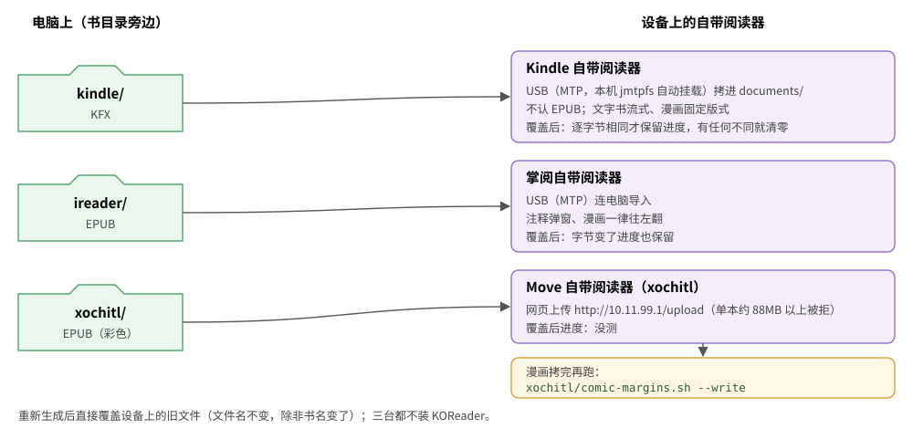

# 使用指南

## 安装与卸载

需要 Rust 工具链（`cargo`）。在仓库目录里：

```sh
./install.sh             # 装 booklib（书库；改 EPUB 元数据的 meta --edit 也在里面）
./install.sh --tools     # 另装开发、排查用的 epub-optimize、epub-to-azw3、readable-probe、readable-measure，以及转 MOBI 词典的 mobi-dict-to-stardict
./install.sh --no-tools  # 卸掉这些开发工具，只留 booklib
./uninstall.sh           # 卸载
./install.sh --help      # 打印脚本开头的说明（uninstall.sh 同样）
```

- 装到 cargo 的 bin 目录，优先级和 cargo 一致：`$CARGO_INSTALL_ROOT/bin` > cargo 配置里的 `install.root`（仓库目录往上各级 `.cargo/config.toml` 越近越优先，最后是 `$CARGO_HOME/config.toml`）> `$CARGO_HOME/bin` > `~/.cargo/bin`。`CARGO_INSTALL_ROOT` 设成空值按没设处理。
- `--tools` 装的是 `bookconv`、`azw3`、`mobidict` 三个包里的命令；`kfx` 包的 `epub-to-kfx`、`kfx-dump`、`kfx-repack` 不随它装，用 `cargo run --release -p kfx --bin <命令> --`。
- 退出码：`0` 装好（卸完）；`1` 没有 cargo、同名命令被别的包占着、编译或卸载失败；`2` 参数不对。
- **升级**：更新代码后再跑一次 `./install.sh`。不加 `--tools`/`--no-tools` 时沿用上次的选择：装过开发工具就一起升级，免得工具停在旧版本、和 `booklib` 的规则对不上。编译复用仓库的 `target/`，第一次要几分钟。
- **同名命令被别的包占着**（比如别处装过一个也叫 `booklib` 的）：脚本报出是哪个包、然后停下，不会悄悄抢过来。确认不要了先 `cargo uninstall` 它再装。
- 装完会核对 `PATH` 里先找到的 `booklib` 是不是刚装的那个；不在 `PATH` 里会告诉你怎么加（fish 给 `fish_add_path`）。
- **卸载只删命令**：按本仓库的路径找出装过的包全部卸掉（仓库经符号链接装的也认）；别处装的同名命令只提示、不删。书库、书目录旁的产物、设备上的东西都不动，脚本只告诉你书库在哪。
- 不想安装也可以直接跑：`cargo run --release -p library --bin booklib -- <命令>`。

## 书库在哪

缺省 `~/.local/share/booklib`。要换位置，任选一种：

- 每条命令加 `--library=目录`；
- 设环境变量 `BOOKLIB_DIR`；
- 设了 `XDG_DATA_HOME`（非空）时，缺省是 `$XDG_DATA_HOME/booklib`。

书库里只有索引：每本书一个几 KB 的 `meta.json`，网址入库的书另存一份 EPUB。书的内容只在你的原件目录里有一份。目录结构见[架构 · 书库](architecture.md#书库)。

## 命令


| 命令 | 作用 |
|---|---|
| `booklib add <文件或网址>...` | 入库单个文件或网址（一次性） |
| `booklib track <目录>...` / `untrack` | 跟踪书目录（递归）/ 不再跟踪 |
| `booklib sync [--prune] [--device=…] [--no-build] [--watch[=秒]]` | 把跟踪的目录同步进书库，接着生成 |
| `booklib build [--device=…] [--force] [书...]` | 按阅读模式生成 |
| `booklib list [书...]` | 列出书和各模式的产物、是否最新 |
| `booklib meta --fetch [--force] [--clear] [书...]` | 联网补简介、标签、封面 |
| `booklib meta --show [书...]` | 查看跟踪目录里的书的元数据（书里写的 + 找来的），只读 |
| `booklib meta --edit 书.epub [选项]` | 查看、改写一个 EPUB 文件的元数据（和书库无关） |
| `booklib remove <id>...` | 从书库删掉一本书（连同产物；原件不动） |
| `booklib dedupe [目录...]` | 早期版本入库的书改成只存索引 |
| `booklib devices` | 列出阅读模式 |

- **选书**（`[书...]`）：书名片段、id 前缀（`list` 第一列），或原件路径——文件就是那一本，目录就是它下面所有的书。不写就是全部。**路径里有空格要整个加引号**，不然后半截被当成书名，结果"没有匹配的书"（会提示你）。
- **`--device`**：不写就是全部三个模式；可以写多次或用逗号分隔，`all` 表示全部。要写成 `--device=ireader`，写成 `--device ireader`（空格）会报错。
- **退出码**：`0` 全部成功；`1` 命令写错；`2` 有书处理失败（或书库打不开、没有匹配的书）。`sync` 里入库失败、旧版本删不掉、目录读不了、拿不到锁也算失败；`--watch` 时只计数，不退出。

### add：入库单个文件或网址

```sh
booklib add 三体.epub 乱马01.cbz https://example.com/post
```

- 只收 **EPUB、CBZ 和网址**。MOBI、AZW3、KFX、FB2、PDF 等报"只支持 EPUB 和 CBZ"（KFX 只是给 Kindle 的产物格式）。给它一个目录会提示改用 `track`。
- 入库时先检查能不能用：EPUB 是不是有效、有没有 DRM；CBZ 是不是 zip、里面有没有页面图片。不能用的当场拒收。只加密了字体的"伪 DRM"不算，照常入库。CBZ 的书名取文件名。
- 生成时读原件：EPUB 直接用；CBZ 当场转成每页一张原图的 EPUB（不存），有打不开的页（不支持的压缩方式等）就报错、不出缺页的书；网址没有原件，入库时抓正文和图片组成 EPUB，**只有这种存在书库里**（网页超过 20MB 不收）。
- 同一个文件重复入库显示 `= 已在库里`（按内容认，改名也认得出）。原件挪了位置，在新位置再 `add` 一次就更新了。
- 同一个路径、内容变了：当成新版本，显示 `↻ 原件改过，换成新版本 … ← 旧书名`，旧条目连同产物删掉。
- 早期版本收进来的 MOBI、PDF 等条目还在书库里：`list` 标"不再支持的格式"，`build`、`sync` 跳过（每本提示一次），已有的产物不动。不要了就 `remove`。

**`add` 和 `track` 的分工**：`add` 一次性收单个文件；整个书目录用 `track` 登记、`sync` 同步，之后目录里增、删、改、挪都跟着走。两者可以混用：`add` 过的书后来出现在跟踪目录里，`sync` 按内容认得出，不会重复入库。

### track / sync：跟踪书目录

```sh
booklib track ~/Documents/ereader/books   # 登记（可以多个）
booklib sync                              # 同步，接着按全部模式生成（只重建有变化的）
booklib sync --device=kindle              # 只生成这一个模式
booklib sync --no-build                   # 只同步，不生成（不能和 --device 一起用）
booklib sync --watch                      # 一直运行，每 60 秒查一次（--watch=300 改间隔）
```

`track` 会拒绝两种目录（要换就先 `untrack`）：

- 和已跟踪的目录互相包含（父目录或子目录）；
- 和产物目录互相包含。产物放在跟踪目录旁边、以模式命名（`kindle/`、`ireader/`、`xochitl/`），所以**跟踪的目录别叫这几个名字**——比如已跟踪 `~/x/books`，再 track `~/x/ireader` 就会被拒：它正是 `books` 的产物目录。

`sync` 只看 `.epub`、`.cbz`（跳过隐藏文件和目录），每个文件按下图处理：


- `untrack` 只是不再跟踪，已入库的书保留。
- 原件删了只报告（这本书没法再生成了）；加 `--prune` 才从书库删掉，连同产物。`add` 进来、原件在跟踪目录以外而且还在的书不删。
- **目录读不了**（没有读或进入权限）：打一行 `✗ 目录读不了…`，那个目录下已登记的书原样保留（`--prune` 也不删），汇总多一项"读不了的目录 N"，退出码 2。`--watch` 时同一个目录只报一次。
- 整个跟踪目录不在（比如 U 盘没插）：什么都不动。

**`--watch` 几乎不耗电**：每轮只看文件的大小和修改时间，不读内容；什么都没变就不写任何文件，也不去生成。生成失败的书在原件和规则都没变之前不再重试。也可以不用 `--watch`，用 systemd 定时器或 cron 定期跑 `booklib sync`。

输出：

```
原件：新增 0，改过 0，没变 35，不在了 0（从书库删了 0），出错 0      ← 原件有没有变化
✓ 生成 [kindle] 一九八四 → ~/Documents/ereader/kindle/好读精排/一九八四.kfx
生成：重新生成 105 本，挪位置 0 本，已是最新 0 本，失败 0 本          ← 这次实际做了什么
```

规则升级（版本号加一）后，原件都没变也会整批重新生成。

### build：按阅读模式生成

```sh
booklib build                           # 全部书、全部模式
booklib build --device=ireader 三体      # 只生成书名含"三体"的、只给 ireader
booklib build --device=all --force      # 全部重建
```

- 每本书记一个**指纹**（原件内容、模式参数、规则版本等，见[架构 · 指纹](architecture.md#指纹)）。都没变就显示 `= 已是最新` 跳过，可以放心反复跑。`--force` 强制重建。
- 输出里的 `⚠ 质量门未过` 只是提示，产物照样生成，说明原书结构有问题（比如链接指向不存在的锚点），可以在设备上看看效果。

**原件的核对**：生成前先看原件还是不是入库时那本书。

- 大小和修改时间没变 → 直接用。
- 变了 → 重算哈希。内容一样（只是被 touch 过）照常；内容不一样就报"原件改过了"并停下，提示先 `sync`（跟踪的目录会换成新版本）或重新 `add`。不拿改过的内容冒充原来那本书。
- 原件不在了 → 产物还在、指纹没变的照样算"已是最新"，不报错；要重新生成的报错，提示挪过就 `sync` 或在新位置 `add`，不要了就 `remove`。

### list：看书库和产物

```text
3fa9c1e07b2d  epub   三体 — 刘慈欣
      ireader              ✓ 最新  /home/你/Documents/ereader/ireader/小说/三体.epub
      kindle               ✓ 最新  /home/你/Documents/ereader/kindle/小说/三体.kfx
      xochitl              ⚠ 过期  /home/你/Documents/ereader/xochitl/小说/三体.epub
```

- `✓ 最新`：和现在 build 出来的会一样。`⚠ 过期`：规则或模式参数变了（或上次没生成完），`build` 会重建。`? 未知`：产物文件被删了，或这个模式已经不在了。
- 书名下可能出现 `✗ 原件不在了`、`⚠ 原件可能改过`、`- 不再支持的格式`。
- `list` 只读，别的命令运行时也能用。

### meta --fetch：联网补简介、标签、封面

`meta` 必须写明 `--fetch` 还是 `--edit`（光写 `booklib meta` 报用法错，免得一不小心给全部书联网）。

```sh
booklib meta --fetch                  # 所有书（找过的跳过）
booklib meta --fetch 白夜行            # 只找某本
booklib meta --fetch --clear 雪人      # 找错了：去掉找来的元数据和封面
booklib meta --fetch --force 雪人      # 重找
```

```text
✓ 白夜行
      元数据 ← 豆瓣 https://book.douban.com/subject/10554308/；原作名 白夜行；简介 500 字；标签 悬疑推理、日系推理、…；参考版本 南海出版公司 2013-1-1 刘姿君 译
      封面 ← 豆瓣 白夜行 [日] 东野圭吾 2013（https://img3.doubanio.com/…）
```


- **元数据**：先找豆瓣条目，取简介、标签、原作名，以及那个条目的出版社、出版年、ISBN、译者；豆瓣没有就用 Wikidata 上的原作名、首版年。
- **写进书里的只有简介和标签，而且只在书里没有时才补**；书名、作者用书自己的，正文不动，原件不动（补在产物里）。出版社、ISBN、译者是豆瓣那个版本的（多是大陆版），不一定是你手上这本，只记在 `meta.json` 给你参考。简介是简体字。
- **封面**只给书里没封面的书找，按顺序试：
  1. **豆瓣**中文版封面：按书名搜，繁简转换后比对（允许只差卷次后缀），作者去掉"[美]"这类国籍前缀后核对；几个候选里挑分辨率最高的。
  2. **原作封面**：Wikidata 找作品（好读的 `．`、Wikidata 的 `·` 比较前都去掉，译名用字不同按重合度判断），再到 Open Library、Wikimedia Commons 找图。
  3. **都没有就生成一张**：书名、作者头像（Wikidata 上的照片，没有就画作者名的第一个字）、作者名。样式每本不一样、同一本每次一样，黑白屏上也清楚。输出标 `◇`。要系统里有中文字体（缺省思源宋体繁体，`fc-match` 找），换字体用 `BOOKLIB_COVER_FONT=字体文件[:序号]`。
- 书名会试两个：书里的，和文件名里的（`作者《书名》` 取书名号里的）。把文件改成更通行的译名也能帮它找到。
- **漫画跳过**（输出 `- 跳过 书名：漫画不找元数据`），`--force` 也不找。CBZ 一律算漫画，EPUB 按优化器同一套判定。
- 找来的东西变了，产物算过期，下次 `build` 重建。
- 所有请求间隔 1.2 秒，每本书只需跑一次。
- **网络出错不当"没找到"**：连不上、被网站拦了（HTTP 403、豆瓣搜索回来的不是数据而是验证页）都算临时出错，报"网络出错，下次再试"，不生成封面、不存不完整的结果。接连两个网站连不上就当断网，整轮中止。
- 一半成功一半出错的如实报（比如 `⚠ 封面 ←… / 元数据 ✗ 网络出错…`），有结果的那半存下，退出码 2，下次再查没查成的。

Google Books、Hardcover 也能用，但要申请 API key，暂时没接。

### meta --show：查看跟踪目录里的书的元数据

```sh
booklib meta --show            # 跟踪目录里所有的书
booklib meta --show 绍宋       # 只看某本（书名片段、id 或原件路径，同 list）
```

每本书列出：id、书名、作者、原件路径；**书里写的**元数据（读原件的 OPF：标题、作者、语言、出版社、标识符、日期、标签、简介，简介超过 80 字只显示开头；封面有没有、尺寸）；**找来的**（`meta --fetch` 的来源、原作名、首版年、简介字数、标签、参考版本，找来的封面）。只读：不加锁、不联网、不改任何文件。原件不在了的那本报 `✗` 并让退出码为 2（改名或移动过就 `sync`）。只列原件在跟踪目录里的书（`add` 进来的单个文件、网址书不列）。

### meta --edit：查看、改写一个 EPUB 的元数据

改的是 EPUB 文件本身（OPF 里的书名作者等和封面），换设备、换软件看到的都是改后的值。和书库无关，不用 `--library`。

```sh
booklib meta --edit 书.epub                                   # 查看：标题、作者、语言、出版社、简介、标签、标识符、日期、封面
booklib meta --edit 书.epub --title 书名 --author 作者甲 --author 作者乙
booklib meta --edit 书.epub --language zh --publisher 出版社 --date 2026-09-28 --description 简介…
booklib meta --edit 书.epub --tag 小说 --tag 科幻              # 标签整体替换
booklib meta --edit 书.epub --publisher ""                    # 值给空 = 删掉这一项
booklib meta --edit 书.epub --cover 封面.jpg                   # 换封面
booklib meta --edit 书.epub --cover ""                        # 去掉封面（封面图、只放封面的那页、目录里的条目）
booklib meta --edit 书.epub --get-cover 封面.jpg               # 取出封面
```

- `--名字 值` 和 `--名字=值` 都行，值可以是空字符串。给了哪个改哪个；`--author`、`--tag`、`--identifier` 可重复，给出即整体替换。
- **可见文字一个不变，图片原样拷过去**；写出前和产物一样整理成规范的 EPUB 3（XHTML 修成合法、补 `nav.xhtml` 等）。一百多 MB 的书也只占几十 MB 内存。
- **不备份**，要留底先自己拷一份。先写临时文件再改名，中途失败原文件不动。改符号链接时改的是它指向的文件（链接保留），原文件的权限保留。
- `--identifier` 不动 OPF 的唯一标识（删了 OPF 就不合法，reMarkable 还会不显示目录）。
- 改了跟踪目录里的原件，下次 `sync` 当新版本入库；改了书名，产物文件名跟着变，设备上的旧文件要自己删。

### remove：删书

```sh
booklib remove 3fa9c1e07b2d
```

删这本书的索引和它在各模式下的产物。要用 `list` 里的完整 id（删除不做模糊匹配）。条目目录先整个改名再删，中途断电不会剩下半个条目，残留的下次运行时清掉。原件不受影响；拷到设备上的那份也要自己删。
原件在跟踪目录里的会提示：**下次 `sync` 会再入库**，要彻底不要就从书目录里删掉原件。

### dedupe：迁移早期版本的书库

早期版本会把原件存一份在书库里。升级后跑一次：

```sh
booklib dedupe ~/Documents/ereader
```

先看 `meta.json` 记着的位置，再在给出的目录里找内容相同的文件；找到就改成只存索引、删掉副本，找不到的保留副本并列出来。书库里的文件本身不算原件（给的目录包含书库也不会把副本配成自己）。网址书不动。可以反复跑。

### devices：列出阅读模式

```text
ireader      掌阅自带阅读器（iReader Ocean 5 Pro）  EPUB  屏幕 1264×1680  阅读范围 1264×1680  黑白
kindle       Kindle 自带阅读器（Paperwhite 12 代签名版）  KFX  屏幕 1272×1696  阅读范围 1104×1546  黑白
xochitl      xochitl（reMarkable Paper Pro Move 原生阅读器）  EPUB  屏幕 954×1696  阅读范围 842×1455  彩色
```

在书库的 `profiles/` 里放 `<id>.toml` 可以加模式或覆盖内置的参数，写法见[设备与阅读模式](devices.md)。

## 产物放在哪

每个模式一个文件夹，文件名是 `书名.epub`（`kindle` 是 `书名.kfx`）：

| 书从哪来 | 产物 |
|---|---|
| 跟踪目录 `D` 里的书 | `D` 旁边的 `<模式>/`，子目录和原件一样。例：原件 `~/Documents/ereader/books/好读/x.epub` → `~/Documents/ereader/ireader/好读/<书名>.epub` |
| `add` 进来的单个文件、网址书 | 书库的 `output/<模式>/` |

- **只删自己生成的文件**：原件挪了、书名变了，旧位置的产物删掉（内容没变的直接挪过去，不重新生成），删空的子目录一起删；产物文件夹里你自己放的文件一概不动。
- 两本书同目录同名（不分大小写），或目录里已有一个不是本工具生成的同名文件，后来的那本加 `[id 前 6 位]`。一本书用上了哪个名字就一直用下去。
- 产物先写成临时文件，过了质量门、落盘后才改名到位，中途失败不留半成品。
- 产物文件夹随时能用 `build` 重新生成，删了也不怕。
- 早期版本的产物（书库 `output/` 下的旧设备 id，跟踪目录旁的 `koreader/`）不再管理，不要了自己删。

## 传书到设备

booklib 只生成，**拷到设备上由你自己来**：把模式的文件夹整个拷过去，有更新就再拷一次（或用同步工具镜像过去）。



| 读的阅读器 | 拷哪个文件夹 | 怎么拷 |
|---|---|---|
| Kindle 自带阅读器 | `kindle/` 里的 `.kfx` | USB 连电脑，拷进 `documents/`。自带阅读器 USB 传书不认 EPUB |
| 掌阅自带阅读器 | `ireader/` 里的 `.epub` | USB 连电脑导入 |
| Move 自带阅读器 | `xochitl/` | reMarkable 自带的传书方式。USB 网页上传（`http://10.11.99.1`）单本约 88MB 以上会被拒 |

- Kindle、掌阅在 Linux 上是 MTP 设备。本机 2026-10-02 起由 jmtpfs 自动挂到 `/run/user/1000/mtp/kindle`、`…/ireader`，按普通文件拷就行。（以前用 gvfs 挂载时普通的写文件、改名都不行，只能 `gio copy` 或文件管理器拷。）
- **重新生成后直接覆盖设备上的旧文件**，文件名不会变（除非书名变了）。覆盖后进度保不保留：Kindle 只有逐字节相同才保留，掌阅保留，见[设备 · 重拷书以后进度还在不在](devices.md#重拷书以后进度还在不在)。
- **已知问题（待定）**：Kindle 的 KFX 唯一 ID 原意是取自书库的书 id，实际取不到（代码取 id 前 16 位，书 id 只有 12 位），退回 OPF 唯一标识符的哈希。同一本书重建时仍然不变，但 OPF 标识符相同的两本书（比如同一模板做的书）在 Kindle 上会被当成同一本。修不修要用户定：修了所有 `kindle/` 产物字节都变，Kindle 上的进度清零。
- 书库删掉的、改了名的书，产物文件夹里的旧文件会删掉，设备上的那份要你自己删（同步工具用"镜像"方式可以一起删）。

### Move 上的漫画：登记页边距

`xochitl/` 里的漫画按 xochitl 页边距 1 排（左右离屏幕 1px），拷到 Move 后要登记一下，第一次打开时才会自动设成 1：


```sh
xochitl/comic-margins.sh            # 列出要登记的漫画（USB 连着；Wi-Fi 用 --host=root@<Move 的 IP>）
xochitl/comic-margins.sh --write    # 登记；然后在 Move 上打开这些书，约 2 秒后页边距变成 1
```

- 没登记的漫画还是默认页边距 56：画面缩小一圈，还多缩一次。
- 每本只登记一次：之后你在界面上把页边距改回去，不会再被设回来。
- 依赖 Move 上已装好的书架服务和页边距代理，以及它网页里「管理→实验室→漫画页边距」开关；脚本会先检查这些，还查 Move 上有没有 `unzip`。
- 写登记队列前核对队列没被书架服务同时改过，改过就不写、让你再跑一次。队列文件是空的也能处理。
- 界面上页边距只有 28/56/112 三档，1 只能这样设；直接改 `.content` 会被运行中的 xochitl 盖回去。

## 单独的命令行工具

书库之外，底层每一步也能单独用，开发和排查时有用（`./install.sh --tools` 装 `bookconv`、`azw3`、`mobidict` 三个包的命令；`kfx` 包的不随它装。不装就 `cargo run --release -p <包> --bin <命令> --`）：

```sh
epub-optimize --device=ireader [选项] 输入.epub 输出.epub
epub-to-azw3 [--ebok] 优化后.epub 输出.azw3            # 输入应是 --device=kindle 优化过的，见 AZW3 写出器
epub-to-kfx [--id=N] 优化后.epub 输出.kfx              # KFX 写出器（书库 kindle 模式用的就是它），见 docs/kfx.md；包 kfx
kfx-dump [--type=N] [--full] 书.kfx                    # 看 KFX 结构；包 kfx
kfx-repack 入.kfx 出.kfx                               # KFX 解开再打包，没改动应逐字节相同；包 kfx
mobi-dict-to-stardict 词典.mobi 输出目录 [--name=名称]   # MOBI 词典转 StarDict（当初给 KOReader 用；掌阅自带阅读器直接认 MOBI 词典，暂时保留）
readable-probe 测量书.epub                              # 生成测量书，见设备与阅读模式
readable-measure [--device=kindle] 竖长.png 横宽.png    # 从截图量出可阅读范围
```

`epub-optimize` 和 `booklib build` 用的是同一个函数。`--device=<模式>` 必填（不写或写错会列出可用的），其余选项：

| 选项 | 作用 |
|---|---|
| `--no-wash` | 只跑优化器，不清洗（不解锁字体、不分页、不升 EPUB 3） |
| `--keep-spacing` | 清洗，但保留原书的段间距（诗集、剧本用） |
| `--auto-toc` | 从标题强制重建目录（缺省只在书没有目录时生成） |
| `--no-paginate` | 不做章节分页 |
| `--keep-color` | 黑白屏模式的漫画也保留彩色（用来比较体积、画质） |
| `--check` | 产物过质量门，打印 JSON 报告；没过退出码 3（产物照样写出） |
| `--require-toc` | 和 `--check` 一起用：没有目录也算质量门没过 |

- 写文件的工具都先写临时文件、成功才改名，中途失败不留半成品；输入输出可以是同一个文件——**测试用的真书别这样就地改**。
- `epub-to-azw3`、`epub-to-kfx`、`kfx-dump`、`kfx-repack` 认 `-h`/`--help`。退出码：`0` 成功，`1` 用法错，`2` 读写或处理失败，`3` 质量门没过（只有 `epub-optimize --check` 时）。
- `epub-to-azw3`、`epub-to-kfx` 不给 `--id` 时唯一 ID 由 OPF 的唯一标识符派生（同一本书每次转出来一样）。
- `mobi-dict-to-stardict` 和 `booklib meta --edit` 的路径可以不是 UTF-8。

## 常见问题

**为什么一个模式的产物全变成"过期"了？**
规则升级了（版本号变了），或者模式的配置改了。跑一次 `build` 或 `sync` 即可。有些升级只影响一部分书（比如只改了 CBZ 转换，只有 CBZ 来源的书过期），见[架构 · 指纹](architecture.md#指纹)。

**我在阅读器里改了页边距，要做什么？**
一般不用管。漫画不看阅读器的页边距设置（Kindle 是固定版式、掌阅整页铺满、Move 按登记的页边距 1 排）；文字书正文自动重排，只有大插图按阅读范围缩放，差一点没关系。真要精确，按[设备 · 在真机上测量](devices.md#在真机上测量)重量，写进 `书库/profiles/<模式>.toml`，再 `build`。

**英文书为什么不断字，词间有时空得很开？**
三台自带阅读器都不支持 CSS 断字。我们不往正文里插软连字符（那是给书加字符），英文书照样两端对齐（[决定记录](decisions.md)）。

**MOBI、AZW3、PDF 的书怎么办？**
不收。先用别的工具转成 EPUB 再入库；带 DRM 的书一律拒收。

**提示"另一个 booklib 正在使用书库"？**
同一时间只允许一个会改书库的命令运行（`list`、`devices` 只读，不受限；`sync --watch` 每轮自己加锁，两轮之间不占着）。锁在进程退出时（包括被杀）自动释放，看到这个提示就是真的还有一个在跑（比如后台的 `sync --watch`）。

**原件放在 U 盘或移动硬盘上可以吗？**
可以。没插上时，产物已是最新的照常算最新，要重建的会提示原件不在；`sync` 遇到整个目录不在什么都不动。

**提示 `sources.json` 或 `output-state/<模式>.json` "坏了"？**
这两份是书库的记录（跟踪的目录、各模式产物在哪）。读不出来时会改书库的命令都拒绝运行，免得当成空的写回去、丢掉全部记录（生成记录丢了，旧产物再也认不出来，每本书会变成两份）。能修就修好；修不了就挪走再运行：跟踪目录要重新 `track`，产物会重新生成，旧产物要自己删。

**`list` 提示某个条目的 meta.json 读不出来？**
书库的文件都是先写临时文件、落盘再改名，断电一般不会写坏。真出现了，`booklib remove <id>` 删掉它，或重新 `add` 同一个原件覆盖它。进程被杀留下的 `.tmp-*` 下次运行自动清掉。
