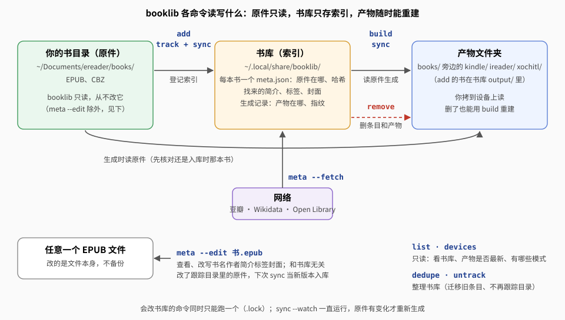
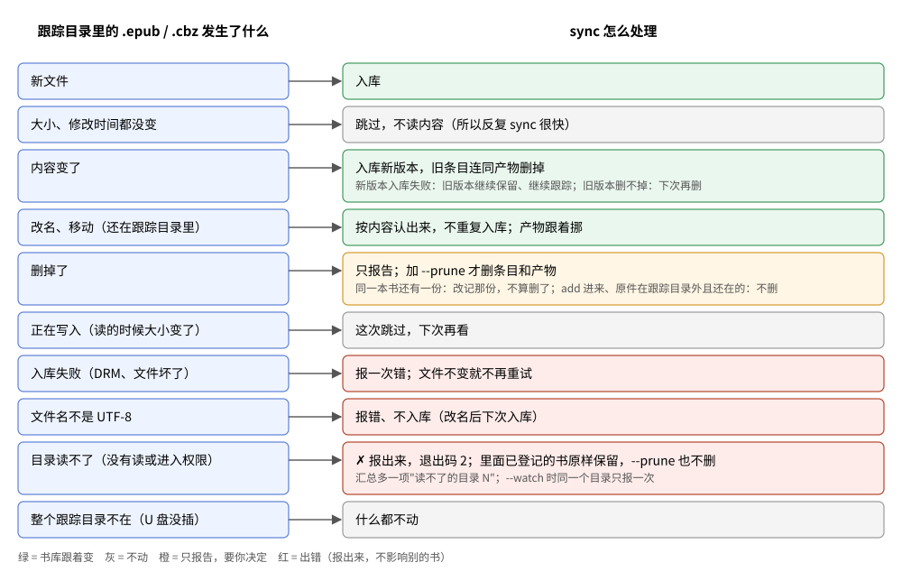
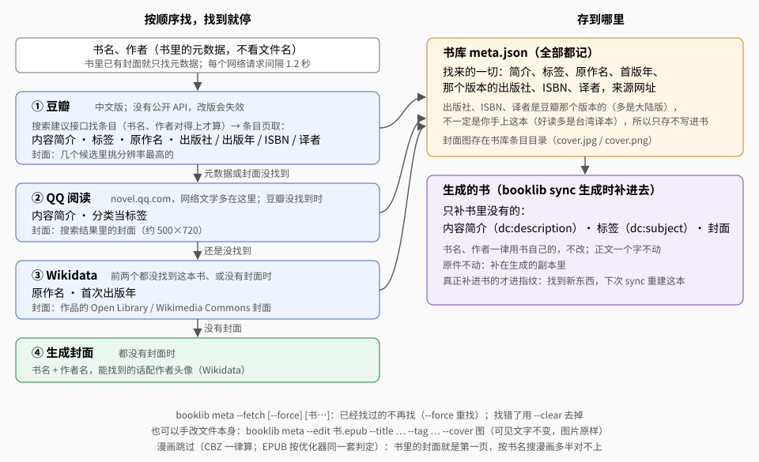
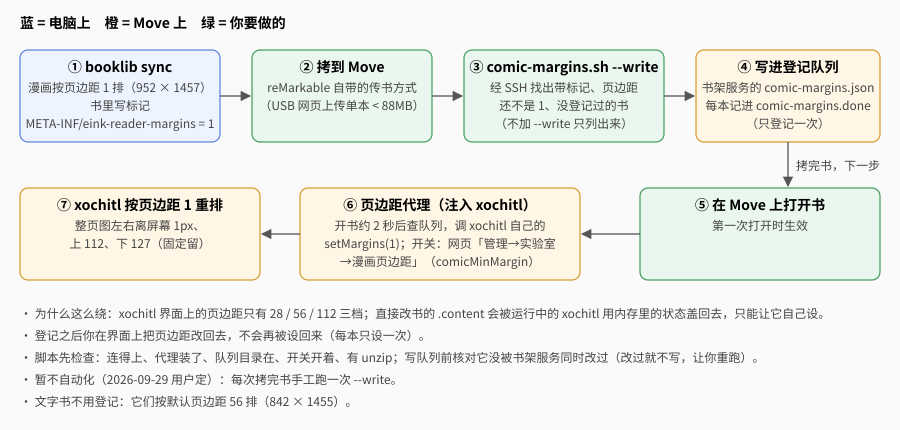

# 使用指南

## 安装与卸载

需要 Rust 工具链（`cargo`）。在仓库目录里：

```sh
./install.sh             # 装 booklib（书库；改 EPUB 元数据的 meta --edit 也在里面）
./install.sh --tools     # 另装开发、排查用的 epub-optimize、readable-probe、readable-measure，以及转 MOBI 词典的 mobi-dict-to-stardict
./install.sh --no-tools  # 卸掉这些开发工具，只留 booklib
./uninstall.sh           # 卸载
./install.sh --help      # 打印脚本开头的说明（uninstall.sh 同样）
```

- 装到 cargo 的 bin 目录，优先级和 cargo 一致：`$CARGO_INSTALL_ROOT/bin` > cargo 配置里的 `install.root`（仓库目录往上各级 `.cargo/config.toml` 越近越优先，最后是 `$CARGO_HOME/config.toml`）> `$CARGO_HOME/bin` > `~/.cargo/bin`。`CARGO_INSTALL_ROOT` 设成空值按没设处理。
- `--tools` 装的是 `bookconv`、`mobidict` 两个包里的命令；`kfx` 包的 `epub-to-kfx`、`kfx-dump`、`kfx-repack` 不随它装，用 `cargo run --release -p kfx --bin <命令> --`。
- 退出码：`0` 装好（卸完）；`1` 没有 cargo、同名命令被别的包占着、编译或卸载失败；`2` 参数不对。
- **升级**：更新代码后再跑一次 `./install.sh`。不加 `--tools`/`--no-tools` 时沿用上次的选择：装过开发工具就一起升级，免得工具停在旧版本、和 `booklib` 的规则对不上。编译复用仓库的 `target/`，第一次要几分钟。
- **同名命令被别的包占着**（比如别处装过一个也叫 `booklib` 的）：脚本报出是哪个包、然后停下，不会悄悄抢过来。确认不要了先 `cargo uninstall` 它再装。
- 装完会核对 `PATH` 里先找到的 `booklib` 是不是刚装的那个；不在 `PATH` 里会告诉你怎么加（fish 给 `fish_add_path`）。
- **卸载只删命令**：按本仓库的路径找出装过的包全部卸掉（仓库经符号链接装的也认）；别处装的同名命令只提示、不删。书库、设备上的书都不动，脚本只告诉你书库在哪。
- 不想安装也可以直接跑：`cargo run --release -p library --bin booklib -- <命令>`。

## 书库在哪

缺省 `~/.local/share/booklib`。要换位置，任选一种：

- 每条命令加 `--library=目录`；
- 设环境变量 `BOOKLIB_DIR`；
- 设了 `XDG_DATA_HOME`（非空）时，缺省是 `$XDG_DATA_HOME/booklib`。

书库里只有索引：每本书一个几 KB 的 `meta.json`，网址入库的书另存一份 EPUB。书的内容只在你的原件目录里有一份。目录结构见[架构 · 书库](architecture.md#书库)。

## 命令



| 命令 | 作用 |
|---|---|
| `booklib add <文件或网址>...` | 入库单个文件或网址（一次性） |
| `booklib track <目录>...` / `untrack` | 跟踪书目录（递归）/ 不再跟踪 |
| `booklib sync [--device=…] [--force] [--no-build] [--keep] [--watch[=秒]] [书...]` | 把跟踪的目录同步进书库（原件删了的连同设备上的产物删掉），接着按阅读模式生成、传到接着的设备 |
| `booklib list [书...]` | 列出书和各设备上的产物、是否最新 |
| `booklib meta --fetch [--force] [--clear] [书...]` | 联网补简介、标签、封面 |
| `booklib meta --show [书...]` | 查看跟踪目录里的书的元数据（书里写的 + 找来的），只读 |
| `booklib meta --edit 书.epub\|书 [选项]` | 查看、改写一个 EPUB 文件的元数据；给书库 id 或书名时改那本书的原件 |
| `booklib remove <id>...` | 从书库删掉一本书（连同设备上的产物；原件不动） |
| `booklib dedupe [目录...]` | 早期版本入库的书改成只存索引 |
| `booklib devices` | 列出阅读模式和设备接没接上 |
| `booklib --version`（`-V`） | 版本：提交号、各项规则的版本 |

- **帮助**：`booklib --help`（或 `-h`、`booklib help`）列出日常用法、全部命令、通用选项、环境变量、退出码；`booklib sync --help`（或 `-h`、`booklib help sync`）只看这一个命令的详细说明和例子。帮助打到标准输出、退出码 0。命令写错时只报错在哪、给这个命令的写法（不再刷一屏全部用法）。
- **版本**：`booklib --version`（或 `-V`、`booklib version`）显示程序版本、编译时的 git 提交号和日期、各项规则的版本（优化、CBZ 转换、补元数据、KFX 写出器、生成流程；哪一项变了哪些书会重建见[开发 · 版本号](development.md#版本号)），如 `booklib 0.1.0（提交 29e80f9，2026-10-07）`。
- **以前的 `build` 已并入 `sync`**（2026-10-06）：`sync` 先扫跟踪的目录，再生成有变化的书；只重做某几本（`sync 书名`）、只给一台设备（`--device=`）、强制重建（`--force`）都用它，扫目录只看大小和修改时间，很快。再敲 `booklib build` 会报用法错，提示改用 `booklib sync [--device=…] [--force] [书...]`。
- **选书**（`[书...]`）：书名片段、id 前缀（`list` 第一列），或原件路径——文件就是那一本，目录就是它下面所有的书。不写就是全部。**路径里有空格要整个加引号**，不然后半截被当成书名，结果"没有匹配的书"（会提示你）。
- **`--device`**：不写就是全部三个模式；可以写多次或用逗号分隔，`all` 表示全部。要写成 `--device=ireader`，写成 `--device ireader`（空格）会报错。
- **退出码**：`0` 全部成功；`1` 命令写错；`2` 有书处理失败（或书库打不开、没有匹配的书）。`sync` 里入库失败、旧版本或原件不在了的书删不掉、目录读不了、拿不到锁也算失败；`--watch` 时只计数，不退出。

### add：入库单个文件或网址

```sh
booklib add 三体.epub 乱马01.cbz https://example.com/post
```

- 只收 **EPUB、CBZ 和网址**。MOBI、AZW3、KFX、FB2、PDF 等报"只支持 EPUB 和 CBZ"（KFX 只是给 Kindle 的产物格式）。给它一个目录会提示改用 `track`。
- 入库时先检查能不能用：EPUB 是不是有效、有没有 DRM；CBZ 是不是 zip、里面有没有页面图片。不能用的当场拒收。只加密了字体的"伪 DRM"不算，照常入库。CBZ 的书名取文件名。
- 生成时读原件：EPUB 直接用；CBZ 当场转成每页一张原图的 EPUB（不存），有打不开的页（不支持的压缩方式等）就报错、不出缺页的书；网址没有原件，入库时抓正文和图片组成 EPUB，**只有这种存在书库里**（网页超过 20MB 不收）。
- 同一个文件重复入库显示 `= 已在库里`（按内容认，改名也认得出）。原件挪了位置，在新位置再 `add` 一次就更新了。
- 同一个路径、内容变了：当成新版本，显示 `↻ 原件改过，换成新版本 … ← 旧书名`，旧条目连同产物删掉。
- 早期版本收进来的 MOBI、PDF 等条目还在书库里：`list` 标"不再支持的格式"，`sync` 生成时跳过（每本提示一次），已有的产物不动。不要了就 `remove`。

**`add` 和 `track` 的分工**：`add` 一次性收单个文件；整个书目录用 `track` 登记、`sync` 同步，之后目录里增、删、改、挪都跟着走。两者可以混用：`add` 过的书后来出现在跟踪目录里，`sync` 按内容认得出，不会重复入库。

### track / sync：跟踪书目录、生成

```sh
booklib track ~/Documents/ereader/books   # 登记（可以多个）
booklib sync                              # 同步，接着按全部模式生成、传到接着的设备上（只传有变化的）
booklib sync --device=kindle              # 只给这一台
booklib sync --device=ireader 三体         # 照样先同步；只生成书名含"三体"的、只给 ireader
booklib sync --device=all --force         # 全部重建
booklib sync --no-build                   # 只同步，不生成（不能和 --device、--force、书名一起用）
booklib sync --keep                       # 这一次原件不在了的只报告、不从书库删
booklib sync --watch                      # 一直运行，每 60 秒查一次（--watch=300 改间隔；不能和 --force、书名一起用）
```

`track` 会拒绝这几种目录（要换就先 `untrack`）：

- 和已跟踪的目录互相包含（父目录或子目录）；
- 和书库自己所在的目录互相包含；
- 和产物放电脑上的自定义模式（没写 `[deliver]` 的）的产物目录互相包含（见[产物放在哪](#产物放在哪)）。内置模式都直接传设备，不受这条限制。

`sync` 分两步：先同步跟踪的目录，再生成并传到接着的设备上（见[产物放在哪](#产物放在哪)）。

**第一步：同步。** 书库严格镜像跟踪的目录。只看 `.epub`、`.cbz`（跳过隐藏文件和目录），每个文件按下图处理：



- **原件删了（不是挪动）：连同产物从书库删掉**，输出 `✗ 原件已删，书库里也删了（连同产物）`。删的只是书库的索引和能重新生成的产物（设备上传过去的那份一起删，Move 上进回收站），原件本来就不在了；删错了（比如只是暂时挪开），放回去再 `sync` 就回来、重新传上去。
- 只删跟踪目录里登记过的书。挪动、改名按内容认出来，不删，产物跟着挪（内容没变不重新生成）；同一本书有两份、删了其中一份的不算删。
- **不删的三种情况**：
  - 整个跟踪目录不在（比如 U 盘没插）：什么都不动。
  - **目录读不了**（没有读或进入权限）：打一行 `✗ 目录读不了…`，那个目录下已登记的书原样保留，汇总多一项"读不了的目录 N"，退出码 2。`--watch` 时同一个目录只报一次。
  - `add` 进来、原件在跟踪目录以外的书：原件没了也不自动删（`list` 标 `✗ 原件不在了`，不要了就 `remove`）。
- `--keep`：这一次原件不在了的只报告（`? 原件不在了（--keep，这次没从书库删）`），下次不加 `--keep` 的 `sync` 再删。以前的 `--prune` 去掉了（现在总会清理），再写会报用法错。
- **书的更新**（同一个文件内容改了；或删了旧文件、放进同名同作者的新文件）：旧条目连同产物删掉，新书入库后生成。清理在生成之前，所以新书用上旧书腾出来的文件名（还是 `三体.epub`），产物文件夹里只剩新书；删旧产物时只删记在旧书名下的文件，不会删到新书的。
- 同名的两本同时在跟踪目录里时，后来的那本产物叫 `书名 [id 前 6 位].epub`，互不覆盖；它用上这个名字就一直用下去，另一本删了也不改回 `书名.epub`（见[产物放在哪](#产物放在哪)）。
- `untrack` 只是不再跟踪，已入库的书保留。

**第二步：生成并传**（`--no-build` 跳过）。没接上的设备打一行 `- [xochitl] 没接上（…），这次不传`，不算失败；`--watch` 时同一台只报一次，接上了就补传。不写书名就是全部书（包括 `add` 进来的、网址书），只报有变化的；写了书名（[选书](#命令)规则同 `list`）只生成这几本，每本都报一行，没有匹配的书退出码 2。还没跟踪任何目录时跳过第一步，只生成 `add` 进来的书。

- 每本书记一个**指纹**（原件内容、模式参数、规则版本等，见[架构 · 指纹](architecture.md#指纹)）。都没变就跳过（选了书时显示 `= 已是最新`），可以放心反复跑。`--force` 强制重建（选中的书，或全部）。
- 输出里的 `⚠ 质量门未过` 只是提示，产物照样生成，说明原书结构有问题（比如链接指向不存在的锚点），可以在设备上看看效果。
- 规则升级（版本号加一）后，原件都没变也会整批重新生成。

**原件的核对**：生成前先看原件还是不是入库时那本书。

- 大小和修改时间没变 → 直接用。
- 变了 → 重算哈希。内容一样（只是被 touch 过）照常；内容不一样就报"原件改过了"并停下（跟踪目录里的书第一步已换成新版本，一般遇不到；`add` 进来的书重新 `add`）。不拿改过的内容冒充原来那本书。
- 原件不在了 → 产物还在、指纹没变的照样算"已是最新"，不报错；要重新生成的报错，提示挪过就在新位置 `add`，不要了就 `remove`。

**`--watch` 几乎不耗电**：每轮只看文件的大小和修改时间，不读内容；什么都没变就不写任何文件，也不去生成。生成失败的书在原件和规则都没变之前不再重试；设备拔了再接上（Move 连接断过重连）时，这台记着的失败会忘掉、下一轮重试。清理每轮照常做。也可以不用 `--watch`，用 systemd 定时器或 cron 定期跑 `booklib sync`。

输出：

```
✗ 原件已删，书库里也删了（连同产物）  动物农场  (~/Documents/ereader/books/好读精排/动物农场.epub)
原件：新增 0，改过 0，没变 35，不在了 1（从书库删了 1），出错 0      ← 原件有没有变化
- [xochitl] 没接上（root@10.11.99.1：SSH 连不上…），这次不传
✓ 生成 [kindle] 一九八四 → /run/user/1000/mtp/kindle/Internal Storage/documents/好读精排/一九八四.kfx
生成：重新生成并传上 105 本，重新生成但内容没变（没再传）3 本，挪位置 0 本，已是最新 0 本，失败 0 本   ← 这次实际做了什么
```

### list：看书库和产物

```text
3fa9c1e07b2d  epub   三体 — 刘慈欣
      ireader              ✓ 最新  /run/user/1000/mtp/ireader/内部共享存储空间/documents/小说/三体.epub
      kindle               ? 未知  /run/user/1000/mtp/kindle/Internal Storage/documents/小说/三体.kfx
      xochitl              ⚠ 过期  xochitl:小说/三体.epub
```

- 路径是生成记录里记的位置：Kindle、掌阅是 MTP 挂载目录下的文件；Move 上的写成 `xochitl:文件夹/文件名`（只看记录，不连 Move）。
- `✓ 最新`：和现在生成出来的会一样。`⚠ 过期`：规则或模式参数变了（或上次没生成完），`sync` 会重建。`? 未知`：电脑上看不到那个文件——设备没接上（挂载目录不在），或设备上那本被删了——或者这个模式已经不在了。
- 书名下可能出现 `✗ 原件不在了`、`⚠ 原件可能改过`、`- 不再支持的格式`。
- `list` 只读，别的命令运行时也能用。

### meta --fetch：联网补简介、标签、封面

`meta` 必须写明 `--fetch` 还是 `--edit`（光写 `booklib meta` 报用法错，免得一不小心给全部书联网）。

```sh
booklib meta --fetch                  # 所有书（找过的跳过）
booklib meta --fetch 白夜行            # 只找某本
booklib meta --fetch --clear 雪人      # 找错了：去掉找来的元数据和封面
booklib meta --fetch --force 雪人      # 重找
```

```text
✓ 白夜行
      元数据 ← 豆瓣 https://book.douban.com/subject/10554308/；原作名 白夜行；简介 500 字；标签 悬疑推理、日系推理、…；参考版本 南海出版公司 2013-1-1 刘姿君 译
      封面 ← 豆瓣 白夜行 [日] 东野圭吾 2013（https://img3.doubanio.com/…）
```



- **元数据**：先找豆瓣条目，取简介、标签、原作名，以及那个条目的出版社、出版年、ISBN、译者；豆瓣没有就找 **QQ 阅读**（`novel.qq.com`，网络文学多在这里；2026-10-08 起），取简介，分类当标签（「侦探/悬疑/推理」拆开，「出版」这种频道名不算）；都没有就用 Wikidata 上的原作名、首版年。
  ```text
  ✓ 疯探
        元数据 ← QQ阅读 https://novel.qq.com/detail/1056370737；简介 232 字；标签 小说、侦探、悬疑、推理
  ```
- **写进书里的只有简介和标签，而且只在书里没有时才补**；书名、作者用书自己的，正文不动，原件不动（补在产物里）。出版社、ISBN、译者是豆瓣那个版本的（多是大陆版），不一定是你手上这本，只记在 `meta.json` 给你参考。简介是简体字。
- **封面**只给书里没封面的书找，按顺序试：
  1. **豆瓣**中文版封面：按书名搜，繁简转换后比对（允许只差卷次后缀），作者去掉"[美]"这类国籍前缀后核对；几个候选里挑分辨率最高的。
  2. **QQ 阅读**的封面（500×720 左右）。
  3. **原作封面**：Wikidata 找作品（好读的 `．`、Wikidata 的 `·` 比较前都去掉，译名用字不同按重合度判断），再到 Open Library、Wikimedia Commons 找图。
  4. **都没有就生成一张**：书名、作者头像（Wikidata 上的照片，没有就画作者名的第一个字）、作者名。样式每本不一样、同一本每次一样，黑白屏上也清楚。输出标 `◇`。要系统里有中文字体（缺省思源宋体繁体，`fc-match` 找），换字体用 `BOOKLIB_COVER_FONT=字体文件[:序号]`。
- 找书只用书里元数据的书名和作者（2026-10-08 起，不看文件名）：豆瓣先搜「书名 作者」，搜不到再只搜书名；QQ 阅读是关键词模糊搜索（「疯探 空城」反而搜不到），先搜书名、再搜「书名 作者」。两边都要书名、作者对得上才算。豆瓣出错没查成时不去 QQ 阅读找（免得存下 QQ 阅读的结果、以后不再查豆瓣）。书名、作者不对时先用 `meta --edit` 改书里的元数据。
- **漫画跳过**（输出 `- 跳过 书名：漫画不找元数据`），`--force` 也不找。CBZ 一律算漫画，EPUB 按优化器同一套判定。
- 找来的东西变了，产物算过期，下次 `sync` 重建。
- 所有请求间隔 1.2 秒，每本书只需跑一次。
- **网络出错不当"没找到"**：连不上、被网站拦了（HTTP 403、豆瓣搜索回来的不是数据而是验证页）都算临时出错，报"网络出错，下次再试"，不生成封面、不存不完整的结果。接连两个网站连不上就当断网，整轮中止。
- 一半成功一半出错的如实报（比如 `⚠ 封面 ←… / 元数据 ✗ 网络出错…`），有结果的那半存下，退出码 2，下次再查没查成的。

Google Books、Hardcover 也能用，但要申请 API key，暂时没接。

### meta --show：查看跟踪目录里的书的元数据

```sh
booklib meta --show            # 跟踪目录里所有的书
booklib meta --show 绍宋       # 只看某本（书名片段、id 或原件路径，同 list）
```

每本书列出：id、书名、作者、原件路径；**书里写的**元数据（读原件的 OPF：标题、作者、语言、出版社、标识符、日期、标签、简介，简介超过 80 字只显示开头；封面有没有、尺寸）；**找来的**（`meta --fetch` 的来源、原作名、首版年、简介字数、标签、参考版本，找来的封面）。只读：不加锁、不联网、不改任何文件。原件不在了的那本报 `✗` 并让退出码为 2（改名或移动过就 `sync`）。只列原件在跟踪目录里的书（`add` 进来的单个文件、网址书不列）。

### meta --edit：查看、改写一个 EPUB 的元数据

改的是 EPUB 文件本身（OPF 里的书名作者等和封面），换设备、换软件看到的都是改后的值。
给的不是存在的文件时，按书库 id 前缀或书名片段找书（同 `list`），改的是那本书的**原件**（2026-10-08 起）：先打印找到的是哪本、原件在哪；对上好几本时列出来、不改；网址入库或书库里存了副本的书没有原件，不改。

```sh
booklib meta --edit b60fc17ffb84 --author 叶真中显              # 书库 id（前几位就行）
booklib meta --edit 恶女的告白 --author 叶真中显                  # 书名片段
```

```sh
booklib meta --edit 书.epub                                   # 查看：标题、作者、语言、出版社、简介、标签、标识符、日期、封面
booklib meta --edit 书.epub --title 书名 --author 作者甲 --author 作者乙
booklib meta --edit 书.epub --language zh --publisher 出版社 --date 2026-09-28 --description 简介…
booklib meta --edit 书.epub --tag 小说 --tag 科幻              # 标签整体替换
booklib meta --edit 书.epub --publisher ""                    # 值给空 = 删掉这一项
booklib meta --edit 书.epub --cover 封面.jpg                   # 换封面
booklib meta --edit 书.epub --cover ""                        # 去掉封面（封面图、只放封面的那页、目录里的条目）
booklib meta --edit 书.epub --get-cover 封面.jpg               # 取出封面
```

- `--名字 值` 和 `--名字=值` 都行，值可以是空字符串。给了哪个改哪个；`--author`、`--tag`、`--identifier` 可重复，给出即整体替换。
- **可见文字一个不变，图片原样拷过去**；写出前和产物一样整理成规范的 EPUB 3（XHTML 修成合法、补 `nav.xhtml` 等）。一百多 MB 的书也只占几十 MB 内存。
- **不备份**，要留底先自己拷一份。先写临时文件再改名，中途失败原文件不动。改符号链接时改的是它指向的文件（链接保留），原文件的权限保留。
- `--identifier` 不动 OPF 的唯一标识（删了 OPF 就不合法，reMarkable 还会不显示目录）。
- 改了跟踪目录里的原件，下次 `sync` 当新版本入库、重新生成；改了书名，产物文件名跟着变，`sync` 把设备上旧名字的那份删掉（Move 上进回收站），见[产物放在哪](#产物放在哪)。

### remove：删书

```sh
booklib remove 3fa9c1e07b2d
```

删这本书的索引和它在各设备上的产物（设备没接上的下次 `sync` 接上时删）。要用 `list` 里的完整 id（删除不做模糊匹配）。条目目录先整个改名再删，中途断电不会剩下半个条目，残留的下次运行时清掉。原件不受影响。
原件在跟踪目录里的会提示：**下次 `sync` 会再入库**，要彻底不要就从书目录里删掉原件。

### dedupe：迁移早期版本的书库

早期版本会把原件存一份在书库里。升级后跑一次：

```sh
booklib dedupe ~/Documents/ereader
```

先看 `meta.json` 记着的位置，再在给出的目录里找内容相同的文件；找到就改成只存索引、删掉副本，找不到的保留副本并列出来。书库里的文件本身不算原件（给的目录包含书库也不会把副本配成自己）。网址书不动。可以反复跑。

### devices：列出阅读模式

```text
ireader      掌阅自带阅读器（iReader Ocean 5 Pro）  EPUB  屏幕 1264×1680  阅读范围 1264×1680  黑白
             ✓ 接上了：/run/user/1000/mtp/ireader/内部共享存储空间/documents
kindle       Kindle 自带阅读器（Paperwhite 12 代签名版）  KFX  屏幕 1272×1696  阅读范围 1104×1546  黑白
             ✓ 接上了：/run/user/1000/mtp/kindle/Internal Storage/documents
xochitl      xochitl（reMarkable Paper Pro Move 原生阅读器）  EPUB  屏幕 954×1696  阅读范围 842×1455  彩色
             ✓ 接上了：xochitl（经 root@10.11.99.1）
```

每个模式下面一行是设备接没接上（只看，不往设备上写）。

在书库的 `profiles/` 里放 `<id>.toml` 可以加模式或覆盖内置的参数，写法见[设备与阅读模式](devices.md)。

## 产物放在哪

2026-10-07 起 `sync` **直接把产物传到接着的设备上，电脑上不留**（设备没接上的这次跳过，下次接上再传）。怎么传由各模式 profile 的 `[deliver]` 定：

| 设备 | 怎么连 | 放在哪 |
|---|---|---|
| Kindle（`kindle`，`.kfx`） | USB，jmtpfs 自动挂到 `/run/user/1000/mtp/kindle` | 存储根目录的 `documents/<子目录>/<书名>.kfx` |
| 掌阅（`ireader`，`.epub`） | USB，挂到 `/run/user/1000/mtp/ireader` | 存储根目录的 `documents/<子目录>/<书名>.epub`（没有 `documents/` 就建） |
| Move（`xochitl`，`.epub`） | SSH（USB `root@10.11.99.1`，不通再试 Wi-Fi `root@10.42.0.224`），调 Move 上书架服务的导入接口 | 直接加入 xochitl 书库（不进书架的母版库），放进文件夹 `<子目录>` |

- `<子目录>`：原件在跟踪目录里所在的子目录，例：原件 `~/Documents/ereader/books/好读/x.epub` → Kindle 上 `documents/好读/<书名>.kfx`、Move 上文件夹「好读」。多级子目录在 Move 上也按层建：`漫画/死亡筆記` 是「漫画」文件夹里的「死亡筆記」文件夹（书架服务逐级找，没有就建）。跟踪目录顶层的书、`add` 进来的书、网址书放 `documents/` 顶层（Move 上放书库根）。
- `booklib devices` 列出各设备接没接上。挂载目录可以用 `BOOKLIB_MTP_DIR` 改，`BOOKLIB_NO_SSH=1` 不连 Move。
- **先比较、再生成、边生成边传**：每本书每台设备先比指纹——没变就跳过；没变但记录里的位置空了（以前放电脑上、你自己挪上设备的）而设备上对应位置有那份，直接认领（`= … 认领设备上已有的那份`），不重新生成。只有变了的才生成。生成好的交给每台设备各自的传输线程，主线程接着生成下一本：Kindle、掌阅拷文件，Move 交给书架服务后等它加入 xochitl、排完版（交一本、做完再交下一本，Move 上不堆）。某台那边排满了（Move 排大书要几分钟）就先做别的设备，那台的留到最后；全部生成完还有在传的，打一行 `… 等设备那边传完`。Move 上一本做了 30 秒以上还没完，打进度行 `… [xochitl] 书名：Move 上等 xochitl 排版（已 2 分 10 秒）`（阶段变了马上报，没变每分钟一次）。中途 Ctrl+C 停掉也不要紧：没传完的下次重做，Move 上已经加进去的书架服务认得出（同一文件夹里内容一样的不再加一份）。
- **增量**：每本书在每台设备上记一个指纹和传上去的那份的哈希。指纹没变就不生成；变了（规则升级、`--force`）就重新生成，生成出来和传上去的那份一样（看哈希，不把设备上的文件读回来）就不再传，输出 `≡ 重新生成 … 和设备上的一样，没再传`。Kindle、掌阅上已有逐字节相同的文件也不再拷（Kindle 覆盖成不同字节会清掉阅读进度，见[设备 · 重拷书以后进度还在不在](devices.md#重拷书以后进度还在不在)）；设备上那本被你删了的，下次 `sync` 补传。Move 上的书更新时按设计**原地替换**（同一个 uuid，想保留阅读进度和所在文件夹）——**还没在真机上验证，而且有反例**，见下面[传书到设备的细节](#传书到设备的细节)。
- **只删自己传上去的**：原件删了（`sync` 自动清理）、`remove` 了的书，设备上的那份一起删（Move 上进回收站，能恢复）；当时设备没接上的，下次接上时删。原件挪了、书名变了，设备上旧位置的删掉（Kindle、掌阅上内容没变的直接挪过去；Move 上文件夹或书名变了是加一本新的、旧的进回收站），删空的子目录一起删。设备上你自己放的书一概不动。
- 两本书同目录同名（不分大小写），或目录里已有一个不是本工具传上去的同名文件，后来的那本加 `[id 前 6 位]`；那个同名文件和这次的产物逐字节相同（以前手工拷上去的）就认领它，不另起名字。一本书用上了哪个名字就一直用下去。
- 产物先在书库的临时目录里生成，过了质量门才传；传到 MTP 设备先写临时文件再改名，中途失败不留半成品。
- **以前留在电脑上的产物**（`~/Documents/ereader/kindle/` 等，2026-10-07 以前的做法）：设备接上后第一次 `sync`，内容没变的直接挪上设备、电脑上那份删掉，不重新生成；设备没接上的先留着。已经被你手工拷到设备上的（电脑上那份挪走了）：设备上同一子目录、和以前产物同名的文件当成那份拷贝，有变化就覆盖，不另起 `[id]` 名字。以前手工拷到 Move 上的书 booklib 不认识，会再加一份，旧的要你自己删。
- 书库 `profiles/` 里没写 `[deliver]` 的自定义模式，产物照旧放电脑上：跟踪目录 `D` 旁边的 `<模式>/`（镜像子目录），`add` 进来的书在书库 `output/<模式>/`；这时跟踪的目录别和这个产物目录互相包含（`track` 会拒绝）。
- 早期版本的产物（书库 `output/` 下的旧设备 id，跟踪目录旁的 `koreader/`）不再管理，不要了自己删。

## 传书到设备的细节

- Kindle 的 KFX 唯一 ID（容器 id）取自书库的书 id：同一本书重建不变，OPF 唯一标识符相同的两本书（同一模板做的书）也不会被当成同一本（2026-10-06 起，写出器 8）。
- Move 要先在设备上装好带导入接口的书架服务（2026-10-07 以后的版本，导入是异步任务：交了书立即回任务号，booklib 隔 2 秒查一次，不挂着连接等排版）；旧版没有导入接口，传的时候报"书架服务太旧"。导入接口经它自己的大文件通道收超过 USB 网页上传上限（约 88MB）的书。
- **Move 原地替换**：2026-10-09《绍宋》《狼厅》原地替换后打开显示的是新内容（补的封面页、拿掉的目录页都在）✓，但阅读进度回到开头（见[设备 · 重拷书以后进度还在不在](devices.md#重拷书以后进度还在不在)）。以前的记录：已经排过版的书原地换文件，xochitl 可能仍显示旧内容（风险和来由只记在 [xochitl · 传书与上传](xochitl.md#传书与上传)）；替换后封面缩略图不会刷新。
- jmtpfs 刚挪完文件偶尔 stat 不到（它的缓存毛病）：下次 `sync` 会当成设备上没有、重新传一次（字节相同，不影响 Kindle 进度）。

### Move 上的漫画：登记页边距

Move 上的漫画按 xochitl 页边距 1 排（左右离屏幕 1px），要登记一下，第一次打开时才会自动设成 1。**`sync` 传上去的不用管**：书架服务的导入接口看到书里的标记（`META-INF/eink-reader-margins`）自己登记（这一步在书架服务里，不在本仓库的代码里；2026-10-09 真机 ✓：sync 传上去的哆啦A夢离屏幕左右 1px）。只有用别的办法传上去的才要手工登记：



```sh
xochitl/comic-margins.sh            # 列出要登记的漫画（USB 连着；Wi-Fi 用 --host=root@<Move 的 IP>）
xochitl/comic-margins.sh --write    # 登记；然后在 Move 上打开这些书，约 2 秒后页边距变成 1
```

- 没登记的漫画还是默认页边距 56：画面缩小一圈，还多缩一次。
- 每本只登记一次：之后你在界面上把页边距改回去，不会再被设回来。
- 依赖 Move 上已装好的书架服务和页边距代理；脚本会先检查这些，还查 Move 上有没有 `unzip`。书架服务 2026-10-07 起不再有「漫画页边距」开关，带标记的漫画经它的网页加入时也会自动登记；更早的版本要先在它网页的「管理→实验室」打开这个开关。
- 写登记队列前核对队列没被书架服务同时改过，改过就不写、让你再跑一次。队列文件是空的也能处理。
- 界面上页边距只有 28/56/112 三档，1 只能这样设；直接改 `.content` 会被运行中的 xochitl 盖回去。

## 单独的命令行工具

书库之外，底层每一步也能单独用，开发和排查时有用（`./install.sh --tools` 装 `bookconv`、`mobidict` 两个包的命令；`kfx` 包的不随它装。不装就 `cargo run --release -p <包> --bin <命令> --`）：

```sh
epub-optimize --device=ireader [选项] 输入.epub 输出.epub
epub-to-kfx [--id=N] [--device=kindle] 优化后.epub 输出.kfx   # KFX 写出器（书库 kindle 模式用的就是它），--device 给 @media 求值，见 docs/kfx.md；包 kfx
epub-to-kfx --styles 书.epub                            # 不写 KFX：按 CSS 原样把每个文字块的样式打到标准输出（tools/kfx/s2kdev.py 用）；包 kfx
kfx-dump [--type=N] [--full] 书.kfx                    # 看 KFX 结构；包 kfx
kfx-dump --json 书.kfx                                  # 整本按 JSON 打印（tools/kfx/ 的分析脚本读它，不再自己解 Ion）；包 kfx
kfx-repack 入.kfx 出.kfx                               # KFX 解开再打包，没改动应逐字节相同；包 kfx
mobi-dict-to-stardict 词典.mobi 输出目录 [--name=名称]   # MOBI 词典转 StarDict（当初给 KOReader 用；掌阅自带阅读器直接认 MOBI 词典，暂时保留）
readable-probe 测量书.epub                              # 生成测量书，见设备与阅读模式
readable-measure [--device=kindle] 竖长.png 横宽.png    # 从截图量出可阅读范围
```

`epub-optimize` 和 `booklib sync` 生成时用的是同一个函数。`--device=<模式>` 必填（不写或写错会列出可用的），其余选项：

| 选项 | 作用 |
|---|---|
| `--no-wash` | 只跑优化器，不清洗。**对文字书无效**：三个内置模式的文字书都只修复（`text_repair_only`），只修复总要走清洗层里修复的那几步；只对漫画有用 |
| `--keep-spacing` | 保留原书的段间距。**对文字书无效**（只修复本来就不动段间距） |
| `--auto-toc` | 从标题强制重建目录。**对文字书无效**（只修复按缺省：书没有目录才生成） |
| `--keep-color` | 黑白屏模式的漫画也保留彩色（用来比较体积、画质） |
| `--check` | 产物过质量门，打印 JSON 报告；没过退出码 3（产物照样写出） |
| `--require-toc` | 和 `--check` 一起用：没有目录也算质量门没过 |

- 写文件的工具都先写临时文件、成功才改名，中途失败不留半成品；输入输出可以是同一个文件——**测试用的真书别这样就地改**。
- `epub-to-kfx`、`kfx-dump`、`kfx-repack` 认 `-h`/`--help`。退出码：`0` 成功，`1` 用法错，`2` 读写或处理失败，`3` 质量门没过（只有 `epub-optimize --check` 时）。
- `epub-to-kfx` 不给 `--id` 时唯一 ID 由 OPF 的唯一标识符派生（同一本书每次转出来一样；书库生成 KFX 时用书 id，单独转出来的和书库的不是同一个 ID）。
- `mobi-dict-to-stardict` 和 `booklib meta --edit` 的路径可以不是 UTF-8。

## 常见问题

**为什么一个模式的产物全变成"过期"了？**
规则升级了（版本号变了），或者模式的配置改了。跑一次 `sync` 即可。有些升级只影响一部分书（比如只改了 CBZ 转换，只有 CBZ 来源的书过期），见[架构 · 指纹](architecture.md#指纹)。

**我在阅读器里改了页边距，要做什么？**
一般不用管。文字书只修复、插图不缩，和页边距无关；漫画不看阅读器的页边距设置（Kindle 是固定版式、掌阅整页铺满、Move 按登记的页边距 1 排）。要改漫画画布时，按[设备 · 在真机上测量](devices.md#在真机上测量)重量，写进 `书库/profiles/<模式>.toml`，再 `sync`。

**英文书为什么不断字，词间有时空得很开？**
三台自带阅读器都不支持 CSS 断字。我们不往正文里插软连字符（那是给书加字符），英文书照样两端对齐（[决定记录](decisions.md)）。

**MOBI、AZW3、PDF 的书怎么办？**
不收。先用别的工具转成 EPUB 再入库；带 DRM 的书一律拒收。

**提示"另一个 booklib 正在使用书库"？**
同一时间只允许一个会改书库的命令运行（`list`、`devices` 只读，不受限；`sync --watch` 每轮自己加锁，两轮之间不占着）。锁在进程退出时（包括被杀）自动释放，看到这个提示就是真的还有一个在跑（比如后台的 `sync --watch`）。

**原件放在 U 盘或移动硬盘上可以吗？**
可以。没插上时，产物已是最新的照常算最新，要重建的会提示原件不在；`sync` 遇到整个目录不在什么都不动。

**提示 `sources.json` 或 `output-state/<模式>.json` "坏了"？**
这两份是书库的记录（跟踪的目录、各模式产物在哪）。读不出来时会改书库的命令都拒绝运行，免得当成空的写回去、丢掉全部记录（生成记录丢了，旧产物再也认不出来，每本书会变成两份）。能修就修好；修不了就挪走再运行：跟踪目录要重新 `track`，产物会重新生成；设备上原来那份：同位置、同字节的会被认回（Kindle、掌阅按文件，Move 由书架服务按同文件夹同内容认），内容变了的会多出一份，要自己删。

**`list` 提示某个条目的 meta.json 读不出来？**
书库的文件都是先写临时文件、落盘再改名，断电一般不会写坏。真出现了，`booklib remove <id>` 删掉它，或重新 `add` 同一个原件覆盖它。进程被杀留下的 `.tmp-*` 下次运行自动清掉。
