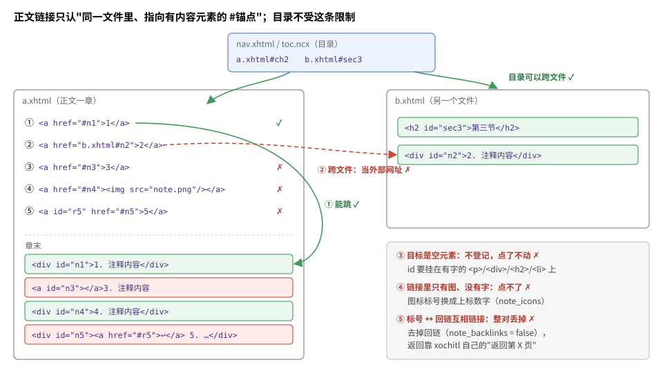

# xochitl 阅读器踩坑

Move 自带的阅读器 xochitl 不开源，排 EPUB 的方式和规范、和别的阅读器都不太一样。这一篇把它的脾气集中记下来：**事实是什么、我们怎么应对、验证到什么程度**。

- 大部分条目是上游设备增强项目 2026-08～09 在 Move 上踩出来的（那时书在 Move 上直接优化，2026-10 起改成在电脑上用本仓库优化）。CSS 和跳转那几批是在固件 3.28.0.172 上测的，系统更新后可能变。
- 已经做成 profile 字段的怪癖（注释回链、图标标号、背景图、漫画页边距等），字段和理由在[设备 · 怪癖 → 字段](devices.md#怪癖--字段)，这里只补来由和细节，不重复。
- 「验证」一栏：**真机** = 在 Move 上看过，或量过 xochitl 自己排出的 PDF；**推断** = 从现象或反编译推出来，没单独验证；**未复核** = 有过结论但后来存疑、没重测。

## 先知道它怎么排书

导入 EPUB 时，xochitl 按当前排版设置把整本书排成一份 PDF（`<uuid>.pdf`），屏幕上显示的就是它（存储方式见[设备 · 附录](devices.md#xochitl-怎么存-epub-和阅读进度2026-09-29-真机摸底只读)）。

- 这份 PDF 每页 303×538pt，和屏幕 954×1696 同比例：**1px = 303/954 ≈ 0.318pt**。下文的 pt 都是这份 PDF 里的尺寸。
- 导入时就排（经网页上传的书，导入完 `.content` 里已经有 `pageCount`）；改字号、字体、页边距整本重排。
- 好处是很多事不用肉眼看：把这份 PDF 拷回电脑量就行，见最后的[怎么验证](#怎么验证不用肉眼)。

## 样式（CSS）

| 事实 | 我们怎么做 | 验证 |
|---|---|---|
| **只认外链 `.css` 文件里的规则**：`<style>` 块不认，`style=""` 属性也不认 | 排版规则一律写进外链的 `eink-wash.css`，每章 `<link>`、OPF 里登记；行内写的居中、居右换成类 | 真机（2026-09-04 七版诊断书 + 《飘》；09-06 再测 `style=""`） |
| `!important` 不认，带它的声明作废 | 不写；要压过书的样式靠"元素名+类"和排在后面 | 真机 |
| 规则里**最后一条声明没写分号会被丢掉**（`p{text-indent:2em}` 不生效，`p{text-indent:2em;}` 生效） | 写出的每条声明都带分号 | 真机（09-06 诊断书） |
| **值写 `0` 当作没设**（`text-indent:0` 不起作用） | 顶格写 `text-indent:0.01em` | 真机 |
| 类选择器认，而且压过元素选择器；**优先级相同时先出现的胜**（和 CSS 标准相反） | 几份样式表改同一个选择器时注意先后；更早"不认类选择器"的结论是上一条（缺分号）的误读 | 真机 |
| 只写 `.x{}` 压不过书自带的类规则（`.calibre7{margin:1em 0}`），**要写成"元素名+类" `p.x{}`** | 漫画混排页的文字留边写 `p.eink-tx{}`、`h1.eink-tx{}` 等，每个标签一条 | 真机（09-21 诊断书） |
| `text-indent` 会从外层的 `div` 继承下来 | 顶格段去掉写了缩进的外层类 | 真机 |
| 裸的 `div{}` 规则不生效 | 不靠 `div{}` 排版 | 真机（09-06） |
| `padding-left/right` 怎么写都无效；**`margin-left/right` 用 pt、em 精确生效**，用 `%` 换算很怪（写 6% 只多出约 1.9pt） | 补留白用 `margin`，单位用 pt 或 em | 真机（09-21 诊断书 12 种写法） |
| 书里写的 `body` 边距、段落上下边距**会叠加**在阅读器页边距上：某本书段距 0.5em/1em 吃掉对话页约四分之一的竖向空间 | 清洗时去掉 `body` 边距和段落上下边距（[排版 · 1](typesetting.md#1-解开字体字号行高的锁别的样式不动)） | 真机（09-02，同一本书两版对比：每页 22.5 行 → 26 行） |
| 逗号并列的选择器 `.a, .b{}` 会不会让整条失效，没复核 | 保守：一条规则只写一个选择器 | 未复核 |

**首行缩进只有外链 CSS 的 `text-indent` 准**（用 em，跟字体无关）。试过都不行的：段首全角空格 U+3000、em 空格 U+2003（被当成段首空白折叠掉）；`&nbsp;`（宽度跟着字体变，连续几个也会被折叠）；`inline-block` 占位（不认）。真机量到 2em = 24.1pt（缺省字号）；英文 1.2em 量出来是 1.184em。

## 严格 XML：一处不合法，整章或整本不显示

xochitl 把 EPUB 当严格的 XML 解析，不像浏览器那样容错。出错时**不报错、只是悄悄少了内容**，所以最好的检查是比页数（见[页数对不上](#页数对不上就是有章没排出来)）。

| 事实 | 我们怎么做 | 验证 |
|---|---|---|
| **同一个标签上出现两个同名属性**（典型是两个 `id`）→ 这一章整章解析失败、一片空白。Calibre 转的 AZW3/MOBI 元素常同时带 `aid` 和 `id`，转换时再生成一个 `id` 就成了两个 | 每个标签只留第一个 `id`（`collapse_dup_id_attrs`），质量门也查；产物的 XHTML 一律修成合法 XML（[排版 · 7](typesetting.md#7-一律升级到-epub-3)） | 真机（《消失的爱人》长篇只排出 7 页） |
| **OPF 不是合法 XML**（书名里混进一个 `\0` 就够）→ 整本只排出 1 页；日志里只有 `Asked for unknown item ""`，看不出原因 | OPF 输出合法 XML，质量门查 | 真机（2026-09-23，一本 PDF 转来的书，书名按 UTF-8 误解出 `\0`） |
| `

…

` 这类无效嵌套成串挨着时，xochitl 自动闭合多出一个 `
`，**吞掉或合并一条** | 注释容器用 `
`，不往 `
` 里套块 | 真机（08-30，多看格式注释"少一条"） |
| 写在 `</body>` 之后的元素，`id` 不登记，指过去的链接点不动 | 往页面里插内容一律插在 `</body>` 之前 | 真机（08-21） |
| 流式 zip（本地文件头里不写大小、靠末尾的数据描述符）的 EPUB 打不开 | 重新打包。`EpubWriter` 写到可回写的文件，大小写在本地文件头里，产物应该不受影响 | 真机（原书打不开、重打包后正常）；我们的产物是推断 |

## 书内跳转

| 事实 | 我们怎么做 | 验证 |
|---|---|---|
| 正文链接**只有同一个文件里的 `#锚点`** 算书内跳转；`b.xhtml#x`、`./b.xhtml#x`、不带 `#` 的一律当外部网址，点了没反应 | 注释搬到同一文件的章末（[排版 · 3](typesetting.md#3-注释点标号跳到章末比正文小一号)）；被几章同时引用的注释留在原处，点不了 | 真机（09-23 三章测试书，读排出 PDF 里的链接） |
| **目录不受上面这条限制**：nav 里写 `a.xhtml#x` 能准确停到那一页 | 目录改指原文件里的锚点（v46） | 真机（09-23） |
| **跳转目标必须是有内容的元素**：空的 `` 不登记，指向它的链接点了没反应；`
`、`
`、`<h2 id>`、`<li>` 都可以 | 补的锚点挂在标题、段落本身上。注意"目录能跳"不代表"正文链接能跳"，两套机制 | 真机（09-23 对照《甲午》331 个目标；09-29 `<li>` 当目标能跳） |
| 链接里只有图、没有字的点不了；标号和回链互相链接的一对整对丢掉 | 见 profile 的 `note_icons`、`note_backlinks` | 真机 |
| **没有弹窗注释**：`epub:type="noteref"`/`<aside epub:type="footnote">`、ARIA 的 `doc-noteref`/`doc-footnote` 全当普通跳转 | `notes = "jump"` | 真机（08-21 对照书穷举） |
| 跳过去以后，"返回第 X 页"的浮标只停 8 秒 | 阅读器自己的行为，本仓库管不到（上游用补丁延到 20 秒） | 真机 |
| 外部网址点了没反应（没有浏览器） | 原样保留，不删 | 真机 |

## 目录与封面

| 事实 | 我们怎么做 | 验证 |
|---|---|---|
| **找 NCX 只认 manifest 里 `id="ncx"` 的那一项**（二进制里写死的），不看 `<spine toc="…">`。合乎规范的 `id="toc"` 会让原生目录入口整个不出现 | NCX 的 manifest id 改成 `ncx`（`fix_ncx_manifest_id`；新生成的也叫 `ncx`） | 真机 + 反编译（《疯探》：只改这一处，94 条目录全出来） |
| **封面条目 id 带点**（如 `x00000001.jpg`）又**只有 `<meta name="cover">`** 时取不到封面（日志 `failed extracting cover: got null cover image`）；加上 `properties="cover-image"` 就好。`<meta name="cover">` 指向不是图片的条目（Calibre 产物里的 `cover.txt`）也取不到 | 两种声明同时写，而且要指向真图片（`ensure_cover_declared`） | 真机（09-20：同一张图做 3 个最小 EPUB，只改声明写法对照） |
| **书架缩略图在导入时生成，之后不再生成**；改了封面要重新导入 | — | 真机 |
| Calibre 的封面页是 `<svg>` 包一张图（`preserveAspectRatio="none"`），会被拉伸放大；改 `preserveAspectRatio` 不管用 | 整页只有这张图时换成 ``（[排版 · 6](typesetting.md#6-目录与其它修复)） | 真机（08-22《喜鹊谋杀案》） |
| 排出的 PDF 里**没有书签**（目录不写进去） | 验目录读 `.epubindex`，不看 PDF 书签 | 真机 |

## 图片

| 事实 | 我们怎么做 | 验证 |
|---|---|---|
| **块级图默认宽度撑满栏宽**：小图也放大到栏宽（400px 到 2400px 宽的图都画成栏宽），大图缩到栏宽。CSS 里只有 `width` 起作用，`height`、`max-height`/`max-width`、`vw`/`vh`、`display:table` 都不认 | 插图按阅读范围只缩不放；不靠 CSS 限高 | 真机（09-02 探针；09-19 五种写法逐像素对比） |
| **竖向可用高度固定 462.1pt**（上留 35.5、下留 40.3，和页边距设置无关）。图按"栏宽、高度上限哪个先到"缩；**比栏窄时靠左**，不居中 | 文字书阅读范围的高 1455 就是这么换算的（[设备 · 可阅读范围](devices.md#可阅读范围)）；漫画补白到画布比例，图正好铺满 | 真机（09-21） |
| **行内图按图自身的像素画、不认 CSS**：70×95 的图标标号变成一大块；1696×630 的行内横幅溢出屏幕 | 插图缩进阅读范围（宽不超过 842）；图标标号换成数字 | 真机（09-04《飘》） |
| **图块在页尾放不下就整个挪到下一页，剩下的空白不回填**：连着几张大图的网文会大片留白 | 没办法：改 CSS 前后排出来逐页像素一致。别再查 | 真机（09-10，25 页 A/B） |
| 网上的图（`src="http…"`）设备离线时画成一个**巨大的放大镜**破图；它按 `src` 直接画，不查 manifest | 抓下来放进书里，抓不到就删掉这个 ``（[排版 · 6](typesetting.md#6-目录与其它修复)） | 真机 |
| 每章开头一张的装饰图（横幅、logo）是正常内容 | 不做"跨章重复图"去重（上游误删过一次，用户照片纠正后撤回） | 真机（用户确认） |

## 页边距与漫画

页边距 1、画布 952×1457、登记脚本这些做法见[排版 · 离屏幕边缘 1px](typesetting.md#离屏幕边缘-1px三种做法)和[使用指南](usage.md#move-上的漫画登记页边距)，这里补几条来由：

| 事实 | 验证 |
|---|---|
| 页边距是**每本书单独**的设置，存在 `.content` 的 `margins`。设置界面只给 28/56/112 三档，点了调的是阅读器内部的 `setMargins`（界面右上角的保存按钮不写任何数据）；`setMargins` 收任意数，0 也行（0 时图离左 0.0、右 0.4pt），用户选了 1 | 真机 + 读固件里的 QML（09-21） |
| **从外面改 `.content` 的 `margins` 不可靠**：试了 5 次只成功 1 次，其余都在用户打开书时被 xochitl 用内存里的值写回 56 | 真机（09-21） |
| 漫画页的宽高比要和"栏宽 : 462.1"对得很准：一张比框窄 1.6% 的页，图少 4.5pt 宽、左右留白不对称（8.9 / 13.4pt）。上游的容差收到 0.3% | 真机（09-21） |
| 不补白时，xochitl 把图贴在页顶、空当全堆到底下（上 6.6%、下 22.3%） | 真机（09-21） |
| PDF 不走这套排版：页面正好 954×1696 的 PDF 左右留白 0，它的 `.content` 里根本没有 `margins`。本仓库只出 EPUB，记着备查 | 真机（09-19） |

## 翻页方向

| 事实 | 我们怎么做 | 验证 |
|---|---|---|
| xochitl 自己不按 OPF 的 `page-progression-direction="rtl"` 从右往左翻：上游是靠补丁对调左右点击和滑动，读的正是 OPF 里这个标记 | `xochitl` 模式照原书写，不改（profile 不写 `comic_page_direction`） | 推断 |
| Calibre 转的日漫大多没写 `rtl`（《亂馬》《镖人》、东立版《火影》），Kmoe 版写了 | 不替书判方向：漫画识别分不出日漫和国漫、美漫，自动设 `rtl` 会把它们翻反 | 看过样本 |

## 墨水屏刷新（波形）

Move 翻页时的刷新方式**跟页面内容走**，不是整机固定一档（2026-09-01 真机，同一本漫画关掉"翻页清残影"后肉眼对比）：

| 页面内容 | 刷新 |
|---|---|
| 彩色 | 最重：整屏黑白闪好几下，慢 |
| 256 级灰 | 中等 |
| 不超过 16 级灰（抖动） | 轻，快 |
| 1 位黑白（抖动） | 最轻最快 |

- **只对纯图页有效**：有文字的页，字是 xochitl 自己带灰边（抗锯齿）画的，整页仍走灰度那一档。文字书没有从内容上减闪的办法（推断）。
- 16 级灰的样本用 JPEG（质量 88）编码后也触发了轻档，面板看的也许是色调复杂度、不是严格的级数（推断）。真要做，少级灰度应存 PNG。
- 抖动不省体积，反而更大（抖动图压不动，《镖人》283→687MB）。
- 本仓库现在 `xochitl` 模式保留彩色（用户定），黑白屏模式转 256 级灰、不抖动（[排版 · 漫画](typesetting.md#漫画)）；降灰阶减闪没有做。

## 传书与上传

| 事实 | 验证 |
|---|---|
| **网页上传有体积上限**。上游二分测得是 100,000,000 字节（超了直接断开）；本仓库遇到过 88MB 的书回 413（[设备](devices.md#怪癖--字段)下的"其它实测行为"）。两个数对不上，没复核 | 真机（两次结论不一致） |
| **上传到指定文件夹**：先 `GET /documents/<文件夹的 uuid>` 把"当前文件夹"设好（服务端的全局状态，不用同一个连接），再 `POST /upload` 就落进那个文件夹；表单里写 `parent` 没用，一律落在根目录 | 真机（08-26） |
| 书架上显示的书名取 EPUB 里的 `dc:title`，不是上传的文件名（PDF 才用文件名） | 真机 |
| 每次上传都是一本新书：同名的再传一份就是两本，旧书的进度、批注不会过去 | 真机 |
| 开着云同步时，每导入一本书，xochitl 马上把书连同排出的 PDF 传到云上（出站约 0.8–1.9MB/s，持续 2–3 秒）；弱热点上传书会显得卡 | 真机（09-04；09-29 摸底时用户已关云同步） |
| **已经排过版的书原地换文件不可靠**：覆盖 `.epub`、删掉排版缓存后，xochitl 仍显示旧内容，重开也一样 | 真机（08-22《喜鹊谋杀案》） |

**`booklib sync` 怎么传 Move**（2026-10-07 起）：经 SSH 调 Move 上书架服务的导入接口（`POST /import?name=&folder=` 新加，超过上限的自动走下面的占位 + 磁盘替换；`POST /import?uuid=` 原地替换；`GET /import/<uuid>` 查还在不在；删书走它的回收站队列）。**原地替换和上一行"原地换文件不可靠"冲突**：接口替换的做法（换 `.epub`、删 `.pdf`/`.epubindex`）就是 08-22 那次不可靠的做法，对排过版的书很可能仍显示旧内容，要真机核实；不行就改成"加新的、旧的进回收站"（进度丢）。

**超过上限的大书：占位 + 磁盘替换**（上游的做法，要在 Move 上运行能写书库目录的程序；书架服务的导入接口用它）：

1. 先经网页上传一个几 KB 的占位书，让 xochitl 建好条目。**占位要带真书名和真封面**：书名和缩略图在导入时定下，替换后不会更新。
2. 在磁盘上把 `<uuid>.epub` 原子替换成真书，删掉占位的 `<uuid>.pdf`、`<uuid>.epubindex`。不用重启 xochitl。
3. 第一次打开时 xochitl 自己重新排：146MB 约 25 秒；156.5MB 约 74 秒排出 349 页。之后走缓存。
4. PDF 还要同时改 `.content` 里的 `pageCount`、`originalPageCount`、逐页 UUID 表、`redirectionPageMap`、`sizeInBytes`；列表里的页数打开一次才刷新。

真机验证过 154MB 的 PDF、153MB 的 EPUB（2026-09-20）。这和上一行"原地换文件不可靠"看起来矛盾，推断区别在于占位书还没被打开过、xochitl 内存里没有它的排版，没验证。

**停掉 xochitl 有概率让整机重启**：xochitl 退出时自己有概率崩溃（上游收集到 5 份崩溃栈，其中 3 份反编译看是退出时数据先析构、刷新屏幕的线程池后停），崩了会触发系统的应急处理、整机重启（会自己回来，没丢过数据）。停掉 xochitl 删书时要知道这一点。真机（2026-09-20～09-25，装着上游扩展的 Move 上多次）；"跟扩展无关"是反编译推断。

## 页数对不上，就是有章没排出来

严格 XML 出错时 xochitl 不报错，只是少排几页甚至整章，所以**比页数**是最省事的检查：

- 默认排版设置下，**中文每页约 460 字，英文每页约 960 个字符**（上游两本真书，估算和实际比 0.99）。期望页数 = 正文字符数 ÷ 每页字符数，跟 `.content` 里的 `pageCount` 比。
- **实际不到期望的一半，就当有章没排出来**：好的测试书 25/29 页，带 3 章双 `id` 的坏书只有 10/29 页；那本书名里有 `\0` 的书只排了 1 页。
- 漫画字少，估出来只有两三页，这个比法没意义。改了字号等设置，每页字数跟着变。
- 日志里的 `pdfrenderer_unix.cpp:141 logErrors` 平时就有成百条，多是噪声；`epubindex … failed to open` 也是良性的。看页数，别看这些日志。

## 怎么验证（不用肉眼）

| 想确认 | 方法 |
|---|---|
| 版面、图的位置大小 | 把 `<uuid>.pdf` 拷回电脑，PyMuPDF 读 `page.get_image_info()[0]['bbox']` 拿图的真实位置（别量非白像素，会把画面自己的留白算进去）；量每段首行的 x 偏移看缩进；比每页行数、行距 |
| **正文链接能不能跳** | 读那份 PDF 的跳转目标表（catalog 的 `/Dests` 名字树），每个链接的目标名都要在表里，再比对目标页的文字；PyMuPDF 的 `get_links()` 里命名目标是好的，`URI`/`launch` 是被当成外链的 |
| 目录跳到哪页 | 读 `<uuid>.epubindex`：Qt 二进制，每条是 u32 字节长 + UTF-16BE 的 `OEBPS/…#锚点` + u32 页号（从 0 起） |
| 书排全了没有 | `.content` 的 `pageCount` 跟期望页数比（上一节） |

- **目录和正文链接是两套机制**：上游曾拿 `.epubindex`（目录用的）核对正文链接、得出"能跳"，用户一点不跳。两样都要过才算能跳。
- **诊断书**：一本小 EPUB，每页只改一个变量、旁边放一段对照，投上去量排出的 PDF。CSS 覆盖类的写法连着几次都无效时，别再换写法，改成只动结构（比如去掉 `body` 的类）。
- **有在真机上生效的活样本，先拆开看它怎么写的**，比凭空造几版诊断书快（上游的缩进问题就是这样绕了远路：《飘》自带的外链 `p{text-indent}` 早就是答案）。
- 看不到屏幕别猜观感：让用户拍照，或直接说看到了什么。
- 测试副本先改掉 `dc:title`，免得和原书同名、点错本。
- 要读 xochitl 的界面代码：二进制里的 Qt 资源是 zstd 压缩的，扫魔数 `28 b5 2f fd` 逐块解压，含 `import Qt` 的就是 QML 源（3.28.0.172 上 553 个文件）；`strings` 要带上 UTF-16LE。
